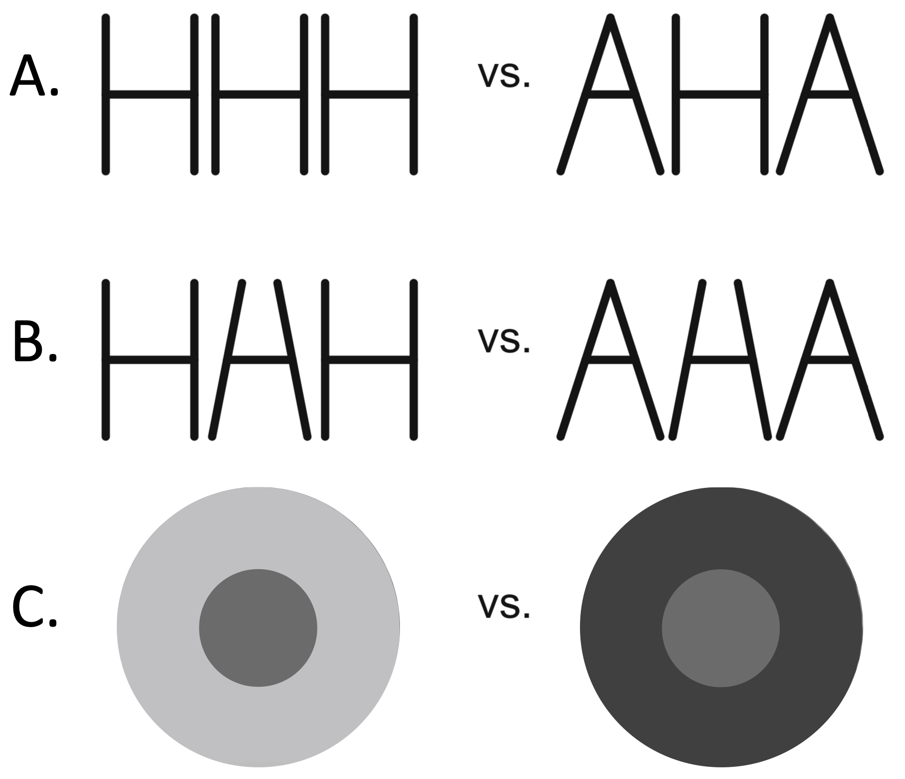
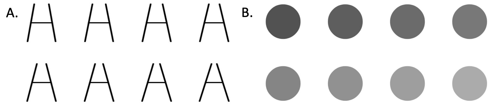
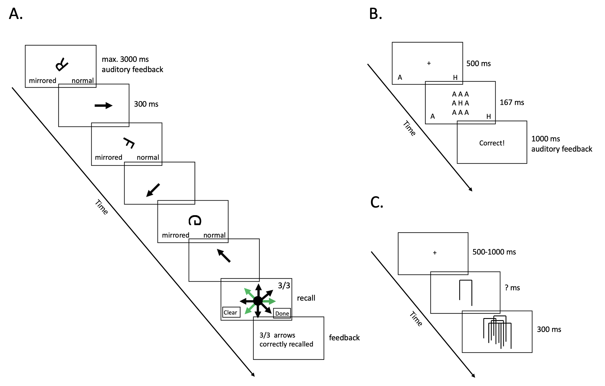

```{r setup, include = FALSE}
library("papaja") # APA template
library("mvtnorm") # rmvnorm() function
library("msm") # rtnorm() function
library("MCMCpack") # riwish() function
library("invgamma") # rinvgamma() function
library("scales") # plotting function alpha() for the colors
library("BayesFactor") # t-test and correlation analyses
library("curl") # load data from github
library("dplyr") # data wrangling
library("brms") # posterior_samples() function to extract draws from stanmodel
library("rstan") # cross-check of Gibbs sampler and modeling in part two
library("corrplot") # correlation plots
library("tidyr") # for data wrangling for posterior pred checks
library("gridExtra") # plot arrangement posterior pred checks
rstan_options(auto_write = TRUE) #  Cache compiled Stan programs
options(mc.cores = parallel::detectCores()) # Parallelize chains
```

```{r analysis-preferences}
# Seed for random number generation
set.seed(42)
knitr::opts_chunk$set(cache.extra = knitr::rand_seed, cache.lazy = FALSE)

r_refs(file = "r-references.bib")
my_citations <- cite_r(file = "r-references.bib")
```

The ability to ignore irrelevant information in one’s environment is essential for everyday cognitive functioning [e.g., @Cowan:1995]. Moreover, this ability to inhibit has been linked to psychologically relevant outcomes, such as impulsive behaviors [@SharmaEtAl:2014] and psychopathology [e.g., @JoormannEtAl:2007; @Nigg:2000; @vonBastianEtAl:2020].   
	Cognitive inhibition is commonly assessed using experimental tasks. Two prominent examples of cognitive inhibition tasks are the flanker [@Eriksen:Eriksen:1974] and the Stroop task [@Stroop:1935]. In the letter-flanker task, a common version of the flanker paradigm, individuals are asked to identify a centrally located letter (i.e., the target) surrounded by other letters (i.e., the distractors). There are two types of trials: in congruent trials, the target-letter and the distractor-letters are the same, and in incongruent trials, they differ. The assumption is that it takes longer for individuals to respond in incongruent than in congruent trials and that this difference in response time (RT) captures one’s ability to inhibit. Accordingly, the flanker effect is the RT difference between trials where the target- and distractor-letters differ (i.e., incongruent) and trials where they are identical (i.e., congruent; Figure \@ref(fig:flankers)A). In the classic Stroop task, the color in which a color-word (e.g., “blue”) is printed needs to be indicated. Here, the target is the print color, and the distractor is the meaning of the color-word. The Stroop effect then is the RT difference between trials where the print color and the meaning of the word are different (i.e., incongruent; e.g., “red” written in blue) and trials where they match (i.e., congruent; e.g., “red” written in red).  
	There are good reasons why researchers use these paradigms to assess inhibition [@RouderHaaf:2019]. For example, they generally yield well-replicable effects -– the Stroop effect is even seen as universal [@Haaf:Rouder:2017; @MacLeod:1991]. Implicitly assuming that robust experimental effects are also well suited to assess individual differences, inhibition tasks are often used in correlational studies [@Hedge:etal:2018]. It seems reasonable to assume that someone who does well in the Stroop task is also good at the flanker task -– after all, they aim to assess the same concept. However, performance in inhibition tasks has generally been found to correlate weakly [e.g., @KeyeEtAl:2009; @PaapGreenberg:2013; @Pettigrew:Martin:2014; @ReyMermet:etal:2018]. This suggests that the robustness of experimental effects does not transfer as easily to individual difference studies as one might expect.  
  Explanations for the low correlations have been substantive as well as statistical [@RouderHaaf:2019]. A substantive account is that the tasks capture unrelated mental processes [e.g., @ReyMermet:etal:2018]. Accordingly, inhibition should not be treated as a unified construct and performance not generalized beyond the specific task. Ultimately, if cognitive performance across standard inhibition tasks truly is unrelated, it is questionable whether cognitive inhibition as a general ability even exists [@ReyMermet:etal:2018].  
	A statistical explanation for the low task correlations is that correlations are obscured by trial noise and latent individual differences too small to be detected. It is well established that observed correlations are attenuated by measurement error [e.g., @Matzke:etal:2017; @Spearman:1904]. In inhibition tasks, individuals only complete a certain, finite number of trials. Even if there are individual differences and the tasks truly are related, the correlations may not be detectable due to a large degree of trial noise [@RouderHaaf:2019]. In fact, there seems to be around seven times more trial noise than true individual variation in inhibition tasks [@RouderEtAl:2019].  
	The extent of true individual variation may be restricted by the size of the overall inhibition effects which tend to be rather small. For example, the average Stroop effect is around 50 milliseconds [@RouderHaaf:2019]. It can be assumed that everybody is slower in incongruent than congruent trials -- nobody truly has a negative Stroop effect [@Haaf:Rouder:2017]. That is, we can assume that everyone requires more time to name the print color when the color and the semantic meaning of the word are different than when they match. If this assumption holds, the degree of possible true individual variation is dependent on the size of the overall effect. With only little latent variation, there cannot be much covariation across different tasks. @RouderEtAl:2019 showed that current experimental designs when using a realistic number of trials do not have the resolution to detect this small extent of latent variation and covariation; even when employing advanced statistical methods such as hierarchical modeling which take trial noise into account. Simulations revealed that to recover correlations between standard inhibition tasks such as the Stroop and flanker, over a thousand trials per task would be needed [@RouderEtAl:2019].  
	Assuming inhibition as a distinct cognitive ability exists, a fundamental question is whether it is a unitary phenomenon or whether it comprises different kinds of phenomena. Often inhibition has been conceptualized as a unified construct [e.g., @Hasher:Zacks:1988]. But various researchers have suggested distinct conceptual processes, comprising two or more domain general factors [e.g., @Friedman:Miyake:2004; @Stahl:etal:2014; for a review, see @ReyMermet:etal:2018]. The question then is whether there is shared variance among those processes, that is whether an overarching cognitive inhibition construct can be established. A natural approach to answer this question is to examine whether performance across tasks assessing different inhibitory processes correlates. At this point, findings are inconclusive, and no substantive conclusions regarding the psychometric structure of inhibition can be drawn [@Draheim:etal:2019].  
  Given the difficulties in obtaining correlations and the uncertainty about the construct 'inhibition', several researchers have called for new tasks assessing inhibitory processes [e.g., @Draheim:etal:2019; @Friedman:Miyake:2004]. Particularly tasks with a resolution high enough to detect correlations among them -- and consequently individual variation -- are needed to answer long-standing questions about the concept of inhibition. Assuming that everybody has inhibition effects in the same direction as in tasks such as the Stroop and flanker, a better inhibition task has to be one that shows a large overall effect and a high signal-to-noise ratio [@RouderEtAl:2019].
	
## The Morph-Flanker and the Brightness-Illusion Task

 Here we present two new tasks that we think have the potential to yield large inhibition effects and individual differences. Both tasks aim to assess the ability to inhibit contrastive information. The first one is based on a paradigm introduced by @SnyderEtAl:2019 [see also @Rouder:King:2003]. These authors adapted the letter-flanker task such that the targets were A-to-H-morphs instead of ordinary A and H letters (Figure \@ref(fig:flankers)B). The effect assessed in this task was perceptual and is best described as a contrastive context effect -- the distractors nudge the response in the opposite direction: participants were more likely to perceive a morph as "A" when the distractors were "H"s but more likely to perceive it as "H" when the distractors were "A"s [Figure \@ref(fig:flankers)B; @SnyderEtAl:2019]. This paradigm yielded larger overall effects than usual and substantial variation across participants.  
 
```{r flankers, out.width = "200px", fig.cap = "Original and modified flanker paradigms (adapted from Snyder et al., 2019, p. 1945). {\\bf A.} reflects the letter-flanker  by Eriksen and Eriksen (1974). {\\bf B.} reflects the paradigm assessing contrast effects based on Snyder and colleagues (2019) and Rouder and King (2003). {\\bf C.} reflects the brightness-illusion paradigm.", fig.align = 'center'}

```
	However, @SnyderEtAl:2019 critically noted that demand characteristics could have influenced their results. There were no objectively right or wrong answers regarding the identity of the target-morphs. This could have led some participants to more or less explicitly use the distractors to inform their responses –- even though they were instructed not to -– as the distractors were the only available information that they could base their judgement on.  
	Addressing this issue, we advanced the paradigm developed by @SnyderEtAl:2019 to what we call the *morph-flanker task*. Perhaps the biggest change is that in our version, participants receive feedback on their performance based on task criteria that determines which morphs are "A"s and which "H"s. Using a range of A-to-H-morphs, participants are trained and instructed to respond with "A" to one half of the morphs and with "H" to the other. One can then examine how effectively individuals ignore contrastive information by comparing their responses across distractor-contexts.  
	The second task builds on the same logic as the morph-flanker, but we use brightness stimuli consisting of an inner circle, the target, and an outer ring, the distractor (Figure \@ref(fig:flankers)C). We call this task the *brightness-illusion task*. The distractors are either of a particularly light or dark grey (Figure \@ref(fig:flankers)C), and the targets differ in their brightness. Participants first learn whether the targets fall into a "dark" or "bright" category. They then judge whether the targets are "bright" or "dark" with the distractors around them. By using two different types of stimuli in this adapted version of the flanker task, we can examine how the ability to inhibit contrastive information compares across (morph)-letter identification and brightness judgements.    
	There are two main aspects in which the morph-flanker and the brightness-illusion task differ from standard ones (e.g., Stroop and flanker task) and that lead us to believe that they will be more discriminative of individuals' inhibitory abilities. The first concerns the nature of the inhibitory effect we are trying to isolate and the second the metric used to quantify it.  
	First, the morph-flanker and the brightness-illusion task evoke the exact opposite response patterns from standard inhibition tasks, and these have shown to yield more individual variation [@SnyderEtAl:2019]. In classic inhibition tasks, individuals are tempted to align their response with the identity of the distractors, a mechanism described as assimilation [@SnyderEtAl:2019]. Consequently, it generally takes longer to respond in incongurent than in congruent trials. For example, in the Stroop task, people are inclined to name the meaning of the color word (i.e., the distractor) instead of the print color. And in the letter-flanker task, the temptation is to use the letters surrounding the target letter to identify the target. In the tasks we introduce here, on the other hand, the assumption is that individuals are inclined to respond contrary to the distractors' identity. Besides the contrast task, @SnyderEtAl:2019 also developed an assimilation task involving morphs. In this task, the morph-targets ("A"-to-"H") were surrounded either by the distractor "C_T" or by "T_E" (the underscore is a placeholder for the target). Participants were asked to indicate whether they perceived the morph as "A" or as "H". This task yielded substantial assimilation effects and performance in the two tasks was substantially correlated, which suggests that there were individual differences. Because the contrast task yielded greater individual variation than the assimilation task, we believe that the former generally yields more individual differences than the latter.  
	The second major difference between classic inhibition tasks and the novel tasks introduced here is that the morph-flanker and the brightness-illusion tasks are based on accuracy data whereas the most prominent inhibition tasks quantify inhibition based on RT. RTs, specifically RT difference scores have been criticized for being susceptible to unreliability [e.g., @Draheim:etal:2019]. Indeed, as already mentioned, the signal-to-noise-ratio in standard inhibition tasks is rather small [$\approx$ 1/7; @RouderEtAl:2019]. This ratio may be more favorable for accuracy data, and therefore for the introduced tasks. 
	
## Overview of Studies  

  This thesis examines the morph-flanker and the brightness-illusion task as two novel tasks for assessing the ability to inhibit contrastive information. To this aim, we first present results of a pilot study examining the morph-flanker and the brightness-illusion task. We asked whether the morph-flanker and/or the brightness-illusion task yield(s) substantial inhibition effects and individual variation. We hypothesized that there are sizable overall effects (hypotheses 1 and 2) and individual differences (hypotheses 3 and 4) in both proposed tasks. Since both tasks were designed to assess the same concept, we also expected the contrast effects to be positively correlated (hypothesis 5).  
	In the second part of this thesis, we propose a correlation study involving the task that yields more individual variation. This study has yet to be conducted. We plan to only include one of the new tasks because we will administer more trials per task than are commonly used to decrease trial noise, as recommended by @RouderEtAl:2019. The aim of this study will be to explore whether the novel inhibition task correlates with other established paradigms assessing cognitive ability. Specifically, we will include two tasks known to yield large individual differences: a working memory task and a visual inspection time task. Besides these two tasks, we will also include the regular letter-flanker task as established inhibition task in the battery. Performance in this task will serve as a reference point for the extent of correlations and the size of the inhibition effect commonly found in inhibition research.
  


# (Pilot) Study 1

```{r}
# load data
filename1 <- curl("https://raw.githubusercontent.com/PerceptionCognitionLab/data3/master/morph2/data")
rdat01 <- read.table(filename1,header=TRUE,colClasses="character",row.names=NULL)
filename2 <- curl("https://raw.githubusercontent.com/PerceptionCognitionLab/data3/master/bright2/data")
rdat02 <- read.table(filename2, header=TRUE,colClasses="character",row.names=NULL)
# rename id variables
rdat01 <- rdat01 %>%
  rename(sessionID = row.names,
         participantID = pid) 
rdat02 <- rdat02 %>%
  rename(sessionID = row.names,
         participantID = pid) 
# add task indicator
rdat01$task <- 1 # morph
rdat02$task <- 2 # brightness-illusion
# drop irrelevant columns
rdat1 <- rdat01 %>%
  dplyr::select(-sid, -timestamp, -sender_id)
rdat2 <- rdat02 %>%
  dplyr::select(-sid, -timestamp, -sender_id)
# turn rt, block, trial, morph, and participantID into numeric
rdat1$rt <- as.numeric(rdat1$rt)
rdat1$block <- as.numeric(rdat1$block)
rdat1$trial <- as.numeric(rdat1$trial)
rdat1$participantID <- as.numeric(rdat1$participantID)
rdat1$morph <- as.numeric(rdat1$morph)
rdat2$rt <- as.numeric(rdat2$rt)
rdat2$block <- as.numeric(rdat2$block)
rdat2$trial <- as.numeric(rdat2$trial)
rdat2$participantID <- as.numeric(rdat2$participantID)
rdat2$morph <- as.numeric(rdat2$morph)
# resp A = 1, H = 0 and bright = 1, dark = 0
rdat1$resp <- ifelse(rdat1$resp == "A", 1, 0)
rdat2$resp <- ifelse(rdat2$resp == "bright", 1, 0)
# target A = 1, H = 0 and bright = 1, dark = 0
rdat1$targ <- ifelse(rdat1$targ == "A", 1, 0)
rdat2$targ <- ifelse(rdat2$targ == "bright", 1, 0)
# background A = -0.5, H = 0.5 and dark = 0.5, bright = -0.5
rdat1$back <- ifelse(rdat1$back == "A", -0.5, 0.5)
rdat2$back <- ifelse(rdat2$back == "bright", -0.5, 0.5)
# combine data
rdat0 <- rbind(rdat1, rdat2)
# add accuracy
rdat0$acc <- ifelse(rdat0$targ == rdat0$resp, 1, 0)
# check which participants completed both tasks
completedBoth <- unique(rdat2$participantID)[unique(rdat2$participantID) %in% unique(rdat1$participantID)]
#  exclude double runs, participant 21, keep participants who completed both tasks, exclude warmups
rdat <- rdat0 %>%
  filter(participantID != 21 & sessionID !=" 21d08") %>%
  filter(participantID %in% completedBoth)  %>%
  na.omit() %>% # warmup 1
  group_by(sessionID) %>% 
  slice(9:n()) # warmup 2
# exclusion criteria: 90% accurate in easiest conditions
morphEx <- rdat %>% 
  filter(task == 1) %>%
  # morph is an H and distractors As OR morph is and A and distractors Hs
  filter((morph == 1 & back ==  -0.5) | (morph == 8 & back == 0.5)) %>%
  group_by(participantID) %>%
  summarize(morph = mean(acc))
brightEx <- rdat %>% 
  filter(task == 2) %>%
  # target is dark and distractors bright OR target is bright and distractors dark
  filter((morph == 1 & back ==  -0.5) | (morph == 8 & back == 0.5)) %>%
  group_by(participantID) %>%
  summarize(bright = mean(acc))
cutoffAcc <- .90
cutoffRT <- 2500
exclcrit <- left_join(brightEx, morphEx) %>%
  filter(morph >= cutoffAcc & bright >= cutoffAcc)
dat <- rdat %>%
  filter(participantID %in% exclcrit$participantID) %>%
  filter(rt < 2500)
# change participantID to 1 to I
subj <- dat$participantID
for(i in 1:length(unique(subj))) {
  subj[subj==unique(subj)[i]] <- i
}
dat$participantID <- subj
# create cleaned subsets of tasks
dat1 <- filter(dat, task == 1)
dat2 <- filter(dat, task == 2)
# set number of participants and tasks
I <- length(unique(dat$participantID))
J <- 2
```

## Procedure

Participants completed the morph-flanker and the brightness-illusion task online on their own computer. Before the start of the experiment, they gave informed consent and answered a few demographic questions. Each task comprised four blocks of eighty trials and took approximately thirty minutes to complete. Participants were encouraged to take breaks between different blocks and after the first task. All participants completed first the brightness-illusion task followed by the morph-flanker task. The tasks were presented in this order because we wanted to ensure the data quality for the brightness-illusion task in the event of decreasing motivation over time. This task was more novel than the morph-flanker in the sense that it used new stimuli that had never been administered before. Whereas the stimuli used in the morph-flanker were a subset of the stimuli used in the paper by @SnyderEtAl:2019. Data were born open [@Rouder:2016], which means that data were automatically archived on GitHub the night they had been collected[^f]. 

[^f]: The raw data can be retrieved using the following links: https://raw.githubusercontent.com/PerceptionCognitionLab/data3/master/morph2/data for the morph-flanker and https://raw.githubusercontent.com/PerceptionCognitionLab/data3/master/bright2/data for the brightness-illusion task.
 
## Participants

Participants were undergraduate psychology students at the University of California, Irvine. They received course credit for their participation. A total of *N* =`r length(unique(rdat02$participantID))` completed the brightness-illusion task and *N* = `r length(unique(rdat01$participantID))` completed the morph-flanker task which means that two participants decided to stop participating after the brightness-illusion task.  
  
## Materials 

__Demographics.__ Participants indicated their age, gender, handedness, and ethnicity.

__Morph-flanker and brightness-illusion task.__ The tasks were programed using lab.js, a free, html-based, online study builder [@HenningerEtAl:2019]. Both tasks had a 2x8 within-subjects design. The first factor refers to the background surrounding the target. Each target was neighbored by either "H"s or "A"s in the morph-flanker and surrounded by a "dark" or "bright" outer ring in the brightness-illusion task. To make the tasks more efficient, we did not use a neutral background condition –- task reliability majorly depends on the number of trials per condition (Rouder et al., 2019), and omitting neutral trials allowed us to administer more trials for the relevant condition. The second factor denotes the target. Both tasks had eight different targets. In the morph-flanker task, these more or less resembled the letters "H" and "A" and in the brightness-illusion task, circles in eight shades of grey, ranging from "dark" to "bright" (see Figure \@ref(fig:stimuli) for an overview of the targets).
	At the beginning of each task, participants completed two training blocks (eight trials each). First, they practiced the targets’ identity without the distractors surrounding them. Then, they practiced the experimental part. The experimental part of each task comprised a total of five blocks of 64 trials each. Participants were instructed to identify the target as either "A" or "H" or "bright" or "dark", respectively, while ignoring the distractors. The target centrally appeared for 167 milliseconds on the screen, surrounded by either "A"s or "H"s or a "bright" or "dark" ring, respectively. Thereafter, the screen went blank again until participants pressed either the key "A" for an "A"/"bright" response or until they pressed the key "H" for an "H"/ "dark" response. Each response was followed by written feedback indicating whether the response had been correct or not. In the brightness-illusion task, the stimuli appeared on top of randomly created white noise.  
	We recorded participants’ responses and RTs. By comparing their proportion of "A" and "dark" responses, respectively, in trials where a target was surrounded by "H"s/a bright ring to the ones where it was surrounded by "A"s/a dark ring, we assessed participants’ ability to inhibit contrastive information.
	
```{r 'stimuli', out.width = "400px", fig.align = 'center', fig.cap = "Target stimuli used in the morph-flanker ({\\bf A.}) and the brightness-illusion task ({\\bf B.}). The upper four stimuli belong to the H/dark category and the lower four to the A/bright category."}

```	
	
## Results

```{r}
# Test of H1: Do participants respond more often with A/bright when the target is surrounded by H/dark and vice versa?
# compute means per participants in morph-flanker
respA <- with(dat1, tapply(resp, list(participantID, back), mean))
BF1 <- ttestBF(x = respA[,2],  y = respA[,1], paired = TRUE, nullInterval = c(0, Inf))
# Test of H2: Do participants respond more often with bright when the target is surrounded by dark and vice versa?
# compute means per participants in brightness-illusion
respB <- with(dat2, tapply(resp, list(participantID, back), mean))
BF2 <- ttestBF(x = respB[,2],  y = respB[,1], paired = TRUE, nullInterval = c(0, Inf))
```

We excluded all 16 warm-up trials from the analyses[^w]. Two participants (partly) completed the tasks twice, which is why we excluded their second runs. Additionally, one of these participants had time-stamps that went back in time in their data. Therefore, we excluded this participant from the analyses. We further cleaned the data based on accuracy in the easiest conditions in that we excluded the data from those participants who did not respond correctly in at least `r cutoffAcc*100` percent of the trials in the easiest task conditions in at least one task. In the morph-flanker task, the least difficult conditions are the ones where the target is the most A- or H-like morph and the distractor a grid of "H"s or "A"s, respectively. In the brightness-illusion task, the easiest conditions involve the brightest and darkest target surrounded by a "dark" or "bright" outer ring, respectively. Besides indicating that participants responded carefully, accurate responses in these conditions also reflect a proper understanding of the task instructions as they suggest that participants responded to the target as opposed to the distractor. It turned out that almost half of the participants did not meet this criterion and were therefore excluded from further analyses (i.e., `r length(unique(rdat02$participantID)) - length(exclcrit$participantID)` out of `r length(unique(rdat02$participantID))` participants). Given that identifying the target morphs in the easiest condition should not be challenging, we do not think that this exclusion criterion was too strong. Rather, we believe that the online setting of the experiment somehow led to more careless responses and participants who at some point during the experiment gave up. As a final step, we excluded all trials with unreasonably long RTs (> `r cutoffRT` ms; a total of `r nrow(rdat %>% filter(participantID %in% exclcrit$participantID)) - nrow(rdat %>% filter(participantID %in% exclcrit$participantID) %>% filter(rt < 2500))` trials)[^q].  
__Overall contrast effects.__ Figure \@ref(fig:descriptives) shows the proportion of "A" and "bright" responses, respectively, across targets, distractor conditions, and participants as well as the contrast effects. The proportion of "A"/"bright" responses overall increased, the more A-like/the brighter the target was, depicting a sigmoid curve. We defined the contrast effect as the difference between the proportion of "A"/"bright" responses when the distractors are "H"/"dark" and when they are "A"/"bright". The plots in Figure \@ref(fig:descriptives) show considerable overall effects in the morph-flanker task but practically no effect in the brightness-illusion task. Plots showing the contrast effects with accuracy plotted on the y-axis and plots based on the full dataset can be found in Appendix A. Both plots vastly depict the same pattern of overall effects although the effects appear slightly smaller in the full dataset. Overall accuracy across participants, targets, and conditions in the cleaned data was `r mean(dat1$acc)` for the morph-flanker and `r mean(dat2$acc)` for the brightness-illusion task.  
  To quantify the evidence for the presence of contrast effects, we conducted two one-sided paired Bayesian t-tests using a noninformative Jeffreys prior for the variance parameter and a cauchy prior with a scale of $\sqrt{2}/2$ as specified by default in the BayesFactor package[^g]. The data supported hypothesis 1 that participants responded more often with "A" in the morph-flanker task when the distractors were "H" rather than "A"s, `r apa_print(BF1)$estimate` over the null hypothesis of no effect by a Bayes factor of `r extractBF(BF1)[1,1]`. A Bayes factor is a continuous measure of evidence comparing the predictive accuracy of two competing hypotheses/models [e.g., @Rouder:etal:2018]. A Bayes factor of `r extractBF(BF1)[1,1]` means that the data are `r extractBF(BF1)[1,1]` times more likely to have occurred under hypothesis 1 than under the null hypothesis. For the second hypothesis, that participants responded more with "bright" in the brightness-illusion task when the distractors were dark rather than bright, `r apa_print(BF2)$full_result[1]` there is much less evidence for an overall contrast effect. The data were only `r extractBF(BF2)[1,1]` times more likely to have occurred under hypothesis 2 than under the null hypothesis of no effect, suggesting neither evidence for nor against hypothesis 2.
  
[^w]: For all analyses, we used `r my_citations`.

[^g]: Note that in the thesis proposal, we had initially planned to test hypotheses 1 and 2 using a hierarchical probit model as we did for hypotheses 3 to 5. Later on, we decided that it was more straightforward to use paired t-tests to test hypotheses 1 and 2.

[^q]: There was an issue with the RT recording, as some latencies were recorded as negative. This was the case for `r filter(rdat, task == 1 & rt < 0) %>% nrow()` negative values in the morph-flanker task and `r filter(rdat, task == 2 & rt < 0) %>% nrow()` concerned data from `r length(unique(filter(rdat, task == 1 & rt < 0)$participantID))` participants in the morph-flanker and `r length(unique(filter(rdat, task == 2 & rt < 0)$participantID))` in the brightness-illusion task (in the raw data). We suspect that this had something to do with the browser type and/or computer system that participants used. We therefore decided not to exclude any participants based on fast responses.

```{r 'descriptives', echo = F, fig.width = 7.5, fig.height = 6.5, fig.align = 'center', fig.pos="H", fig.cap = "{\\bf A.} and {\\bf C.} show the proportion of 'A' responses in the morph-flanker task and the proportion of 'bright' responses in the brightness-illusion task, respectively, for each target. Each line represents a participant's average response in either of the distractor conditions. The thick lines denote the average proportion per condition and across participants. The error bars denote the standard errors. The contrast effect for each target is reflected in the vertical distance between the blue and red lines. {\\bf B.} and {\\bf D.} show the inhibition effects across the two tasks. For each target, we subtracted the proportion of 'A' or 'bright' responses, respectively, in one condition from the other. Each line represents a participant and the thick grey lines shows the average contrast effects.", warning = F}
ntarget <- 8
# colors for plotting
colors <- hsv((1:I)/I,1,.7,1)
darkred <- c("#8F2727")
par(mfrow = c(2, 2))
# A.
resp1 <- with(dat1, tapply(resp, list(participantID, morph, back), mean, na.rm = T))
means01 <- apply(resp1[,,1], 2, mean)
ses01 <- apply(resp1[,,1], 2, sd)/sqrt((nrow(resp1)))
means10 <- apply(resp1[,,2], 2, mean)
ses11 <- apply(resp1[,,2], 2, sd)/sqrt((nrow(resp1)))
matplot(t(resp1[,,1]), type = "l", lty = 1, col = alpha(darkred, 0.2), bty = "n", 
        ylab = "Proportion A-Responses", xlab = "Target", main = "A.", xaxt = "n")
axis(side=1,at=1:ntarget,labels=c("","","","","","","",""))
mtext("H-like", side = 1, line = 1.78, at = 2.5, cex = 0.75)
mtext("A-like", side = 1, line = 1.78, at = 6.5, cex = 0.75)
lines(means01, lwd = 2.5, col = darkred)
arrows(1:ntarget, means01 - ses01, 1:ntarget, means01 + ses01
, col = darkred, code = 3, angle = 90, len = .05, lwd = 1)
matlines(t(resp1[,,2]), type = "l", lty = 1, col = alpha("darkblue", .2))
lines(means10, lwd = 2.5, col = "darkblue")
arrows(1:ntarget, means10 - ses11, 1:ntarget, means10 + ses11
, col = "darkblue", code = 3, angle = 90, len = .05, lwd = 1)
legend(5, 0.22, legend=c("H-Distractors", "A-Distractors"),
       col=c("darkblue", darkred), lty=1, lwd = 2.5, cex = 0.75, bty = "n")
opar <- par(new = TRUE, ## add a new layer
            mar = c(0,4.1,0,2.1)) ## with no margins margins
plot(1,1,xlim=c(1,8),ylim=c(0,1),type='n',xlab='',ylab='', bty = "n", yaxt = "n", xaxt = "n")
arrows(4,0.155,1,0.155, length = 0.09) ## add arrow
arrows(5,0.155,8,0.155, length = 0.09) ## add arrow
segments(x0 = 4, x1 = 4, y0 = 0.166, y1= 0.143 )
segments(x0 = 5, x1 = 5, y0 = 0.167, y1= 0.143 )
#B.
par(mar = c(5.1, 4.1, 4.1, 2.1))
diff <- resp1[,,2]-resp1[,,1]
meansdiff <- colMeans(diff)
matplot(t(diff), type = 'l', lty= 1, col = alpha(colors, 0.2), bty = "n", 
        ylim = c(-1,1), xlab = "Target",  ylab = "H- minus A-context", main = "B.", xaxt = "n")
axis(side=1,at=1:ntarget,labels=c("","","","","","","",""))
mtext("H-like", side = 1, line = 1.8, at = 2.5, cex = 0.75)
mtext("A-like", side = 1, line = 1.8, at = 6.5, cex = 0.75)
lines(meansdiff,lwd = 2.5, col = "grey37")
abline(h = 0)
opar <- par(new = TRUE, ## add a new layer
            mar = c(0,4.1,0,2.1)) ## with no margins margins
plot(-1,1,xlim=c(1,8),ylim=c(-1,1),type='n',xlab='',ylab='', bty = "n", yaxt = "n", xaxt = "n")
arrows(x0 = 1,-.69, x1 = 4,-.69, 1, length = 0.09,angle = 30) ## add arrow
arrows(x0 = 8,-.69, x1 = 5,-.69, 1, length = 0.09,angle = 30) ## add arrow
segments(x0 = 4, x1 = 4, y0 = -.665, y1= -.715)
segments(x0 = 5, x1 = 5, y0 = -.665, y1= -.715)
# C.
par(mar = c(5.1, 4.1, 4.1, 2.1))
resp2 <- with(dat2, tapply(resp, list(participantID, morph, back), mean))
means02 <- apply(resp2[,,1], 2, mean)
ses02 <- apply(resp2[,,1], 2, sd)/sqrt((nrow(resp2)))
means12 <- apply(resp2[,,2], 2, mean)
ses12 <- apply(resp2[,,2], 2, sd)/sqrt((nrow(resp2)))
matplot(t(resp2[,,1]), type = "l", lty = 1, col = alpha(darkred, .2), bty = "n", 
        ylab = "Proportion Bright-Responses", xlab = "Target", main = "C.", xaxt = "n")
axis(side=1,at=1:ntarget,labels=c("","","","","","","",""))
mtext("darker", side = 1, line = 1.78, at = 2.5, cex = 0.75)
mtext("brighter", side = 1, line = 1.78, at = 6.5, cex = 0.75)
lines(means02, lwd = 2.5, col = darkred)
arrows(1:ntarget, means02 - ses02, 1:ntarget, means02 + ses02
, col = darkred, code = 3, angle = 90, len = .05, lwd = 1)
matlines(t(resp2[,,2]), type = "l", lty = 1, col = alpha("darkblue", 0.2))
lines(means12, lwd = 2.5, col = "darkblue")
arrows(1:ntarget, means12 - ses12, 1:ntarget, means12 + ses12
, col = "darkblue", code = 3, angle = 90, len = .05, lwd = 1)
legend(5, 0.22, legend=c("Dark-Distractors", "Bright-Distractors"),
       col=c("darkblue", darkred), lty=1, lwd = 2.5, cex = 0.75, bty = "n")
opar <- par(new = TRUE, ## add a new layer
            mar = c(0,4.1,0,2.1)) ## with no margins margins
plot(1,1,xlim=c(1,8),ylim=c(0,1),type='n',xlab='',ylab='', bty = "n", yaxt = "n", xaxt = "n")
arrows(4,0.155,1,0.155, length = 0.09) ## add arrow
arrows(5,0.155,8,0.155, length = 0.09) ## add arrow
segments(x0 = 4, x1 = 4, y0 = 0.166, y1= 0.143 )
segments(x0 = 5, x1 = 5, y0 = 0.167, y1= 0.143 )
# D.
par(mar = c(5.1, 4.1, 4.1, 2.1))
# Responses in dark-context minus bright-context
diff <- resp2[,,2]-resp2[,,1]
meansdiff <- colMeans(diff)
matplot(t(diff), type = 'l', lty= 1, col = alpha(colors, 0.2), bty = "n", 
        ylim = c(-1,1), xlab = "Target",  ylab = "Dark- minus Bright-context", main = "D.", xaxt = "n")
axis(side=1,at=1:ntarget,labels=c("","","","","","","",""))
mtext("darker", side = 1, line = 1.8, at = 2.5, cex = 0.75)
mtext("brighter", side = 1, line = 1.8, at = 6.5, cex = 0.75)
lines(meansdiff,lwd = 2.5, col = "grey37")
abline(h = 0)
opar <- par(new = TRUE, ## add a new layer
            mar = c(0,4.1,0,2.1)) ## with no margins margins
plot(-1,1,xlim=c(1,8),ylim=c(-1,1),type='n',xlab='',ylab='', bty = "n", yaxt = "n", xaxt = "n")
arrows(x0 = 1,-.69, x1 = 4,-.69, 1, length = 0.09,angle = 30) ## add arrow
arrows(x0 = 8,-.69, x1 = 5,-.69, 1, length = 0.09,angle = 30) ## add arrow
segments(x0 = 4, x1 = 4, y0 = -.665, y1= -.715)
segments(x0 = 5, x1 = 5, y0 = -.665, y1= -.715)
```
__Individual differences in contrast effects.__ To estimate the extent of true individual variation, we estimated a hierarchical trial-level model. Such a model allowed us to quantify contrast effects across targets and to estimate the correlation between the tasks while taking trial noise into account. Because participants only completed a finite number of trials, their observed effects are confounded by measurement error. Measurement error is known to attenuate correlations [e.g., @Matzke:etal:2017; @Spearman:1904] and to overestimate individual differences. In theory and when the trial number is large enough, hierarchical models can estimate effects in the large trial limit, thereby disattenuating correlations [but see @RouderEtAl:2019]. They also provide more conservative estimates of individual differences by shrinking the individual effects towards the population mean [e.g., @Efron:Morris:1977; @HaafRouder:2018].  
__*Model specification.*__  We describe the hierarchical model using random variable notation. Similar models were described in @SnyderEtAl:2019, @Rouder:Lu:2005, and in @RouderHaaf:2019. Let $Y = 0,1$ denote whether a response is "H" or "A" in the morph-flanker task, or "dark" or "bright" in the brightness-illusion task. Further, let $Y_{ijklm}$ denote a response for the $i$th individual, $i = 1,\dots,$ `r length(unique(dat$participantID))`, in the $j$th task, $j = 1,\dots,2$ (for the morph-flanker and brightness illusion task, respectively), the $k$th target, $k = 1,\dots,8$ the $l$th distractor condition, $l = 1,2$ ("H" or "A" or "dark" or "bright", respectively) and the $m$th replicate, $m=1,...,$ `r 320/8/2`.  
  We model the dichotomous responses $Y_{ijklm}$ as independent Bernoulli-trials with a probit link transforming probabilities into $z$ scores $\in(-\infty,\infty)$:  
$$Y_{ijklm} \stackrel{ind}\sim \mbox{Bernoulli}\left[\Phi(\eta_{ijkl})\right].$$
  Here $\Phi$ denotes the cumulative distribution function of the standard normal, and $\eta_{ijkl}$ is the combined effect of participants, tasks, targets, and background conditions on the propensity to respond with "A" or "bright", depending on the task $j$. An $\eta_{ijkl}$ of zero corresponds to a probability of 0.5 of responding with "A"/"bright".       
  To model individual inhibition effects across tasks, we decompose $\eta_{ijkl}$ as follows,
$$\eta_{ijkl}  = \alpha_{ij} +  u_{k}\beta_{ij} + x_l \gamma_{ij}.$$
$u_k$ indicates the background condition, $u_k = \{-0.5, 0.5\}$, where "H"-distractors and "dark"-distractors were coded as 0.5 and "A" and "bright"-distractors as -0.5. $\beta_{ij}$ is our main parameter of interest, the contrast effect for individual $i$ in task $j$. $x_l$ denotes the target, ranging from -3.5 to 3.5 with the most ambiguous ones centered around 0. $\gamma_{ij}$ denotes participant $i$'s target effect in task $j$. This parameter captures the notion that the propensity to respond with "A"/"bright" increases, the more A-like/the brighter the target is. Lastly, $\alpha_{ij}$ is the intercept for individual $i$ in task $j$. It is the average propensity to respond with "A"/"bright" for a middle target. Consequently, it can be understood as a parameter that captures the bias towards either response.    
 We needed prior distributions for $\alpha_{ij}$, $\beta_{ij}$, and $\gamma_{ij}$. Because we used Gibbs sampling [@Geman:Geman:1984] to estimate the model, normal priors for the population means and inverse-gamma priors for the variances are a convenient choice. We start with the intercept $\alpha_{ij}$,
$$\alpha_{ij} \sim \mbox{Normal}(\mu_{\alpha_j}, \sigma^2_{\alpha_j}),$$
on which we placed a normal prior distribution with mean $\mu_{\alpha_j}$ and variance $\sigma^2_j$. We used the following hyperpriors:
$$\mu_{\alpha_j} \sim \mbox{Normal}(0,0.15^2)$$
$$\sigma^2_{\alpha_j} \sim \mbox{Inverse-Gamma}(3,0.1).$$
  The prior on  $\mu_{\alpha_j}$ reflects the assumption that the overall bias towards either response lies somewhere between 0.4 and 0.6 in the probability space and that values outside of that range are increasingly implausible. The prior on $\sigma^2_{\alpha_j}$ reflects the expectation that the variance lies below 0.1 and that greater variability parameters are implausible. For the inhibition effects $\beta_{ij}$, the parameter of primary interest, we used a multivariate-normal prior,
$$\beta_{ij} \sim \mbox{Multivariate-Normal}(\boldsymbol{\mu_\beta}, \boldsymbol{\Sigma_\beta}),$$
where $\boldsymbol{\mu_\beta}$ is a vector of length two containing the population means $\mu_{\beta_j}$, one for each of the two tasks, and $\boldsymbol{\Sigma_\beta}$ is a 2x2 variance-covariance matrix. We placed again a normal distribution on the population means,
$$\mu_{\beta_j} \sim \mbox{Normal}(0,0.7^2).$$
This prior is again centered on zero and restricts the population means to a plausible range. As hyperprior for the variance-covariance matrix $\boldsymbol{\Sigma_\beta}$ we used an inverse-wishart distribution,
$$\boldsymbol{\Sigma_\beta} \sim \mbox{Inverse-Wishart}(3,\Omega).$$
Here, $\Omega$ is a scale matrix, $\Omega = \begin{vmatrix}0.04 & 0\\0 & 0.04\end{vmatrix}$ and three is the number of degrees of freedom. With two estimated variances and one covariance, three degrees of freedom reflect a uniform prior on the size and direction of the correlation. The diagonal in $\Omega$ contains the expected variances, 0.04. They are weakly informative and reflect our expectations regarding the ratio of latent individual variation to trial noise. This signal-to-noise ratio can be computed by dividing the standard deviation of the contrast effect (i.e., the interindividual variability) by the standard deviation of the observations [i.e., trial-by-trial variation; @RouderEtAl:2019]. Based on the findings of @SnyderEtAl:2019, we expected a slightly higher signal-to-noise ratio than what is commonly found in standard inhibition tasks. A variance of .04 corresponds to a signal-to-noise ratio of 1/5 (i.e.,  $\sqrt{0.04}/1 = 1/5$) since in our hierarchical probit model, the trial-by-trial variation is set to 1 (see Appendix B). Whereas in standard inhibition tasks such as the Stroop and flanker task, this ratio has shown to lie between 1/7 and 1/12 [@RouderEtAl:2019]. The off-diagonal elements of 0 in $\Omega$ reflect a lack of information regarding the magnitude and direction of the covariation between the inhibition effects across tasks [e.g., @RouderEtAl:2007]. The values we place on the diagonal are equal to each other, reflecting no prior information regarding the relative size of the individual variability in the two tasks. The covariance between the two inhibition effects across tasks is defined as $\Sigma_{1,2} = \rho\sigma_{\beta_1}\sigma_{\beta_2}$, and so the task correlation can be computed as follows: $\rho = \frac{\Sigma_{1,2}}{\sigma_{\beta_1}\sigma_{\beta_2}}$.  
  Lastly, for the target effects, we used the same prior settings as for the contrast effects,
$$\gamma_{ij} \sim \mbox{Multivariate-Normal}(\boldsymbol{\mu_\gamma}, \boldsymbol{\Sigma_\gamma}).$$  
On the population mean, we place the same normal distribution,  
$$\mu_{\gamma_j}  \sim \mbox{Normal}(0, 0.7^2),$$

and on the the variance-covariance matrix the inverse-wishart prior,
$$\boldsymbol{\Sigma_\gamma} \sim \mbox{Inverse-Wishart}(3,\Omega),$$
with three degrees of freedom and scale matrix $\Omega = \begin{vmatrix}0.04 & 0\\0 & 0.04\end{vmatrix}$.  

```{stan output.var= 'priorpred', cache = T}
data{
  int<lower = 1> I;                     // participants
  int<lower = 1> N;                     // number of observations
  int<lower = 1> J;                     // number of tasks
  real<lower = -.5, upper =.5> b[N];    // background predictors
  real<lower = -3.5, upper= 3.5> t[N];  // target predictors
  int<lower = 1, upper = I> subj[N];    // participant ids
  int<lower = 1, upper = I> task[N];    // task ids
  matrix[J,J] Omega;                    // scale matrix (prior)
}

generated quantities {
  int<lower = 0, upper = 1> y[N];       // responses
  cov_matrix[J] Sigma2Beta;
  cov_matrix[J] Sigma2Gamma;
  matrix[I,J] al;                       // (individual alphas, one per task)
  vector[J] be[I];                      // (individual betas, one per task)
  vector[J] ga[I];                       // (individual gammas, one per task)
  vector[J] muAlpha;                    // a vector with J elements
  vector<lower=0>[J] sigma2Alpha;        // a vector with J elements
  vector[J] muGamma;                    // a vector with J elements
  vector<lower=0>[J] sigma2Gamma;        // a vector with J elements
  vector[J] muBeta; 
  real rhoBeta;
  real rhoGamma;
  Sigma2Beta = inv_wishart_rng(3, Omega);
  Sigma2Gamma = inv_wishart_rng(3, Omega);
  for(j in 1:J){
    muBeta[j] = normal_rng(0,0.7);        
    muAlpha[j] = normal_rng(0,0.15);    
    sigma2Alpha[j] = inv_gamma_rng(3, 0.1); 
    muGamma[j] = normal_rng(0,0.7);      
    sigma2Gamma[j] = inv_gamma_rng(3,0.1); 
    for(i in 1:I) {
      al[i,j] = normal_rng(muAlpha[j],sqrt(sigma2Alpha[j]));
    }
  }
  for(i in 1:I){
    be[i] = multi_normal_rng(muBeta, Sigma2Beta);  
    ga[i] = multi_normal_rng(muGamma, Sigma2Gamma);  
  }
  for (n in 1:N) {
    y[n] = bernoulli_rng(Phi(al[subj[n]][task[n]] + (b[n]* be[subj[n],task[n]]) + (t[n]*ga[subj[n],task[n]])));
  }    
 rhoBeta = Sigma2Beta[1,2]/(sqrt(Sigma2Beta[1,1])*sqrt(Sigma2Beta[2,2]));
 rhoGamma = Sigma2Gamma[1,2]/(sqrt(Sigma2Gamma[1,1])*sqrt(Sigma2Gamma[2,2]));
}
```

```{r 'priorpred checks'}
I <- length(unique(dat$participantID))
N <- nrow(dat)
J <- 2
b <- dat$back
t <- dat$morph-4.5
subj <- subj
task <- dat$task
y <- dat$resp
chains <- 4
niterStan <- 2000
Omega <- diag(2)*.04
# data for stan
data <- list(I=I, N=N, J=J,  b = b, t = t, subj= subj, task = task, Omega = Omega)
# estimate model
stanfitpriorpred <- rstan::sampling(priorpred, data = data, chains = chains, seed = 101, iter = niterStan, algorithm="Fixed_param")
```

To check whether the prior settings were reasonable, we generated `r niterStan*4/2` data sets from the prior predictive distribution. Figure \@ref(fig:plotpriorpred)A and B show the overall contrast effects across the eight targets. The generated data cover all reasonable sizes of the overall effect with most datasets centered around zero. For example, highly implausible outcomes, such as overall effects as high as 0.8, are not covered by the generated datasets. Note that the effects are more extreme for the middle targets. This pattern is in line with our expectations and caused by the coding of the target effects from -3.5 to 3.5 with the most ambiguous ones in the middle. When predicting the propensity to respond "A"/"bright", the contrast effect is relatively more accentuated for the ambiguous targets than for the easier ones.  

```{r 'plotpriorpred', fig.width = 7.5, fig.align = 'center', fig.height = 4, fig.cap = 'Contrast effects (as shown in Figure 3C and D) from four thousand datasets generated according to the prior predictive distribution for the morph-flanker ({\\bf A.}) and the brightness-illusion task ({\\bf B.}). Each horizontal line denotes a dataset. The black line denotes the observed effects in the collected data and the lightgrey line the contrast effect for each target averaged across all generated datasets.'}

predsamples <- brms::posterior_samples(stanfitpriorpred)

dat_pred <- rstan::extract(stanfitpriorpred)$y
task1 <- ifelse(dat$task == 1, T, F)
task2 <- ifelse(dat$task == 2, T, F)

par(mfrow = c(1,2))

# task 1
par(mar = c(5.1, 4.1, 4.1, 2.1))
pred_task1 <- dat_pred[,task1]
diff1_pred <- matrix(ncol = 8, nrow= nrow(pred_task1))
plot(0, type = "n", ylim = c(-1,1), bty = "n", xlim = c(1,8), xlab = "Target", ylab = "H- minus A-context", xaxt = "n", main = "A.")
axis(side=1,at=1:ntarget,labels=c("","","","","","","",""))
mtext("H-like", side = 1, line = 1.8, at = 2.5, cex = 0.75)
mtext("A-like", side = 1, line = 1.8, at = 6.5, cex = 0.75)
for(i in 1:nrow(pred_task1)){
  dat1$resp_pred <- pred_task1[i,]
  resp1_pred <- with(dat1, tapply(resp_pred, list(morph, back), mean))
  diff1_pred[i,] <- resp1_pred[,2]-resp1_pred[,1]
  points(diff1_pred[i,], type = "l", col = alpha("#2b5329", 0.04))
}
#abline(h=0)
resp1 <- with(dat1, tapply(resp, list(morph, back), mean, na.rm = T))
diff1 <- resp1[,2]-resp1[,1]
points(diff1, type = "l", lwd = 3)
points(colMeans(diff1_pred), type = "l", col = "darkgray", lwd = 2)
opar <- par(new = TRUE, ## add a new layer
            mar = c(0,4.1,0,2.1)) ## with no margins margins
plot(-1,1,xlim=c(1,8),ylim=c(-1,1),type='n',xlab='',ylab='', bty = "n", yaxt = "n", xaxt = "n")
arrows(x0 = 1,-.69, x1 = 4,-.69, 1, length = 0.09,angle = 30) ## add arrow
arrows(x0 = 8,-.69, x1 = 5,-.69, 1, length = 0.09,angle = 30) ## add arrow
segments(x0 = 4, x1 = 4, y0 = -.665, y1= -.715)
segments(x0 = 5, x1 = 5, y0 = -.665, y1= -.715)


# task 2
par(mar = c(5.1, 4.1, 4.1, 2.1))
pred_task2 <- dat_pred[,task2]
diff2_pred <- matrix(nrow = nrow(pred_task2), ncol = 8)
plot(0, type = "n", ylim = c(-1,1), bty = "n", xlim = c(1,8), xlab = "Target", ylab = "Dark- minus Bright-context", xaxt = "n", main = "B.")
axis(side=1,at=1:ntarget,labels=c("","","","","","","",""))
mtext("darker", side = 1, line = 1.8, at = 2.5, cex = 0.75)
mtext("brighter", side = 1, line = 1.8, at = 6.5, cex = 0.75)
for(i in 1:nrow(pred_task2)){
  dat2$resp_pred <- pred_task2[i,]
  resp2_pred <- with(dat2, tapply(resp_pred, list(morph, back), mean))
  diff2_pred[i,] <- resp2_pred[,2]-resp2_pred[,1]
  points(diff2_pred[i,], type = "l", col = alpha("#2b5329", 0.04))
}
# #abline(h=0)
resp2 <- with(dat2, tapply(resp, list(morph, back), mean))
diff2 <- resp2[,2]-resp2[,1]
points(diff2, type = "l", lwd = 3)
points(colMeans(diff2_pred), type = "l", col = "darkgray", lwd = 2)
opar <- par(new = TRUE, ## add a new layer
            mar = c(0,4.1,0,2.1)) ## with no margins margins
plot(-1,1,xlim=c(1,8),ylim=c(-1,1),type='n',xlab='',ylab='', bty = "n", yaxt = "n", xaxt = "n")
arrows(x0 = 1,-.69, x1 = 4,-.69, 1, length = 0.09,angle = 30) ## add arrow
arrows(x0 = 8,-.69, x1 = 5,-.69, 1, length = 0.09,angle = 30) ## add arrow
segments(x0 = 4, x1 = 4, y0 = -.665, y1= -.715)
segments(x0 = 5, x1 = 5, y0 = -.665, y1= -.715)
```


```{r, cache = T}
# nr parameters
nparam <- ((3*I)*J)
# create design matrix
X <- matrix(0, nrow = nrow(dat), ncol = nparam)
alpha_t1  <- seq(from = 1, to = 2*I, by = 2)
alpha_t2 <- seq(from = 2, to = 2*I, by = 2)
beta_t1 <- seq(from = 2*I+1, to = 4*I, by = 2)
beta_t2 <- seq(from = 2*I+2, to = 4*I, by = 2)
gamma_t1 <- seq(from = 4*I+1, to = nparam, by = 2)
gamma_t2 <- seq(from = 4*I+2, to = nparam, by = 2)
# fill design matrix
for(n in 1:nrow(X)){
  if(dat$task[n] == 1){
    X[n,alpha_t1[subj[n]]] <- 1
    X[n,beta_t1[subj[n]]] <- dat$back[n]
    X[n,gamma_t1[subj[n]]] <- dat$morph[n] -4.5
  }
  if(dat$task[n] == 2){
    X[n,alpha_t2[subj[n]]] <- 1
    X[n,beta_t2[subj[n]]] <- dat$back[n]
    X[n,gamma_t2[subj[n]]] <- dat$morph[n] -4.5
  }
}
# priors
c1 <- 0 # mean mu_gamma
c2 <- 0.7^2 # variance mu_gamma
c3 <- 0 # mean mu_beta
c4 <- 0.7^2 # variance mu_beta
c5 <- 0 # mean mu_alpha
c6 <- 0.15^2 # variance mu_alpha
c7 <- 3 # shape sigma2_alpha
c8 <- .1 # rate sigma2_alpha
Omega <- diag(2)*.04 # scale matrix
c9 <- 3
# initialization and starting values
niter <- 20000
# index for 1 and 0 responses
pos <- dat$resp == 1
neg <- dat$resp == 0
# to be filled
# individual parameter and gammas
theta <- matrix(NA, nrow=niter, ncol=nparam)  
# group-level parameters
muAlpha <- matrix(NA, ncol = J, nrow = niter+1)
muBeta <- matrix(NA, ncol = J, nrow = niter+1)
muGamma <- matrix(NA, ncol = J, nrow = niter+1)
sigma2Alpha <- matrix(NA, ncol = J, nrow = niter+1)
Sigma2Beta <- array(NA, dim=c(2, 2, niter+1))
Sigma2Gamma <- array(NA, dim=c(2, 2, niter+1))
rhoBeta <- numeric(niter)
rhoGamma <- numeric(niter)
# start values
w <- numeric(nrow(dat))
pos <- dat$resp == 1
neg <- dat$resp == 0
w[pos] <- rtnorm(sum(pos), lower = 0, upper = Inf)
w[neg] <- rtnorm(sum(neg), lower = -Inf, upper = 0)
sigma2Alpha[1,1:J] <- 1
Sigma2Beta[,,1] <- matrix(c(.5,.2,.2,.5), nrow = 2)
Sigma2Gamma[,,1] <- matrix(c(.5,.2,.2,.5), nrow = 2)
muAlpha[1,1:J] <- 0
muBeta[1,1:J] <- 0
muGamma[1,1:J] <- 0
for(t in 1:niter){
  # update mu and Sigma
  mu <- c(rep(c(muAlpha[t,1], muAlpha[t,2]),I),
          rep(c(muBeta[t,1], muBeta[t,2]), I),
          rep(c(muGamma[t,1], muGamma[t,2]), I))
  Sigma <- diag(c(rep(c(sigma2Alpha[t,1], sigma2Alpha[t,2]),I),
                  rep(c(Sigma2Beta[1,1,t], Sigma2Beta[2,2,t]),I),
                  rep(c(Sigma2Gamma[1,1,t], Sigma2Gamma[2,2,t]),I)))
  # fill in task covariation in Sigma
  for(i in (2*I+1):(4*I)){
    if(i%%2!=0){
      Sigma[i+1,i] <- Sigma2Beta[1,2,t]
    }
    if(i%%2==0){
      Sigma[i-1,i] <- Sigma2Beta[1,2,t]
    }
  }
  for(i in (4*I+1):(6*I)){
    if(i%%2!=0){
      Sigma[i+1,i] <- Sigma2Gamma[1,2,t]
    }
    if(i%%2==0){
      Sigma[i-1,i] <- Sigma2Gamma[1,2,t]
    }
  }
  # update theta
  V <- solve((t(X)%*%X) + solve(Sigma))
  C <- (t(X)%*%w) + (solve(Sigma) %*% mu)
  theta[t, ] <- rmvnorm(n=1, mean = V%*%C, sigma = V)
  # update w
  eta <- X%*%theta[t,]
  w[pos] <-  rtnorm(sum(pos), mean = eta[pos], sd = 1, lower = 0, upper = Inf)
  w[neg] <- rtnorm(sum(neg), mean = eta[neg], sd = 1, upper = 0, lower = -Inf)
  # update sigma2Alpha 1 and 2
  sigma2Alpha[t+1,1] <- invgamma::rinvgamma(n=1, shape= c7 + (I/2), 
                                 rate =c8 + (sum((theta[t,alpha_t1]-muAlpha[t,1])^2)/2))
  sigma2Alpha[t+1,2] <- invgamma::rinvgamma(n=1, shape= c7 + (I/2), 
                                 rate=c8 + (sum((theta[t,alpha_t2]-muAlpha[t,2])^2)/2))
  # update muAlpha_1
  alpha1_bar <- mean(theta[t, alpha_t1])
  v <- ((I/sigma2Alpha[t+1,1]) + (1/c6))^(-1)
  c <- ((alpha1_bar*I)/sigma2Alpha[t+1,1])  + (c5/c6)
  muAlpha[t+1,1] <- rnorm(1, mean = c*v, sd = sqrt(v))
  # update muAlpha_2
  alpha2_bar <- mean(theta[t, alpha_t2])
  v <- ((I/sigma2Alpha[t+1,2]) + (1/c6))^(-1)
  c <- ((alpha2_bar*I)/sigma2Alpha[t+1,2])  + (c5/c6)
  muAlpha[t+1,2] <- rnorm(1, mean = c*v, sd = sqrt(v))
  # update Sigma2Beta
  X_i <- cbind(theta[t,beta_t1], theta[t,beta_t2])
  theta_b <- matrix(c(muBeta[t,1], muBeta[t,2]), ncol = J, nrow = I, byrow = T)
  Omega_new <- t(X_i - theta_b) %*% (X_i - theta_b)
  Sigma2Beta[,,t+1] <- riwish(c9+I, (Omega + Omega_new))
 # update muBeta_2
  beta2_bar <- mean(theta[t, beta_t2])
  v <- ((I/Sigma2Beta[2,2,t+1]) + (1/c4))^(-1)
  c <- ((beta2_bar*I)/Sigma2Beta[2,2,t+1])  + (c3/c4)
  muBeta[t+1,2] <- rnorm(1, mean = c*v, sd = sqrt(v))
  # update muBeta_1
  beta1_bar <- mean(theta[t, beta_t1])
  v <- ((I/Sigma2Beta[1,1,t+1]) + (1/c4))^(-1)
  c <- ((beta1_bar*I)/Sigma2Beta[1,1,t+1])  + (c3/c4)
  muBeta[t+1,1] <- rnorm(1, mean = c*v, sd = sqrt(v))
  # update Sigma2Gamma
  X_i <- cbind(theta[t,gamma_t1], theta[t,gamma_t2])
  theta_g <- matrix(c(muGamma[t,1], muGamma[t,2]), ncol = J, nrow = I, byrow = T)
  Omega_new <- t(X_i - theta_g) %*% (X_i - theta_g)
  Sigma2Gamma[,,t+1] <- riwish(c9+I, (Omega + Omega_new))
  # update muGamma_2
  gamma2_bar <- mean(theta[t, gamma_t2])
  v <- ((I/Sigma2Gamma[2,2,t+1]) + (1/c2))^(-1)
  c <- ((gamma2_bar*I)/Sigma2Gamma[2,2,t+1])  + (c1/c2)
  muGamma[t+1,2] <- rnorm(1, mean = c*v, sd = sqrt(v))
  # update muGamma_1
  gamma1_bar <- mean(theta[t, gamma_t1])
  v <- ((I/Sigma2Gamma[1,1,t+1]) + (1/c2))^(-1)
  c <- ((gamma1_bar*I)/Sigma2Gamma[1,1,t+1])  + (c1/c2)
  muGamma[t+1,1] <- rnorm(1, mean = c*v, sd = sqrt(v))
  # extract correlation
  rhoBeta[t] <- Sigma2Beta[1,2,t+1]/(sqrt(Sigma2Beta[1,1,t+1])*sqrt(Sigma2Beta[2,2,t+1]))
  rhoGamma[t] <- Sigma2Gamma[1,2,t+1]/(sqrt(Sigma2Gamma[1,1,t+1])*sqrt(Sigma2Gamma[2,2,t+1]))
}
```


```{r}
burnin <- 1:2000
# RQ 1:
# Which task leads to more individual variation?
# evidential iterations from posterior
var1 <- numeric()
var2 <- numeric()
var1_g <- numeric()
var2_g <- numeric()

for(m in 1:niter){
  var1[m] <- Sigma2Beta[,,m][1,1]
  var2[m] <- Sigma2Beta[,,m][2,2]
  var1_g[m] <- Sigma2Gamma[,,m][1,1]
  var2_g[m] <- Sigma2Gamma[,,m][2,2]
}
post1 <- mean(var1[-burnin] > var2[-burnin])
post2 <- mean(var1[-burnin] < var2[-burnin])
# proportion from prior
prior <- 0.5
# Bayes factors
BF_10_V <- post1/prior
BF_20_V <- post2/prior
BF_21_V  <- BF_20_V/BF_10_V

# Does everybody have a positive inhibition effect?
# count evidential iterations in posterior for beta_i > 0 for each task
above01 <- numeric(nrow(theta))
above02 <- numeric(nrow(theta))
for(r in 1:nrow(theta)){
  if(all(theta[r,beta_t1]>0)){
    above01[r] <- 1
  }
  if(all(theta[r,beta_t2]>0)){
    above02[r] <- 1
  }
}
# sample beta_i's from  prior
niterP <- 100000
muBeta_prior <- matrix(NA, nrow = niterP, ncol = 2)
Sigma2Beta_prior <- array(NA, dim=c(2, 2, niterP+1))
beta_i_prior <- matrix(NA, nrow = niterP, ncol = I*J)
for(t in 1:niterP){
  muBeta_prior[t,] <- rnorm(n = 2, mean = c3, sd = sqrt(c4))
  Sigma2Beta_prior[,,t] <- riwish(c9, Omega)
  beta_i_prior[t,] <- as.vector(rmvnorm(n=I, mean = muBeta_prior[t,], sigma = Sigma2Beta_prior[,,t]))
}
beta1_prior_i <- 1:I
beta2_prior_i <- (1+I):(2*I)
beta_t1_prior <- beta_i_prior[,beta1_prior_i]
beta_t2_prior <- beta_i_prior[,beta2_prior_i]
# count evidential iterations in prior for beta_i > 0
above0_prior <- rep(0,nrow(beta_t2_prior))
for(r in 1:nrow(beta_t2_prior)){
  if(all(beta_t2_prior[r,] > 0)){
    above0_prior[r] <- 1
  }
}
# BF does everybody have a positive effect or or does not everybody (unconstrained)? Task 1
prior <- mean(above0_prior)
post1 <- mean(above01[-burnin])
BF_10_I1 <- post1/prior
# BF does everybody have a positive effect or or does not everybody (unconstrained)? Task 2
post2 <- mean(above02[-burnin])
BF_10_I2 <- post2/prior
```

__*Model estimation.*__ We estimated the model using Gibbs sampling [@Geman:Geman:1984]. We ran `r niter` iterations and discarded `r length(burnin)` as burnin. Consequently, inference is based on `r niter-length(burnin)` samples[^l]. A summary overview of the estimated population means and variances as estimated using Gibbs sampling is shown in Tables \@ref(tab:restable1) and \@ref(tab:restable2).  

[^l]: The model estimation procedure is further described in Appendix B. To cross-check the Gibbs sampling results, we also estimated the specified model in Stan. This estimation yielded largely the same result. Perhaps the greatest difference between the two estimation approaches lies in the size of the correlation coefficient which was estimated slightly higher in Stan. An overview of those results can be found in Appendix B.

__*Model fit assessment.*__ Before presenting the estimation results, we describe the model fit. We first checked to what extent we could reproduce the data using point estimates of the regression model parameters. We thereby compared the average proportion of "A"/"Bright" responses in each distractor condition as observed in the data to the corresponding average proportions as computed using the posterior medians of the model parameters. We did this for each of the sixteen target-distractor conditions and for both tasks. As shown in Figure \@ref(fig:fitcond), the observed and estimated proportions across conditions are more or less aligned. The biggest misfit in both tasks seems to be at the fourth target where, according to the model, the proportion "A"/"Bright" is slightly higher than observed. But overall, there are no concerning differences.    
  To inspect the individual-level model fit, we computed the average probit-transformed contrast effects per participant and task using again the point estimates of the model parameters. We then compared them to the corresponding 'observed' contrast effect on the probability scale. For this purpose, we only used data from the four middle targets as the contrast effect is mostly reflected in those. For some individuals, the contrast effect could be better reproduced than for others and the model-based average contrast effect seemed to be slightly overestimated (see Figure \@ref(fig:fit)A and B). However, overall, there was no dramatic misfit. We also inspected to what extent the model could reproduce the intercepts. We turned the probit-transformed intercepts into probabilities and compared them to the observed overall proportion of "A"/"bright" responses (see Figure \@ref(fig:fit)C and D). Here, the model somewhat overestimated the extent of individual variation for the morph-flanker but less so for the brightness-illusion task. We explored whether a more restrictive prior variability parameter would reduce this, but none of the prior settings we tried out improved the fit.  
  One possibility is that the misfits observed were caused by some peculiarities in the small dataset. We therefore fitted the model on simulated data with more participants. The model assessment plots from this simulation can be found in Appendix D. Essentially, we observed the same patterns in the simulated data as in the pilot data, suggesting that the patterns did not occur due to the small sample size. To further assess the fit of the model, we conducted posterior predictive checks which are shown in Appendix D. In sum, apart from a couple of misfits at the individual-level, the model could reproduce the general patterns in the data. 
  
```{r 'fitcond', fig.height = 5.5,  fig.width = 5, fig.align = 'center', fig.pos = 'H', fig.cap = "{\\bf A.} and {\\bf B.} show the model-based and observed proportions of A-responses for the background conditions 'A' and 'H', respectively. {\\bf C.} and {\\bf D.} show the proportion of 'bright' responses for the background conditions 'bright' and 'dark', respectively. Each triangle represents a target. The model-based and observed proportions are highly correlated, suggesting that the model represents the general pattern in the data well."}
par(mfrow = c(2,2), pty = "s")
resp1 <- with(dat1, tapply(resp, list(participantID, morph, back), mean, na.rm = T))

backA <- colMeans(resp1[,,1])
backA_est <- pnorm(median(muAlpha[-burnin,1]) + rep(c(-.5, .5), each = 8)*median(muBeta[-burnin,1]) + rep(seq(-3.5, 3.5, by = 1), 2) * median(muGamma[-burnin,1]))[1:8]
plot(backA_est, backA, bty ="n", ylim = c(0,1),  xlim = c(0,1), ylab = "Observed (background A)", xlab = "Estimated (background A)", main = "A.", col = darkred, pch = 17)
abline(a = 0, b =1)

backH <- colMeans(resp1[,,2])
backH_est <- pnorm(median(muAlpha[-burnin,1]) + rep(c(-.5, .5), each = 8)*median(muBeta[-burnin,1]) + rep(seq(-3.5, 3.5, by = 1), 2) * median(muGamma[-burnin,1]))[9:16]
plot(backH_est, backH, bty ="n", ylim = c(0,1),  xlim = c(0,1), ylab = "Observed (background H)", xlab = "Estimated (background H)", main = "B.",  col = "darkblue", pch = 17)
abline(a = 0, b =1)


resp2 <- with(dat2, tapply(resp, list(participantID, morph, back), mean, na.rm = T))

backB <- colMeans(resp2[,,1])
backB_est <- pnorm(median(muAlpha[-burnin,2]) + rep(c(-.5, .5), each = 8)*median(muBeta[-burnin,2]) + rep(seq(-3.5, 3.5, by = 1), 2) * median(muGamma[-burnin,2]))[1:8]
plot(backB_est, backB, bty ="n", ylim = c(0,1),  xlim = c(0,1), ylab = "Observed (background bright)", xlab = "Estimated (background bright)", main = "C.", col =darkred, pch = 17)
abline(a = 0, b =1)

backD <- colMeans(resp2[,,2])
backD_est <- pnorm(median(muAlpha[-burnin,2]) + rep(c(-.5, .5), each = 8)*median(muBeta[-burnin,2]) + rep(seq(-3.5, 3.5, by = 1), 2) * median(muGamma[-burnin,2]))[9:16]
plot(backD_est, backD, bty ="n", ylim = c(0,1),  xlim = c(0,1), ylab = "Observed (background dark)", xlab = "Estimated (background dark)", main = "D.",  col = "darkblue", pch = 17)
abline(a = 0, b =1)

```

```{r 'fit', fig.width = 7.5,  fig.height = 6.5, fig.pos = 'H', fig.align = 'center', fig.cap = "Fit assessment of the hierarchical trial-level model. {\\bf A.} and {\\bf B.} show the contrast effects on the probability scale for the morph-flanker and the brightness-illusion task, respectively. {\\bf C.} and {\\bf D.} show the observed and estimated intercepts per participant (see text for details). Each dot and rectangle denotes a participant. The blue dots are computed based on model-based estimates and the grey rectangles are observed effects. The horizontal lines indicate the corresponding averages."}

par(mfrow= c(2,2))

thetaP <- apply(theta[-burnin,],2, median)
dat$etaP <- X%*%thetaP
## model fit
# morph-flanker
modelfit1 <- dplyr::select(dat, participantID, morph, resp, etaP, back, task) %>%
  # background A  = -0.5
  filter(back ==  -0.5 & task == 1) %>%
  filter(morph == 3 |morph == 4 | morph == 5 | morph == 6) %>%
  group_by(participantID) %>%
  # compute mean response 'A' on probit scale
  summarize(meanEtaA = mean(etaP),
            # transform the  above to probabilities
            meanPrA_m = pnorm(meanEtaA),
            # observed mean response
            meanPrA_obs = mean(resp))  %>%
  # below is the same for background  'H' =  0.5
  left_join(dplyr::select(dat, participantID, morph, resp, etaP, back, task) %>%
               filter(back ==  0.5 & task == 1) %>%
              filter(morph == 3 |morph == 4 | morph == 5 | morph == 6 ) %>%
  group_by(participantID) %>%
  summarize(meanEtaH = mean(etaP),
            meanPrH_m = pnorm(meanEtaH),
            meanPrH_obs = mean(resp))) %>%
  # compute difference score from model and  
  mutate(diff_m = meanPrH_m - meanPrA_m,
         diff_obs = meanPrH_obs - meanPrA_obs)
# brightness-illusion
modelfit2 <- dplyr::select(dat, participantID, morph, resp, etaP, back, task) %>%
  # Bright  = -0.5
  filter(back ==  -0.5 & task == 2) %>%
  filter(morph == 3 |morph == 4 | morph == 5 | morph == 6) %>%
  group_by(participantID) %>%
  summarize(meanEtaBr = mean(etaP),
            meanPrBr_m = pnorm(meanEtaBr),
            meanPrBr_obs = mean(resp))  %>%
  left_join(dplyr::select(dat, participantID, morph, resp, etaP, back, task) %>%
               filter(back ==  0.5 & task == 2) %>%
              filter(morph == 3 |morph == 4 | morph == 5 | morph == 6) %>%
  group_by(participantID) %>%
  summarize(meanEtaD = mean(etaP),
            meanPrD_m = pnorm(meanEtaD),
            meanPrD_obs = mean(resp))) %>%
  mutate(diff_m = meanPrD_m - meanPrBr_m,
         diff_obs = meanPrD_obs - meanPrBr_obs)
# morph-flanker
ordered <- order(modelfit1$diff_obs, decreasing = F)
plot(sort(modelfit1$diff_obs, decreasing  = F), bty = "n", col = "grey", 
     pch = 15, ylim = c(-.3,1), ylab  = "Contrast MF", main = "A.",
     panel.first = c(abline(h = mean(modelfit1$diff_m), lwd  = 2, col  = "slateblue"),
abline(h = mean(modelfit1$diff_obs), lwd  = 2, col  ="grey")))
segments(x0 = 1:I, x1 = 1:I,  y0 = sort(modelfit1$diff_obs), y1 = modelfit1$diff_m[ordered], col = alpha("grey", 0.5))
points(modelfit1$diff_m[ordered], col = "slateblue", pch = 16)
abline(h = 0,col = "grey50", lty=3)

# brightness-illusion
ordered <- order(modelfit2$diff_obs, decreasing = F)
plot(sort(modelfit2$diff_obs, decreasing  = F), bty = "n", col = "grey", 
    pch = 15, ylim = c(-.3,1), ylab  = "Contrast BI", main = "B.",
     panel.first = c(abline(h = mean(modelfit2$diff_m), lwd  = 2, col  = "slateblue"),
abline(h = mean(modelfit2$diff_obs), lwd  = 2, col  = "grey")
))
segments(x0 = 1:I, x1 = 1:I,  y0 = sort(modelfit2$diff_obs), y1 = modelfit2$diff_m[ordered], col = alpha("grey", 0.5))
points(modelfit2$diff_m[ordered], col = "slateblue", pch = 16)
abline(h = 0,col = "grey50", lty=3)
legend(8, 1, legend=c("Model-based", "Observed"), col=c("slateblue", "grey"), pch =  16:15, box.lty=0)

# Plot intercepts
alphas_1 <- pnorm(colMeans(theta[-burnin, alpha_t1]))
alphas_1_obs <- tapply(dat1$resp, dat1$participantID, mean)
alphas_2 <- pnorm(colMeans(theta[-burnin, alpha_t2]))
alphas_2_obs <- tapply(dat2$resp, dat2$participantID, mean)
# morph-flanker
ordered <- order(alphas_1_obs, decreasing  =  F)
plot(sort(alphas_1_obs, decreasing  = F), bty = "n", col = "grey", 
     pch = 15, ylim = c(0,1), ylab = "Intercept (Bias) MF", main = "C.",
     panel.first =  c(abline(h = mean(alphas_1), lwd = 2, col  = "slateblue"),
     abline(h = mean(alphas_1_obs), col = "grey",  lwd = 2)))
segments(x0 = 1:I, x1 = 1:I,  y0 = sort(alphas_1_obs), y1 = alphas_1[ordered], col = alpha("grey", 0.5))
points(alphas_1[ordered], col = "slateblue", pch = 16)
abline(h = 0,col = "grey50", lty=3)


# brightness-illusion
ordered <- order(alphas_2_obs, decreasing  =  F)
plot(sort(alphas_2_obs, decreasing  = F), bty = "n", col = "grey", 
     pch = 15, ylim = c(0,1), ylab = "Intercept (Bias) BI", main = "D.",
     panel.first = c(abline(h = mean(alphas_2), lwd = 2, col  = "slateblue"),
     abline(h = mean(alphas_2_obs), col = "grey", lwd = 2)))
segments(x0 = 1:I, x1 = 1:I,  y0 = sort(alphas_2_obs), y1 = alphas_2[ordered], col = alpha("grey", 0.5))
points(alphas_2[ordered], col = "slateblue", pch = 16)
abline(h = 0,col = "grey50", lty=3)
```

__*Model estimation results.*__ Figure \@ref(fig:indEst)A and B show the posterior medians of the overall contrast effects of the two tasks, $\mu_{\beta_1}$ and $\mu_{\beta_2}$, and the posterior medians of the hierarchical estimates, $\beta_{i1}$ and $\beta_{i2}$, in increasing order including their credible intervals. Both plots suggest that there are considerable individual differences in the sample since some credible intervals do not overlap with each other.  
  In the morph-flanker task, all but one 95% credible intervals exclude zero. Furthermore, all posterior medians lie on the positive side, suggesting that more or less everyone has a positive contrast effect. To quantify the evidence for this constraint[^k], we used the encompassing prior approach [@Klugkist:Hoijtink:2007; @Klugkist:etal:2005]. In the encompassing prior approach, one counts the evidential iterations that fulfill a constraint in the posterior samples, as well as in the prior samples. The Bayes factor can then be approximated by the ratio of evidential iterations in the posterior and prior samples. This Bayes factor was `r  BF_10_I1` in favor of a "positive only" effect as opposed to an unconstrained effect in the morph-flanker task.   
  In the brightness-illusion task, some participants seem to show an effect in the expected direction, some an effect around zero, and a few even an effect in the opposite direction, suggesting that they judged a target more often as "bright" when it was surrounded by a bright outer ring rather than a dark outer ring. In line with this observation, the Bayes factor comparing the relative predictive accuracy of an unconstrained model that allows positive, negative, and no effects to a positive-only model was infinitely high in favor of the unconstrained model.
  
[^k]: The analyses involving the encompassing prior approach had not been previously specified in the thesis proposal and corresponding response letter. For the sake of readability, they are reported here and not in the 'exploratory analysis' section.

```{r 'restable1', results = "asis"}
flankerParam <- data.frame("Median" = c(median(muAlpha[-burnin,1]), 
                             median(muBeta[-burnin,1]), 
                             median(muGamma[-burnin,1]), 
                             median(sigma2Alpha[-burnin,1]), 
                             median(var1[-burnin]),
                             median(var1_g[-burnin])),
                           "SD" = c(sd(muAlpha[-burnin,1]), 
                             sd(muBeta[-burnin,1]), 
                             sd(muGamma[-burnin,1]), 
                             sd(sigma2Alpha[-burnin,1]), 
                             sd(var1[-burnin]),
                             sd(var1_g[-burnin])),
                           "Lower Bound" = c(quantile(muAlpha[-burnin,1], probs = 0.025), 
                              quantile(muBeta[-burnin,1], probs = 0.025), 
                              quantile(muGamma[-burnin,1], probs = 0.025), 
                              quantile(sigma2Alpha[-burnin,1], probs = 0.025), 
                              quantile(var1[-burnin],  probs = 0.025),
                              quantile(var1_g[-burnin],  probs = 0.025)),
                            "Upper Bound" = c(quantile(muAlpha[-burnin,1], probs = 0.975), 
                              quantile(muBeta[-burnin,1], probs = 0.975), 
                              quantile(muGamma[-burnin,1], probs = 0.975), 
                              quantile(sigma2Alpha[-burnin,1], probs = 0.975), 
                              quantile(var1[-burnin],  probs = 0.975),
                              quantile(var1_g[-burnin],  probs = 0.975))
                           )
colnames(flankerParam) <- c("Median",  "SD", "Lower Bound", "Upper Bound")
rownames(flankerParam) <- c("$\\mu_{\\alpha_{1}}$", "$\\mu_{\\beta_{1}}$"
                            , "$\\mu_{\\gamma_{1}}$", "$\\sigma^2_{\\alpha_{1}}$",
                            "$\\sigma^2_{\\beta_{1}}$", "$\\sigma^2_{\\gamma_{1}}$")
apa_table(
    flankerParam,
    placement = "H",
    align = c("c", "c", "c", "c"),
    caption = "Model estimation results for the morph-flanker task",
    small = TRUE,
    digits = 3,
    escape = FALSE,
    note = "Posterior medians, standard deviations, and 95\\% credible intervals of the population means and variances for the morph-flanker task (indicated by the subscript 1) as estimated using Gibbs sampling."
    )
```

```{r 'restable2', results = "asis"}
brightnessParam <- data.frame("Median" = c(median(muAlpha[-burnin,2]), 
                             median(muBeta[-burnin,2]), 
                             median(muGamma[-burnin,2]), 
                             median(sigma2Alpha[-burnin,2]), 
                             median(var2[-burnin]),
                             median(var2_g[-burnin])),
                           "SD" = c(sd(muAlpha[-burnin,2]), 
                             sd(muBeta[-burnin,2]), 
                             sd(muGamma[-burnin,2]), 
                             sd(sigma2Alpha[-burnin,2]), 
                             sd(var2[-burnin]),
                             sd(var2_g[-burnin])),
                           "Lower Bound" = c(quantile(muAlpha[-burnin,2], probs = 0.025), 
                              quantile(muBeta[-burnin,2], probs = 0.025), 
                              quantile(muGamma[-burnin,2], probs = 0.025), 
                              quantile(sigma2Alpha[-burnin,2], probs = 0.025), 
                              quantile(var2[-burnin],  probs = 0.025),
                              quantile(var2_g[-burnin],  probs = 0.025)),
                            "Upper Bound" = c(quantile(muAlpha[-burnin,2], probs = 0.975), 
                              quantile(muBeta[-burnin,2], probs = 0.975), 
                              quantile(muGamma[-burnin,2], probs = 0.975), 
                              quantile(sigma2Alpha[-burnin,2], probs = 0.975), 
                              quantile(var2[-burnin],  probs = 0.975),
                              quantile(var2_g[-burnin],  probs = 0.975))
                           )
colnames(brightnessParam) <- c("Median",  "SD", "Lower Bound", "Upper Bound")
rownames(brightnessParam) <- c("$\\mu_{\\alpha_{2}}$", "$\\mu_{\\beta_{2}}$"
                            , "$\\mu_{\\gamma_{2}}$", "$\\sigma^2_{\\alpha_{2}}$",
                            "$\\sigma^2_{\\beta_{2}}$", "$\\sigma^2_{\\gamma_{2}}$")
apa_table(
    brightnessParam,
    placement = "H",
    align = c("c", "c", "c", "c"),
    caption = "Model estimation results for the brightness-illusion task",
    small = TRUE,
    digits = 3,
    escape = FALSE,
    note = "Posterior medians, standard deviations, and 95\\% credible intervals of the population means and variances for the brightness-illusion task (indicated by the subscript 2) as estimated using Gibbs sampling."
    )
```

 Comparing the extent of individual differences among the contrast effects, one can see that the brightness-illusion task yielded more individual variation than the morph-flanker task. This is reflected in the posterior medians of the variances $\sigma^2_{\beta_1}$ (`r median(var1[-burnin])`) for the morph-flanker and $\sigma^2_{\beta 2}$ (`r median(var2[-burnin])`) for the brightness-illusion task. Moreover, a Bayes factor of `r BF_21_V` suggested that it is `r BF_21_V` times more plausible that the brightness-illusion task yields greater individual variation than the morph-flanker as opposed to the other way around.  
 
```{r}
# H5: Is there a positive correlation between the contrast effects?
# prior correlation
# zwischen  -1 und 1
# posterior density at 0
post <- density(rhoBeta[-burnin], from = 0, to = 0)$y[1]
# density at 0 of prior with unconstrained prior (same as estimation)
prior <- dunif(0,-1,1)
BF10_corr <- prior/post
# with constrained prior
prior <- dunif(0,0,1)
BF10_corr_c <- prior/post
```


```{r 'indEst', echo = F, fig.width = 7.5, fig.height = 4, fig.align = 'center', fig.cap = "{\\bf A.} shows the individual contrast effects (posterior medians) in increasing order for the morph-flanker task and {\\bf B.} for the brightness-illusion task. Each dot represents a participant. The horizontal lines denote the 95\\% credible intervals. The dotted line shows the posterior median of the population mean of the contrast effect."}
# ploting function for individual estimates
plotIndEst <- function(indSamples, muSamples, title= NULL, limits = NULL, colors = NULL, ylab = NULL){
  if(is.null(limits)){
    limits <- c(-.85, 3.5)
  }
  if(is.null(title)){
    title <- ""
  }
  I <- ncol(indSamples)
  if(is.null(colors)){
  colors <- hsv((1:I)/I,1,.7,1)
  }
  if(is.null(ylab)){
    ylab = "Individual effects (median)"
  }
  cri <- apply(indSamples, 2, quantile, probs = c(0.025, 0.975))
  median <- apply(indSamples, 2, median)
  ordered <- order(median)
  plot(median[ordered], col = colors[ordered], pch = 16, bty = "n", 
     ylab = ylab, main = title, ylim = limits, panel.first = c(abline(h = median(muSamples), col  = "#8F2727",  lty = 3, xaxt = "n"),
  abline(h=0)))
  arrows(1:I, cri[1,][ordered], 1:I, cri[2,][ordered], 
         col = alpha(colors[ordered], 0.2), 
       code = 3, angle = 90, len = .05, lwd = 2)
  axis(1, at = 1:I, labels = 1:I)
}


par(mfrow= c(1,2))
cri1 <- apply(theta[-burnin,beta_t1], 2, quantile, probs = c(0.025, 0.975))
cri2 <- apply(theta[-burnin,beta_t2], 2, quantile, probs = c(0.025, 0.975))
# A.
plotIndEst(theta[-burnin,beta_t1],muBeta[-burnin,1], limits = c((min(cri2[1,])+.02),max(cri1[2,])), colors = colors, title = "A.", ylab = "Contrast effects (median)")
# B.
plotIndEst(theta[-burnin,beta_t2],muBeta[-burnin,2], limits = c((min(cri2[1,])+.02),max(cri1[2,])), colors = colors, title = "B.", ylab = "Contrast effects (median)")
```

__Correlation between contrast effects.__ To assess our fifth and last hypothesis that the inhibition effects in the morph-flanker and the brightness-illusion task are positively correlated, we computed a Bayes factor using the Savage-Dickey approach [@Dickey:1976]. In this method, the Bayes factor is approximated by computing a ratio of the prior and posterior density at point zero. The resulting Bayes factor was `r BF10_corr`, suggesting that the data were `r BF10_corr` times more likely to have occurred under hypothesis 5 than under the null hypothesis of no correlation. Note that this Bayes factor reflects an undirected test whereas our hypothesis was a directed one. We realized that we cannot test the directed hypotheses in the intended manner because we did not place a truncated prior on the variance-covariance matrix $\boldsymbol{\Sigma_\beta}$. However, since we used a uniform prior on the correlation, the Bayes factor in favor of a positive correlation as opposed to no correlation is double as high, *BF =* `r BF10_corr_c`. The posterior median of the correlation was `r median(rhoBeta[-burnin])`, $SD =$ `r sd(rhoBeta[-burnin])`, 95% CrI[`r quantile(rhoBeta[-burnin], 0.025)`, `r quantile(rhoBeta[-burnin], 0.975)`] suggesting that the contrast effects across tasks were highly positively correlated: the higher the contrast effect in the morph-flanker, the higher the contrast effect in the brightness-illusion task. Figure \@ref(fig:correlation)C visualizes the correlation coefficient in terms of its prior and posterior distribution and Figure \@ref(fig:correlation)B in terms of a scatterplot of participants' estimated contrast effects.  
  
```{r 'correlation', fig.height = 5.5, fig.width = 5.5, fig.align = 'center', fig.pos =  'H', fig.cap = "Correlation between the contrast effect in the morph-flanker and the brightness-illusion task. {\\bf A.} shows the relationship between the observed contrast effects based on the middle four targets in the two tasks. Each rectangle represents a participant. {\\bf B.} shows the individual estimates (medians) of the contrast effect in the morph-flanker and the brightness-illusion task. Each dot represents a participant. The horizontal and vertical lines denote the 95\\% credible intervals. {\\bf C.} shows the posterior and prior distribution of the correlation. The dotted vertical line denotes the median and serves as a point estimate. MF indicates morph-flanker and BI brightness-illusion."}

par(mai=rep(0.5, 4), pty = "s")
layout(matrix(c(1,1, 2,2, 0, 3,3, 0), ncol = 4, byrow = TRUE))


# A. 
# morph-flanker
respA <- with(dat1, tapply(resp, list(participantID, morph, back), mean))
respAbackA <- rowMeans(respA[,c(3,4,5,6),1])
respAbackH <- rowMeans(respA[,c(3,4,5,6),2])
contrastMorph <- respAbackH-respAbackA

# brightness-illusion
respBright <- with(dat2, tapply(resp, list(participantID, morph, back), mean))
respBrightbackBright <- rowMeans(respBright[,c(3,4,5,6),1])
respBrightbackDark <- rowMeans(respBright[,c(3,4,5,6),2])
contrastBright <- respBrightbackDark-respBrightbackBright
# plot
colors <- hsv((1:I)/I,1,.7,1)
par(pty="s")
plot(contrastMorph, contrastBright, bty = "n", col = colors, pch = 15, 
     xlab  = "Observed contrast MF", ylab = "Observed contrast BI",
     ylim = c(-0.3, 0.5), xlim  = c(-0.3, 0.5),
     main = "A.",
     panel.first = c(abline(v = 0,col = "grey50", lty=3), 
                     abline(h = 0,col = "grey50", lty=3)))

# B.
cri1 <- apply(theta[-burnin,beta_t1], 2, quantile, probs = c(0.025, 0.975))
cri2 <- apply(theta[-burnin,beta_t2], 2, quantile, probs = c(0.025, 0.975))
median1 <- apply(theta[-burnin,beta_t1], 2, median)
median2 <- apply(theta[-burnin,beta_t2], 2, median)
plot(median1, median2, col = colors, pch = 20,
     ylab = "Contrast effect BI", xlab = "Contrast effect MF", frame.plot = F, 
     xlim = c(-1, 1.5), ylim = c(-1, 1.5), xaxt = "n", yaxt = "n", main = "B.",
     panel.first = c(abline(v = 0,col = "grey50", lty=3), 
                     abline(h = 0,col = "grey50", lty=3)))
axis(side = 1)
axis(side = 2)
for (i in 1:I) {
  segments(x0 = cri1[1,i], y0 = median2[i], x1 = cri1[2,i], y1=median2[i], col = alpha(colors[i], 0.2))
  segments(x0 = median1[i], y0 = cri2[1,i], x1 = median1[i], y1=cri2[2,i], col = alpha(colors[i], 0.2))
}


# C.
hist(rhoBeta[-burnin], freq = F, xlim = c(-1,1), xlab ="Correlation",
       col = "lightgrey", main = "C.",  breaks = 50)
abline(v = median(rhoBeta[-burnin]), lwd = 3, lty = 2, col = "#8F2727")
abline(h = 0.5, lwd = 2, col = "lightblue")
lines(density(rhoBeta[-burnin], adjust = 2, from = -1, to = 1), lwd = 2, col = "slateblue")
abline(v=0, col = "grey50", lty=3)
abline(h=0, col = "grey50", lty=3)

```

```{r}
# correlation analysis target effects
BF_o <- correlationBF(contrastBright, contrastMorph)
cor <- correlationBF(contrastBright, contrastMorph,  posterior = T, iterations = 10000)
```
The correlation coefficient as estimated by the hierarchical model seems extraordinarily high. Therefore, even if attenuation due to trial noise is at play, we should also see a correlation in the observed contrast effects. For example, @RouderEtAl:2019 suggested that in most designs, an attenuation factor of around two can be expected. This would lead us to expect an 'observed' correlation as high as $\rho$ = `r median(rhoBeta[-burnin])/2`. As a plausibility check, we examined the correlation between the 'observed' contrast effects of the tasks. We computed the average proportion of "A"/"bright" responses across the four middle targets in each task and for each distractor condition separately. The contrast effect reflects the difference between these two averages. In line with the modeling results, \@ref(fig:correlation)A depicts a positive relationship between the observed contrast effects across tasks posterior mean = `r summary(cor)$statistics[1,1]`, $SD=$ `r summary(cor)$statistics[1,2]`, $r=0.333$ `r apa_print(BF_o)$full_result`. This is a sizable correlation given the small sample size. And it is approximately what we would expect under the assumption that observed correlations are about half as big as latent ones.  

### Exploratory Analysis

We also explored to what extent there were individual differences in the intercepts and in the target effects. There was substantial variation in both. Furthermore, the target effects were positively correlated, posterior median = `r median(rhoGamma[-burnin])`, $SD =$ `r sd(rhoGamma[-burnin])`, 95% CrI[`r quantile(rhoGamma[-burnin], 0.025)`, `r quantile(rhoGamma[-burnin], 0.975)`]. This finding suggests that the more individuals discriminated between the different morph-levels, the more they discriminated between the different brightness-levels and vice versa. Plots of the hierarchical estimates for the intercepts and target effects across participants and the correlation between the target effects can be found in Appendix C.  

## Discussion (Pilot) Study 1  

This pilot study examined the morph-flanker and the brightness-illusion task as two paradigms for assessing the ability to inhibit contrastive information. The morph-flanker task worked as expected and yielded a sizable inhibition effect in that participants were more likely to respond with "A" when the (morph-)target was surrounded by H's rather than A's. The results of the brightness-illusion task, on the other hand, were different than expected. Some participants even had a negative effect, meaning that they were more likely to respond with "bright" when the distractor was bright rather than dark. However, both tasks yielded substantial individual variation. Despite the small overall effect, the brightness-illusion task even led to more individual differences than the morph-flanker, and the contrast effects across the two tasks were highly positively correlated.    
  The results are initial evidence that the two tasks can distinguish between individuals. They may even have a better resolution to detect individual variation in the presence of trial noise than standard ones such as the Stroop or flanker task. Both tasks yielded a greater signal-to-noise ratio than what is commonly found. In the morph-flanker, this ratio was 1/`r 1/sqrt(mean(var1[-burnin]))` and in the brightness-illusion task, this was 1/`r 1/sqrt(mean(var2[-burnin]))`. Whereas the signal-to-noise ratio in standard inhibition paradigms commonly lies between 1/7 and 1/12 [@RouderEtAl:2019].  
  An unexpected finding was that the brightness-illusion task yielded substantial individual differences even though the data provided very little evidence for an overall effect. The brightness-illusion task even led to more individual variation than the morph-flanker task. This finding is unexpected because we started this research assuming that a sizable overall effect is needed to find true individual variation. The reasoning was that true individual variation would be bounded at zero (and therefore restricted by the size of the overall effect) because negative contrast effects are implausible [see e.g., @HaafRouder:2018]. Yet, two participants showed such a negative contrast effect. A negative contrast effect is the opposite of the visual illusion that the task is thought to evoke. Essentially, it is an assimilation effect where individuals align their response with the distractors. It means responding with "bright" more often when the target is surrounded by a bright rather than a dark outer ring. Note that the outer rings were always more extreme than the inner circles such that the distractor was brighter than the brightest target. This raises the question as to how credible these results are. An alternative explanation for the negative effects is that the participants suppressed their natural responses and deliberately showed the opposite effect. On the other hand, the RTs in question were not noticeably different from the rest. We would expect that consciously suppressing one's initial reaction increases RTs. As we proceed with this research, we will increase task difficulty of the brightness-illusion task by making the targets more similar and the outer rings more extreme. This way we hope to increase the overall contrast effect. It is is possible that the whole range of individual estimates will then be shifted towards the positive side, such that negative contrast effects no longer persist.  
   While the results of this pilot study are encouraging, they should be interpreted with some caution. One reason is the small sample size (*n* = `r length(unique(dat1$participantID))`) that the results are based on. We excluded over half of the initial participants due to careless responding. We suspect that the online setting of the study contributed to the low quality of the data. In the future, we will take several measures to increase the quality of the data. By welcoming participants to future studies personally, for example via online video call, we hope to increase a sense of accountability. Furthermore, we will remind participants of the task instructions if they fall below a certain accuracy level and increase stimulus presentation time for participants who answer incorrectly in the easier trials. This might discourage rushing through the task.  
   We also observed some misfit in the model. While the hierarchical probit model overall seemed to provide an acceptable account of the data, the fit was worse at the individual level. One explanation for this misfit might be the model's restrictiveness. For example, regarding the effects of the target, the model assumes a strictly linear trend in the probit space. This assumption might not hold in reality. Hopefully, more extensive simulations and more data both at the individual as well as the trial-level will show whether certain model assumptions or aspects of the model in general need to be adjusted.    
  Initially, our plan was to use the results of this pilot study to decide with which of the two tasks to proceed. The decision criterion was the extent of latent individual variation. However, because of the unexpected result that the task with the smaller overall effect yielded more individual differences and the small sample size, we will postpone this decision. We will make the described adjustments to the brightness-illusion and collect new data before deciding which of the two proposed tasks we will use in the correlational study. Nonetheless, we describe the planned correlational study below.

# Proposed Correlational Study

Given we have established that at least one of the proposed tasks works as expected and leads to substantial individual variation, the next question we aim to address is: does the proposed task truly assess individual differences in inhibition? We will answer this question by examining what performance in the proposed task correlates with. For example, we can explore how contrast effects relate to cognitive abilities that have shown to be associated with inhibitory processes, thereby gaining more insight into the psychometric structure of the task and inhibition as a construct.    
  Since substantial individual variation is needed to detect covariation, we plan to administer tasks that are known to be well-discriminative: a working memory capacity measure and a visual inspection time task. First, from an executive-attention account of working memory [WM; @Engle:2002; @Engle:2018], one of the driving forces behind WM capacity is the ability to keep information retrievable in the face of interference. Accordingly, studies suggest that individuals with better inhibitory abilities have greater WM capacity [e.g., @Chuderski:2014; @McVayKane:2009; @McVayKane:2012; @UnsworthEtAl:2014]. Therefore, if the proposed task truly assesses an inhibitory process, we would expect a negative correlation between the contrast effects in our proposed task and a WM capacity score in that people who are better at inhibiting contrastive information presumably have a higher WM capacity score.  
  Second, visual inspection time (VIT) reflects the time needed to process a single visual input [@VickersEtAl:1972]. VIT tasks are among the most popular psychometric measures for general cognitive ability. They capture individual differences in basic information processing, specifically in perceptual discrimination. Including a VIT task in the correlational study will allow us to explore how individuals' basic perceptual ability is associated with their performance in the proposed inhibition task.  
  A useful property of the proposed and standard inhibition tasks is that inhibition can be isolated from general cognitive performance by computing difference scores between congruent and incongruent conditions. Therefore, if the contrast effect in the proposed task truly assesses an inhibitory process, we would expect it to not be closely related to VIT. In fact, a positive correlation would suggest that the effect may not (only) be a function of one's ability to inhibit contrastive information but (also) to visually discriminate briefly presented target-morphs (i.e., the A-to-H morphs or different shades of grey, respectively). Moreover, there may only be a correlation because some people process visual stimuli faster than others [see processing-speed theory; @Salthouse:1996]. Since the correlations may then not tell us anything about inhibitory processes, this would be an important insight. We would, however, expect VIT to be positively correlated with the target effects since those are thought to represent individuals' ability to distinguish between morphs.    
  Besides WM capacity and VIT, we will also include a regular letter-flanker task. This task will serve as a reference point for the extent of individual (co-)variation commonly found in inhibition research. Due to the methodological challenges, we are skeptical about finding a correlation between the proposed task and the regular letter-flanker task. It is likely that the resolution will not be high enough to obtain correlations. Simulations by @RouderEtAl:2019 suggest that over a thousand trials per task and participant may be needed to find correlations across inhibition paradigms such as the letter-flanker. This is not feasible within the scope of this project. But even if we do not find correlations, it will still be interesting to directly compare the tasks, for example, regarding their signal-to-noise ratio as the morph-flanker and the brightness-illusion tasks were inspired by the design of the standard letter-flanker task.  
  This study will be exploratory in that we will not specify any strong hypotheses regarding the presence of correlations between the proposed task and the remaining tasks. As outlined above, different patterns of correlations seem plausible. The goal is to explore whether the contrast effects go hand in hand with performance in other established cognitive tasks. If we find correlations, this would suggest that the proposed task does indeed assess some cognitive mechanisms that go beyond those underlying the paradigm itself. If we do not find correlations, we might be merely assessing task-specific performance with little meaning for the concept 'inhibition'  [see @ReyMermet:etal:2018]. Furthermore, if we find that the signal-to-noise ratio is considerably smaller for the proposed task than for the letter-flanker, a standard inhibition task, we will have some initial direct evidence that the proposed task may be better suited for assessing individual differences in cognitive inhibition.    
  
## Planned Procedure

Participants will complete the four cognitive tasks on different days in random order. For the proposed inhibition task, the letter-flanker task, and the working memory task, we will administer two sessions on two different days. This will allow us to increase the number of trials per participant. Accordingly, the study will take place over seven days. At the beginning of the first session, participants will answer a few demographic questions. They will complete the sessions online on their own computer, except for the VIT task. Because of the perceptual nature of this task, it is particularly important to have a controlled environment. Before completion of each task, participants will receive oral as well as written instructions. For the tasks administered online, we will give participants personal instructions via a video-conferencing software. Each session will take approximately thirty minutes to complete.

## Participants

Participants will be undergraduate students at the University of California, Irvine. They will receive course credit for their participation.

## Materials

All tasks will be programed using lab.js [@HenningerEtAl:2019].

__Demographics.__ Participants will be asked the same questions as in the pilot study.  

__Proposed inhibition task.__ Depending on the results of future pilot studies, participants will either complete the morph-flanker or the brightness-illusion task. They will complete sixteen warm-up trials, eight only showing the targets and eight mimicking the experiment. The number of experimental trials per session will be 200, resulting in 400 trials in total.

__Rotation span.__ We will use the rotation span task [e.g., @Kane:etal:2004] to measure WM capacity. This task has shown to be well-discriminative of high-ability individuals such as university students [@DraheimEtAl:2018]. Participants need to recall a series of three arrows pointing in one of eight directions. They must keep the arrow sequence in memory while, before each arrow, judging whether a letter is mirrored or not. After three letter-arrow pairs, participants are asked to recall the sequence of arrows in the right order (see Figure \@ref(fig:battery)A). The rotation span score will be computed by taking the average proportion of correctly recalled arrows with respect to order and orientation [@Kane:etal:2004; @WilhelmEtAl:2013]. As letter stimuli, we will use the letters R, G, and F. Each trial will consist of three letter-arrow pairs. While researchers commonly administer several set sizes [e.g., set sizes ranging from two to five; @WilhelmEtAl:2013], we plan to only use one set size of three to maximize the number of trials per condition, which we think will reduce trial noise. Participants will complete two practice and 36 experimental trials per session. They will be given auditory feedback during the letter-task and visual feedback after the recall task.  

__Letter-flanker.__ In the letter-flanker task [@Eriksen:Eriksen:1974], participants are asked to identify a centrally located letter-target surrounded by other distractor-letters. They will first see a fixation cross followed by a target distractors (see Figure \@ref(fig:battery)B). In congruent trials, the target and the distractors are the same and in incongruent trials, they differ. We will use the letters 'A' and 'H' as stimulus targets and distractors. The flanker effect will be computed as the RT difference between the incongruent and congruent conditions. Participants will complete four practice trials and 200 experimental trials per session, half of which will be congruent and half of which will be incongruent. They will be instructed to answer as fast and as accurately as possible and will be given auditory and visual feedback after each trial.

__Visual inspection time.__ In the VIT task [@VickersEtAl:1972], participants are shown a stimulus consisting of two vertical parallel lines that differ in length and that are horizontally connected at the top. Their task is to indicate which line is longer. We will use the same task set-up as @GaraasPomplun:2008. The distance between participants eyes and the screen will approximately be 60 cm, with a horizontal viewing angle of 31.5 degrees and a vertical viewing angle of 24.6 degrees. In each trial, participants will see a fixation cross followed by a brief stimulus presentation and a subsequent backward mask. The backward mask will consist of randomly overlapping stimuli and will prevent further processing of the stimulus (see Figure \@ref(fig:battery)C). Participants can take as long as they want to respond as their VIT is computed based on the required presentation time to achieve a certain accuracy. We will use an accuracy level of 75 percent. The line lengths will be 3.4 degrees for the horizontal, and 5.1 and 6.8 degrees for the two vertical lines. To make the task more efficient, we will use an adaptive staircase algorithm as described in @GaraasPomplun:2008. In the first experimental trial, the stimulus will be presented for 75 ms. Subsequently, presentation time will be increased by 8.3 ms after every two trials if either of the two trials was answered incorrectly and decreased if both trial were answered correctly. The task is completed once the following two presentation times can be identified: the presentation time where the accuracy is $\leq$ 75 percent in at least 36 trials and the presentation time where the accuracy is $\geq$ 75 percent in at least 36 trials. Using these two times, we will estimate the presentation time for which participant respond accurately in exactly 75 percent (i.e., the VIT). Before the start of the experiment, participants will complete eight practice trials to familiarize themselves with the task.


```{r 'battery', out.width = "500px", fig.align = 'center', fig.cap = "Example trials for {\\bf A.} the rotation-span task, {\\bf B.} the letter-flanker task, and {\\bf C.} the visual inspection time task."}

```

## Planned analysis 

  To explore correlations across the different tasks, we will estimate a multivariate hierarchical trial-level model using Stan [@CarpenterEtAl:2017] that explicitly models the covariation between the task parameters of interest. The model will contain the proposed inhibition task, the rotation span task, and the letter-flanker task. No trial-level model can be estimated for the VIT task since for this task, we only have one observation per participant. However, we will correlate the VIT estimate with the individual hierarchical estimates from the other tasks.   
  
### Model specification

We specify the model using random variable notation. Let $i$,  denote the individuals, $i = 1, ..., I$, $j$ the trials, $j= 1,..., J$, $k$ the experimental conditions, $k= 1,..., K$, and $l$ the tasks, $l= 1,..., L$. Furthermore, let $\boldsymbol\theta$ denote the effects of interests such that $\theta_{il}$ indicates participant $i$'s effect in task  $l$. For the proposed inhibition task, the effect of interest is the contrast effect, for the rotation span task, the probability of recalling an arrow correctly, and for the letter-flanker task, it is the congruency effect.   
  We start by describing the different likelihoods of the tasks. To model the proposed inhibition task, we again use a probit model,  
$$y_{ijk1}\sim \mbox{Bernoulli}\left[\Phi(\alpha_i + \theta_{i1}u_k + \gamma_ix_l)\right],$$ 
where $y_{ijk1}$ denotes participant $i$'s response in the $j$th trial and $k$th condition, $\alpha_i$ denotes the individual intercepts, $x_k$ the condition variable that is either -0.5 or 0.5, and $\theta_{i1}$ denotes the contrast effect. Finally, $x_l$ is the target variable, ranging from -3.5 to 3.5, and $\gamma_i$ is the individual target effect.  
  For the rotation span task, $y_{ij2}$ denotes the number of successfully recalled arrows for participant $i$, in trial $j$. We model $y_{ij2}$ using a binomial distribution,  
  $$y_{ij2} \sim \mbox{Binomial}(3, \Phi(\theta_{i2})),$$  
with three subtrials and probit-transformed success probability $\theta_{i2}$.  
  Finally, for the letter-flanker task, $y_{ijk3}$ denotes individual $i$'s response time in the $j$th trial and $k$th condition, $$y_{ijk3}\sim \mbox{Normal}(\zeta_i + \theta_{i3}x_k, \tau^2).$$  
Here, $\zeta_i$ is the intercept, $\theta_{i3}$ the flanker effect, $x_k$ is the condition variable coded as -0.5 in the case of a congruent trial and as 0.5 in the case of incongruent trials, and $\tau^2$ is the trial-by-trial variation.  
  We model the parameters that are of primary interests, $\theta_{i1}$, $\theta_{i2}$, and $\theta_{i3}$, using a multivariate-normal distribution,
$$\theta_{i1}, \theta_{i2}, \theta_{i3} \sim \mbox{Multivariate-Normal}(\boldsymbol\mu, \boldsymbol{\Sigma}),$$
where $\boldsymbol\mu$ contains the population means $[\mu_1 \; \mu_2 \; \mu_3]^T$ and $\boldsymbol{\Sigma}$ is a 3x3 variance-covariance matrix.  
  To estimate the model, we need prior distributions for all model parameters. Our strategy is to use mildly informative priors that restrict the parameters to plausible ranges given their scales. For the population means $\boldsymbol\mu$, we will use the following normal priors:
  $$\mu_1 \sim \mbox{Normal}(0, 0.7^2),$$
  $$\mu_2 \sim \mbox{Normal}(0, 0.9^2),$$
  $$\mu_3 \sim \mbox{Normal}(0, 0.1^2).$$
  The prior on $\mu_1$ anticipates the population mean of the contrast effect to lie somewhere between -2 and 2 with most weight assigned to values around zero. The prior on $\mu_2$, the population mean of the probability of a correctly recalled arrow, assigns less prior mass to extreme probabilities such as zero and one. Lastly, the prior that we place on the population mean of the flanker effect, $\mu_3$, reflects the finding that flanker effects typically lie somewhere between zero and 100 milliseconds [@RouderEtAl:2019].  
  To estimate the variance-covariance matrix $\boldsymbol{\Sigma}$ efficiently in Stan, we do not directly place a prior on $\boldsymbol{\Sigma}$ but place separate priors on the standard deviations and on the cholesky-factor of the respective correlation matrix. We thereby use the fact that $\boldsymbol{\Sigma}$ can be decomposed into a correlation matrix and a matrix with the standard deviations of the parameters of interest on the diagonal,
  $$\boldsymbol{\Sigma} = \mbox{diag}(\boldsymbol\sigma)\space\boldsymbol{\Omega}\space\mbox{diag}(\boldsymbol\sigma).$$
  On the standard deviations $\boldsymbol\sigma$, we place a truncated multivariate-normal prior,
$$\boldsymbol{\sigma} \sim \mbox{Normal}^+_3\left(\left[\begin{array}
{rrr}
0 \\
0 \\
0
\end{array}\right], \left[\begin{array}
{rrr}
0.7^2 & 0 & 0 \\
0 & 0.7^2 & 0 \\
0 & 0 & 0.7^2
\end{array}\right]\right),$$
which allows each variance to be estimated freely within a plausible range.   
  We then further decompose $\boldsymbol{\Omega}$, such that $\boldsymbol{\Omega} = \boldsymbol{\mbox{LL}'}$ and consequently,
   $$\boldsymbol{\Sigma} = \mbox{diag}(\boldsymbol\sigma)\space\boldsymbol{\mbox{LL}'}\space\mbox{diag}(\boldsymbol\sigma),$$
   where $\boldsymbol{\mbox{L}}$ is the Cholesky factor of the correlation matrix and a lower triangular matrix with the same dimensions as $\boldsymbol{\Omega}$ and $\boldsymbol{\Sigma}$. We then place an LKJ-Cholesky prior distribution on $\boldsymbol{\mbox{L}}$,
   $$\boldsymbol{\mbox{L}} \sim \mbox{LKJ-Cholesky}(3). $$
This parameterization implies $\boldsymbol{\mbox{LL}'} \sim \mbox{LKJ}(3)$, and the shape parameter of 3 denotes a mildly informative prior that is skeptical regarding high correlations.      
  For the proposed inhibition task, we further need to specify priors for the intercept $\alpha_{i}$, and the target effect $\gamma_{i}$. We place hierarchical priors on both parameters, $\alpha_i \sim \mbox{Normal}(\mu_\alpha, \sigma^2_\alpha)$ and $\gamma_i \sim \mbox{Normal}(\mu_\gamma, \sigma^2_\gamma)$. The normal prior on the population mean of the intercept, $\mu_\alpha \sim \mbox{Normal}(0, 0.2^2)$, reflects our belief that on average, the bias towards either response option lies around 0.5 and that an average bias that is greater than 0.7 and smaller than 0.3 is rather implausible. On $\sigma_\alpha$, we place a truncated normal $\sigma_\alpha \sim \mbox{Normal}^+(0, 0.3^2)$. This prior reflects the expectation that individual variability in the bias lies somewhere below a standard deviation of one with smaller values being more probable. The prior that we place on the population mean of the target effect, $\mu_\gamma \sim \mbox{Normal}(0, 0.7^2)$ anticipates $\mu_\gamma$ to lie somewhere between -2 and 2 with most probable values centered around 0. Lastly, we again use a truncated normal for the interindividual variation in the target effects, $\sigma_\gamma \sim \mbox{Normal}^+(0, 0.3^2)$, expecting the standard deviation to lie somewhere below a standard deviation of one.  
  The remaining model parameters that need a prior distribution are the intercept, $\zeta_i$, and the trial-by-trial variation, $\tau^2$, of the letter-flanker task. $\zeta_i$ represents the average response time, and we place a normal prior on  it that constrains average response times to be around 900 milliseconds plus minus 1 second, $\zeta_i \sim \mbox{Normal}(0.9, 0.5^2)$ (in seconds). Lastly, we again use a truncated normal distribution as a prior for the trial-by-trial variation, $\tau \sim \mbox{Normal}^+(0, 0.4^2)$.   

## Intended Results

```{r}
######################
# Simulation of data #
######################
set.seed(14628)

I <- 100
# fixed correlation coefs, negative for the cors involving WM
rho_pos <- 0.5
rho_neg <- -0.5

# nr tasks, subj, trials, observations, and targets
trials <- 400
N <- I*trials
ntarget <- 8

# fix values for each task
# proposed task (values from morph-flanker)
muBeta_1 <- median(muBeta[-burnin,1])
sigma2Beta_1 <- median(var1[-burnin])
muAlpha_1 <-  median(muAlpha[-burnin,1])
sigma2Alpha_1 <- median(sigma2Alpha[-burnin, 1])
muGamma_1 <- median(muGamma[-burnin,1])
sigma2Gamma_1 <-median(var1_g[-burnin])
alpha_t1_sim <- 1:I
beta_t1_sim <- (I+1):(2*I)
gamma_t1_sim <- (2*I+1):(3*I)

# WM scoresamples_mul from Wilhelm et al., 2013: mean = 0.68 and SD = 0.18
muWM <- qnorm(0.68)
sigma2WM <- var(qnorm(rtnorm(1000000, 0.68, 0.1, lower = 0, upper = 1)))
score_t2 <- ((3*I)+1):(4*I)

# VIT scores from Garaas & Pomplun, 2008:  mean = 80.1 ms and SD = 23.4 ms
muVIT <- 80.1/1000
sigma2VIT <- (23.4/1000)^2
vit_t3 <- (4*I+1):(5*I)

# letter-flanker: simulated scores from Rouder et al., 2019
muBetaLF <- 50/1000
sigma2BetaLF <- (25/1000)^2
muZetaLF <- 800/1000
sigma2ZetaLF <- (200/1000)^2
tau2LF <- (175/1000)^2 # trial noise
alpha_t4 <- ((5*I)+1):(6*I)
letter_t4 <- ((6*I)+1):(7*I)

# create covariance matrix across betas
SigmaTheta <- matrix(c(sigma2Beta_1, 
                      sqrt(sigma2Beta_1)*sqrt(sigma2WM)*rho_neg,
                      sqrt(sigma2Beta_1)*sqrt(sigma2VIT)*rho_pos,
                      sqrt(sigma2Beta_1)*sqrt(sigma2BetaLF)*rho_pos,
                    
                      sqrt(sigma2WM)*sqrt(sigma2Beta_1)*rho_neg,
                      sigma2WM,
                      sqrt(sigma2WM)*sqrt(sigma2VIT)*rho_neg,
                      sqrt(sigma2WM)*sqrt(sigma2BetaLF)*rho_neg,
                      
                      sqrt(sigma2VIT)*sqrt(sigma2Beta_1)*rho_pos, 
                      sqrt(sigma2VIT)*sqrt(sigma2WM)*rho_neg, 
                      sigma2VIT,
                      sqrt(sigma2VIT)*sqrt(sigma2BetaLF)*rho_pos,
                      
                      sqrt(sigma2BetaLF)*sqrt(sigma2Beta_1)*rho_pos, 
                      sqrt(sigma2BetaLF)*sqrt(sigma2WM)*rho_neg, 
                      sqrt(sigma2BetaLF)*sqrt(sigma2VIT)*rho_pos, 
                      sigma2BetaLF),
                     ncol = 4)
# population-level parameters
mus <- c(rep(muAlpha_1, I), 
         rep(muBeta_1, I), 
         rep(muGamma_1, I), 
         rep(muWM, I), 
         rep(muVIT, I), 
         rep(muZetaLF, I), 
         rep(muBetaLF, I))
Sigma <- diag(7*I)*c(rep(sigma2Alpha_1, I), 
                        rep(sigma2Beta_1, I), 
                        rep(sigma2Gamma_1, I), 
                        rep(sigma2WM, I), 
                        rep(sigma2VIT, I), 
                        rep(sigma2ZetaLF, I), 
                        rep(sigma2BetaLF, I))
# fill in task correlations in Sigma
for(i in 1:I){
  # new task and wm-task
  Sigma[beta_t1_sim[i],score_t2[i]] <- SigmaTheta[1,2]
  Sigma[score_t2[i],beta_t1_sim[i]] <- SigmaTheta[1,2]
  # new task and vit 
  Sigma[beta_t1_sim[i],vit_t3[i]] <- SigmaTheta[1,3]
  Sigma[vit_t3[i],beta_t1_sim[i]] <- SigmaTheta[1,3]
  # new task and letter-flanker
  Sigma[beta_t1_sim[i],letter_t4[i]] <- SigmaTheta[1,4]
  Sigma[letter_t4[i],beta_t1_sim[i]] <- SigmaTheta[1,4]
  # wm and vit
  Sigma[score_t2[i],vit_t3[i]] <- SigmaTheta[2,3]
  Sigma[vit_t3[i],score_t2[i]] <- SigmaTheta[2,3]
  # wm and letter-flanker
  Sigma[score_t2[i],letter_t4[i]] <- SigmaTheta[2,4]
  Sigma[letter_t4[i],score_t2[i]] <- SigmaTheta[2,4]
  # vit and letter-flanker
  Sigma[vit_t3[i],letter_t4[i]] <- SigmaTheta[3,4]
  Sigma[letter_t4[i],vit_t3[i]] <- SigmaTheta[3,4]
}
# sample individual parameters
theta_t <- rmvnorm(1, mean=mus, sigma = Sigma)
## simulate data for new inhibition task
# create background and targets per participant and task
back <- rep(c(0,1), trials/2)
targ <- rep(1:8-4.5, trials/ntarget)
datPI  <- data.frame(participantID = rep(1:I, each = trials), 
                    back = rep(sample(back), I),
                    morph = rep(sample(targ), I),
                    task = 1)
datPI$back <- ifelse(datPI$back == 1, -0.5, 0.5)
# create design matrix
X <- matrix(0, nrow = trials*I, ncol = 3*I)
subj <- datPI$participantID
# fill design matrix
for(n in 1:nrow(X)){
  X[n,alpha_t1_sim[subj[n]]] <- 1
  X[n,beta_t1_sim[subj[n]]] <- datPI$back[n]
  X[n,gamma_t1_sim[subj[n]]] <- datPI$morph[n]
}
eta   <- X %*% theta_t[,-c(score_t2, vit_t3, alpha_t4, letter_t4)]
datPI$resp <- rbinom(N, 1, prob = pnorm(eta))

## simulate scores for WM task
# nr of participants and trials
J <- 72
subj <- rep(1:I, each = J)
datWM <- data.frame(trial = rep(1:J, I),
                    participantID = subj)
# design matrix
X <- matrix(0, nrow = I*J, ncol = I)
for(n in 1:nrow(X)){
  X[n,subj[n]] <- 1
}
# population level parameters
# individual scores
eta <- X %*% theta_t[,score_t2]
datWM$score <- rbinom(nrow(X), size = 3, prob = pnorm(eta))
datWM$task <- 2

# create VIT data
datVIT <- data.frame(participantID = 1:I,
                     vit = theta_t[,vit_t3],
                     task = 3)

# create regular letter-flanker task
datLF  <- data.frame(participantID = rep(1:I, each = trials), 
                    cond = rep(sample(back), I))
# create design matrix for LF task
X <- matrix(0, nrow = trials*I, ncol = 2*I)
subj <- datLF$participantID
# fill design matrix
cond_t4 <- (I+1):(I*2)
for(n in 1:nrow(X)){
  X[n,subj[n]] <- 1
  X[n,cond_t4[subj[n]]] <- datLF$cond[n]
}
eta <- X %*% theta_t[,c(alpha_t4, letter_t4)]
datLF$rt  <- rtnorm(nrow(X), mean  = eta, sd = sqrt(tau2LF), lower = 0)
```

```{stan output.var= 'multitask', cache = T}
data{
  int<lower = 1> I;                                // number of people
  int<lower = 1> N_morph;                          // number of observations morph-flanker (MF)
  int<lower = 1> N_wm;                             // number of observations rotation span (WM)
  int<lower = 1> N_lf;                             // number of observations letter-flanker (LF)
  int<lower = 1> J;                                // number of tasks
  real<lower = -.5, upper =.5> b_morph[N_morph];   // distractor condition for MF
  real<lower = -3.5, upper= 3.5> t_morph[N_morph]; // target predictor for MF
  real<lower = -.5, upper =.5> b_lf[N_lf];         // congruency condition LF
  int<lower = 1, upper = I> subj_morph[N_morph];   // participant id indicator
  int<lower = 1, upper = I> subj_wm[N_wm];         // participant id indicator
  int<lower = 1, upper = I> subj_lf[N_lf];         // participant id indicator
  int<lower = 0, upper = 1> respA[N_morph];        // response (1 if 'A' 0 if 'H')
  int<lower = 0, upper = 3> scoreWM[N_wm];         // wm score
  real<lower = 0> rtLF[N_lf];                      // response time LF
}

parameters{
  cholesky_factor_corr[J] Lcorr;                   // Cholesky factor for the correlation matrix
  vector<lower=0>[J] sigma;                        // standard deviation for the effects of interest
  vector[J] mu;                                    // population means for effects of interest
  real muAlpha_morph;                              // overall interecept for MF
  real muGamma_morph;                              // overall target effect for MF
  real muZeta_lf;                                 // overall intercept for LF  
  real<lower=0> sigmaAlpha_morph;                  // SD for MF intercept
  real<lower=0> sigmaGamma_morph;                  // SD for MF taget effect
  real<lower=0> sigmaZeta_lf;                     // SD for LF intercept
  real<lower=0> tau_lf;                          // SD for LF trial-by-trial variation
  vector[J] theta_raw[I];                          // stand-in variables for non-centered parameterization. non-centered parameterization was needed to avoid divergent transitions
  vector[I] al_raw_morph;  
  vector[I] gamma_raw_morph;
  real ze_lf[I];
}

transformed parameters{
  vector[J] theta[I];                              // effects of interest
  vector[I] al_morph;                              // individual intercepts MF
  vector[I] gamma_morph;                           // individual target effects MF
  matrix[J,J] L =  diag_pre_multiply(sigma, Lcorr);
  
  for(i in 1:I) {
    theta[i] = mu + L * theta_raw[i];  // implies theta ~ Multivariate-Normal(mu, diag_pre_multiply(sigma,Lcorr))
  }
  al_morph = muAlpha_morph + sigmaAlpha_morph * al_raw_morph; // implies al_morph ~ Normal(muAlpha, sigmaAlpha_morph)
  gamma_morph = muGamma_morph + sigmaGamma_morph * gamma_raw_morph; // implies gamma_morph ~ Normal(muGamma_morph, sigmaGamma_morph)
}

model{
  for(i in 1:I){
    theta_raw[i] ~ std_normal();                    //  ensures non-centered parameterization
  }
  al_raw_morph ~ std_normal();
  gamma_raw_morph ~ std_normal();
  
  sigma ~  normal(0, 0.7);                          // prior on SDs of effects of interest
  Lcorr ~ lkj_corr_cholesky(3);                     // prior on correlations between effects of interest
  muAlpha_morph ~ normal(0, 0.2);                   
  muZeta_lf ~  normal(0.9, 0.5);
  sigmaAlpha_morph ~ normal(0, 0.3); 
  sigmaZeta_lf ~ normal(0, 0.3); 
  muGamma_morph ~ normal(0,0.7);        
  sigmaGamma_morph ~ normal(0, 0.3); 
  tau_lf ~ normal(0,0.4);
  mu[1] ~ normal(0, 0.7);                            // prior on overall contrast effect
  mu[2] ~ normal(0, 0.9);                          // prior on overall working memory score
  mu[3] ~ normal(0, 0.1);                         // prior on overall flanker-effect
  ze_lf ~ normal(muZeta_lf, sigmaZeta_lf);         // centered parameterization for LF-intercepts to overcome low ESS_bulk issue
  
  for (n in 1:N_morph) {
    respA[n] ~ bernoulli(Phi(al_morph[subj_morph[n]] + (b_morph[n]* theta[subj_morph[n],1]) + (t_morph[n]*gamma_morph[subj_morph[n]])));
  }
  for (n in 1:N_wm) {
    scoreWM[n] ~ binomial(3, Phi(theta[subj_wm[n],2]));
  }
  
  for (n in 1:N_lf) {
    rtLF[n] ~ normal(ze_lf[subj_lf[n]] + b_lf[n]*theta[subj_lf[n],3], tau_lf);
  }
}

generated quantities {
  matrix[J,J] Omega;
  Omega = multiply_lower_tri_self_transpose(Lcorr);   // creates correlation matrix
}

```


```{r, cache  =  T, results = 'hide'}
I <- length(unique(datPI$participantID))
N_morph <- nrow(datPI)
N_wm <- nrow(datWM)
N_lf <- nrow(datLF)
J <- 3
b_morph <- datPI$back
b_lf <- ifelse(datLF$cond==1,  0.5, -0.5)
t_morph <- datPI$morph
subj_morph <- datPI$participantID
subj_wm <- datWM$participantID
subj_lf <- datLF$participantID
respA <- datPI$resp
scoreWM <- datWM$score
rtLF <- datLF$rt
chainsmulti <- 4
niterStanmulti <- 4000
warmupStanmulti <- 1500
# data for stan
data <- list(I = I, 
             N_morph = N_morph, 
             N_wm = N_wm,
             N_lf = N_lf,
             J = J,  
             b_morph = b_morph, 
             b_lf = b_lf,
             t_morph = t_morph, 
             subj_morph = subj_morph,
             subj_wm = subj_wm,
             subj_lf =  subj_lf,
             respA = respA,
             scoreWM = scoreWM,
             rtLF = rtLF)
# estimate model
stanfitmultitask <- rstan::sampling(multitask, data = data, chains = chainsmulti, iter = niterStanmulti, warmup = warmupStanmulti)
# extract posterior draws
samples_multi <- posterior_samples(stanfitmultitask)
# extract convergence infos

# extract estimated effects
# proposed inhibition task
estPI <- samples_multi %>%
  dplyr::select(starts_with("theta[") & ends_with("1]")) %>%
  summarize(across(.cols= everything(), median)) %>%
  slice(1) %>%
  unlist(use.names = FALSE)
# working memory
estWM <- samples_multi %>%
  dplyr::select(starts_with("theta[") & ends_with("2]")) %>%
  summarize(across(.cols= everything(), median)) %>%
  slice(1) %>%
  unlist(use.names = FALSE)
# letter-flanker 
estLF <- samples_multi %>%
  dplyr::select(starts_with("theta[") & ends_with("3]")) %>%
  summarize(across(.cols= everything(), median)) %>%
  slice(1) %>%
  unlist(use.names = FALSE)

# compute observed effects
# proposed inhibition task
datPI_s <- datPI %>% filter(morph == -1.5 | morph == -0.5 |morph == 0.5 |morph == 1.5)
resp  <- with(datPI_s, tapply(resp, list(participantID, morph, back), mean))
respback1 <- rowMeans(resp[,,1])
respback2 <- rowMeans(resp[,,2])
obsPI <- respback2-respback1
# working memory
obsWM <- with(datWM, tapply(score/3, participantID, mean))
# letter-flanker
rtCond <- with(datLF, tapply(rt, list(participantID, cond), mean))
obsLF <- rtCond[,2]-rtCond[,1]
# visual inspection time
VIT <- datVIT$vit
```

  To examine whether the multivariate hierarchical model works as expected, we created a correlated dataset containing simulated data for the proposed inhibition, the rotation span, the letter-flanker, and the VIT task. We simulated data for `r I` participants. For the proposed inhibition task, we thereby used the posterior medians of the morph-flanker parameters from the pilot study. To simulate data for the rotation span task, we sampled individual scores from a population distribution with a mean proportion correct of 0.68 as reported in @WilhelmEtAl:2013 and a standard deviation of 0.1. For the letter-flanker task, we used the same values as @RouderEtAl:2019 in their simulations. The individual intercepts were drawn from a population distribution with mean `r muZetaLF` (in seconds) and a standard deviation of `r sqrt(sigma2ZetaLF)` and the individual congruency effects from a population distribution with mean `r muBetaLF` (in seconds) and a standard deviation of `r sqrt(sigma2BetaLF)`. As trial noise, we specified a standard deviation of `r sqrt(tau2LF)`. These settings reflect a signal-to-noise ratio of 1 to `r 1/(sqrt(sigma2BetaLF)/ sqrt(tau2LF))`, as commonly found in inhibition studies [@RouderEtAl:2019]. Finally, we sampled individual VIT scores from a normal distribution with mean `r muVIT*1000` and standard deviation `r sqrt(sigma2VIT)*1000` (in milliseconds). These are values reported in the study by @GaraasPomplun:2008. We further set the size of all correlations to 0.5. The correlations involving the WM task were further set to negative since higher scores indicate greater WM capacity. Note that this size of the correlation does not reflect our expectations regarding the absolute or relative sizes of the correlations that we will find. We merely used it to demonstrate the analyses that we are planning to do and to check whether the proposed model manages to recover the true parameter values.      

  
```{r 'restableStanSim', results = "asis"}
flankerParamS <- data.frame("True Parameter" = c(muBeta_1,
                                                  muWM,
                                                  muBetaLF,
                                                  sqrt(sigma2Beta_1),
                                                  sqrt(sigma2WM),
                                                  sqrt(sigma2BetaLF)),
                            "Posterior Median" = c(median(samples_multi$`mu[1]`), 
                             median(samples_multi$`mu[2]`), 
                             median(samples_multi$`mu[3]`), 
                             median(samples_multi$`sigma[1]`), 
                             median(samples_multi$`sigma[2]`),
                             median(samples_multi$`sigma[3]`)),
                           "SD" = c(sd(samples_multi$`mu[1]`), 
                             sd(samples_multi$`mu[2]`), 
                             sd(samples_multi$`mu[3]`), 
                             sd(samples_multi$`sigma[1]`), 
                             sd(samples_multi$`sigma[2]`),
                             sd(samples_multi$`sigma[3]`)),
                           "Lower Bound" = c(quantile(samples_multi$`mu[1]`, probs = 0.025), 
                              quantile(samples_multi$`mu[2]`, probs = 0.025), 
                              quantile(samples_multi$`mu[3]`, probs = 0.025), 
                              quantile(samples_multi$`sigma[1]`, probs = 0.025), 
                              quantile(samples_multi$`sigma[2]`,  probs = 0.025),
                              quantile(samples_multi$`sigma[3]`,  probs = 0.025)),
                            "Upper Bound" = c(quantile(samples_multi$`mu[1]`, probs = 0.975), 
                              quantile(samples_multi$`mu[2]`, probs = 0.975), 
                              quantile(samples_multi$`mu[3]`, probs = 0.975), 
                              quantile(samples_multi$`sigma[1]`, probs = 0.975), 
                              quantile(samples_multi$`sigma[2]`,  probs = 0.975),
                              quantile(samples_multi$`sigma[3]`,  probs = 0.975))
                           )
colnames(flankerParamS) <- c("True Parameter", "Posterior Median",  "SD", "Lower Bound", "Upper Bound")
rownames(flankerParamS) <- c("$\\mu_{1}$", "$\\mu_{2}$"
                            , "$\\mu_{3}$", "$\\sigma_{1}$",
                            "$\\sigma_{2}$", "$\\sigma_{3}$")
apa_table(
    flankerParamS,
    placement = "H",
    align = c("c", "c", "c", "c", "c"),
    caption = "Model estimation results for simulated data",
    small = TRUE,
    digits = 3,
    escape = FALSE,
    note = "True parameters, posterior medians, standard deviations, and 95\\% credible intervals of the population mean and variances for the proposed inhibition task (subscript 1), the rotation span task  (subscript 2), and the letter-flanker task (subscript 3) as estimated using Stan. Note that the population means and standard deviations for the inhibition task and the rotation span task show the probit-transformed parameters."
    )
```
  We estimated the model using Stan [@CarpenterEtAl:2017]. We ran `r chainsmulti` chains with `r niterStanmulti` iterations each, of which `r warmupStanmulti` were used as warm-up to calibrate the sampler. Consequently, inference is based on `r nrow(samples_multi)` samples. There were no signs of non-convergence: there were no divergent transitions, the largest *R-hat* value was `r tail(sort(rstan::summary(stanfitmultitask)$summary[,"Rhat"]))[6]` and the smallest number of estimated effective sample size was `r head(sort(rstan::summary(stanfitmultitask)$summary[,"n_eff"]))[1]`. The 'true' population mean and variances and the estimated posterior medians including standard deviation and credible intervals are shown in Table \@ref(tab:restableStanSim). There are no severe differences between the posterior medians and the true parameter values. This suggests that the model worked as expected. Importantly, the model also managed to recover the task correlations. Figure \@ref(fig:corrsim) shows the true correlations, the correlations based on the observed effects and the ones based on the individual hierarchical estimates of the effects. The correlations between the observed effects are considerably smaller than the true correlations. This indicates that the observed ones are attenuated by trial noise. The hierarchical model takes the trial noise into account and thereby disattenuates the correlations. Notably, the model even slightly overestimates the correlation between the WM score and the contrast effect and the correlation between the flanker effect and the contrast effect. An explanation for these higher values is that the correlations are computed based on single individual point estimates without directly taking the uncertainty associated with each estimate into account. Figure \@ref(fig:simplots) therefore shows the posterior distribution from the population-level correlation parameter. Here the model could recover the correlations more precisely, except the posterior median of the correlation between the working memory score and the flanker effect was slightly underestimated. Overall, all posterior distributions mostly lie on one side of zero, suggesting that the model was able to detect the presence of the correlations.  
  
```{r 'corrsim', fig.pos='H', fig.align = 'center', fig.cap = 'True, observed, and model-based task correlations based on simulated data. PI = proposed inhibition task, LF = letter-flanker task, WM = working memory task, VIT = visual inspection time task. The true correlations were set to 0.5 and -0.5, respectively. Note that for visual inspection time, there was only one observation. Therefore, no trial-level hierarchical model was estimated.'}

layout(matrix(nrow=1,ncol=3, byrow=T, c(1,2,3)))  

colnames(SigmaTheta) <- c("truePI", "trueWM", "trueLF", "VIT")
rownames(SigmaTheta) <- c("truePI", "trueWM", "trueLF", "VIT")
corrplot.mixed(cov2cor(SigmaTheta),
               upper="ellipse",
               cl.lim=c(-1,1),
               lower.col="black",
               number.cex=1,
               number.font=1,
               tl.col="black",
               cl.cex=1,
               cl.length=2,
               mar=c(0,0,2,0))

corrplot.mixed(cor(cbind(obsPI, obsWM, obsLF, VIT)),
               upper="ellipse",
               cl.lim=c(-1,1),
               lower.col="black",
               number.cex=1,
               number.font=1,
               tl.col="black",
               cl.cex=1,
               cl.length=2,
               mar=c(0,0,2,0))

corrplot.mixed(cor(cbind(estPI, estWM, estLF, VIT)),
               upper="ellipse",
               cl.lim=c(-1,1),
               lower.col="black",
               number.cex=1,
               number.font=1,
               tl.col="black",
               cl.cex=1,
               cl.length=2,
               mar=c(0,0,2,0))
```
  
  Figure \@ref(fig:simplots) shows the observed and estimated effects in increasing order, sorted according to the observed effects. For the proposed inhibition task, we again computed the observed and model-based contrast effects on the probability scale and based on the middle four targets. For the proposed inhibition task and the flanker task, the extent of individual variation in the individual estimates is smaller than the extent of individual variation in the observed estimates. The estimates are drawn towards the population mean. This indicates hierarchical shrinkage and suggests that a large extent of the variation in the observed effects was due to trial noise. For the rotation span task, there is less shrinkage, which was to be expected given the large true individual differences.  
  While the results of this small simulation seem encouraging, we should keep in mind that the data were simulated under highly ideal conditions. For example, we used the same likelihoods as the model to create the data. With real data, the model might not perform that well because real data usually are noisier. Therefore, a way to further advance the presented model is to extend it to a factor model. An advantage of a factor model is that it is possible to constrain the covariance matrix by a priori determining the number of factors. This decreases model flexibility. In noisy data, the correlations may therefore be better localized [@RouderEtAl:2019]. In the further course of this project, we plan to develop a one-factor model and to compare its performance to the pure estimation model introduced here. A one-factor model implies that the cognitive tasks are solely correlated via one latent variable which may reflect general task performance. If we find that a latent factor loads onto the proposed inhibition task as well as on the other three cognitive tasks in the task battery, we can conclude that the tasks are indeed correlated.  


```{r 'correlationSim', fig.height = 6.5, fig.width = 7.5, fig.align = 'center', fig.pos =  'H', fig.cap = "Posterior and prior distributions of the correlation between the simulated effects as estimated by the hierarchical trial-level model. The true correlations were set to 0.5 and -0.5, respectively. The dotted vertical lines denote the medians and serve as point estimates. PI = proposed inhibition task, WM = working memory task, LF = letter-flanker task. {\\bf A.} shows the correlation between the contrast effect and the rotation-span score. {\\bf B.} shows the correlation between the contrast effect and the flanker/assimilation effect. {\\bf C.} shows the correlation between the rotation-span score and the flanker effect."}

par(mai=rep(0.6, 4))
layout(matrix(c(1,1, 2,2, 0, 3,3, 0), ncol = 4, byrow = TRUE))

# A.
hist(samples_multi$`Omega[1,2]`, freq = F, xlim = c(-1,1), xlab ="Correlation PI and WM",
       col = "lightgrey", main = "A.",  breaks = 25, ylim = c(0,3.5),  cex.axis = 1.2, cex.lab = 1.2)
abline(v = median(samples_multi$`Omega[1,2]`), lwd = 3, lty = 2, col = "#8F2727")
abline(h = 0.5, lwd = 2, col = "lightblue")
lines(density(samples_multi$`Omega[1,2]`, adjust = 2, from = -1, to = 1), lwd = 2, col = "slateblue")
abline(v=0, col = "grey50", lty=3)
abline(h=0, col = "grey50", lty=3)


# B.
hist(samples_multi$`Omega[1,3]`, freq = F, xlim = c(-1,1), xlab ="Correlation PI and LF",
       col = "lightgrey", main = "B.",  breaks = 25, ylim = c(0,3.5),  cex.axis = 1.2, cex.lab = 1.2)
abline(v = median(samples_multi$`Omega[1,3]`), lwd = 3, lty = 2, col = "#8F2727")
abline(h = 0.5, lwd = 2, col = "lightblue")
lines(density(samples_multi$`Omega[1,3]`, adjust = 2, from = -1, to = 1), lwd = 2, col = "slateblue")
abline(v=0, col = "grey50", lty=3)
abline(h=0, col = "grey50", lty=3)


# C.
hist(samples_multi$`Omega[2,3]`, freq = F, xlim = c(-1,1), xlab ="Correlation WM and LF",
       col = "lightgrey", main = "C.",  breaks = 25, ylim = c(0,3.5),  cex.axis = 1.2, cex.lab = 1.2)
abline(v = median(samples_multi$`Omega[2,3]`), lwd = 3, lty = 2, col = "#8F2727")
abline(h = 0.5, lwd = 2, col = "lightblue")
lines(density(samples_multi$`Omega[2,3]`, adjust = 2, from = -1, to = 1), lwd = 2, col = "slateblue")
abline(v=0, col = "grey50", lty=3)
abline(h=0, col = "grey50", lty=3)

```


```{r 'simplots', fig.width  = 7.5, fig.height = 6.5, fig.pos = 'H', fig.align = 'center', fig.cap = "Estimated and 'observed' effects for the simulated data. The blue dots denote individuals' posterior medians and the vertical lines denote the 95\\% credible intervals. The estimates are ordered according to the observed effects shown in grey. The dashed lines denote the posterior medians. The difference between the observed and model-based effects indicates hierarchical shrinkage. {\\bf A.} shows the individual success probabilities in the rotation-span task, {\\bf B.} the assimilation effects in the letter-flanker task, and {\\bf C.}, the contrast effects in the proposed inhibition task. Note that for the proposed inhibition task, the contrast effect is not an immediate reflection of a single model parameter. It is computed based on the intercept, the contrast and target effects and based on the middle four targets. Here, the dashed line denotes the average of those effects."}

par(mai=rep(0.6, 4))
layout(matrix(c(1,1, 2,2, 0, 3,3, 0), ncol = 4, byrow = TRUE))

# A.
estWMsamples <- samples_multi %>% dplyr::select(starts_with("theta[") & ends_with("2]"))
cri <- pnorm(apply(estWMsamples, 2, quantile, probs = c(0.025, 0.975)))
ordered <- order(obsWM,  decreasing = F)
plot(sort(obsWM),  pch = 15, bty = "n",main = "A.", ylab = "Arrow recall probability", type = "l", lwd = 2, col = "grey",  cex.axis = 1.2, cex.lab = 1.2,  cex.main = 1.2)
points(pnorm(estWM)[ordered], pch  = 16,  col = "slateblue")
abline(h = pnorm(median(samples_multi$`mu[2]`)), lty = 2, lwd = 2, col = "darkred")
arrows(1:I, cri[1,][ordered], 1:I, cri[2,][ordered], 
         col = alpha("slateblue", 0.2), 
       code = 3, angle = 90, len = .05, lwd = 1)
# B.
estLFsamples <- samples_multi %>% dplyr::select(starts_with("theta[") & ends_with("3]"))
cri <- apply(estLFsamples, 2, quantile, probs = c(0.025, 0.975))
ordered <- order(obsLF,  decreasing = F)
plot(sort(obsLF),  pch = 15, bty = "n",main = "B.", ylab = "Flanker effect", type = "l", lwd = 2, col = "grey",  cex.axis = 1.2, cex.lab = 1.2,  cex.main = 1.2)
points(estLF[ordered], pch  = 16,  col = "slateblue")
abline(h = median(samples_multi$`mu[3]`), lty = 2, lwd = 2, col = "darkred")
arrows(1:I, cri[1,][ordered], 1:I, cri[2,][ordered], 
         col = alpha("slateblue", 0.2), 
       code = 3, angle = 90, len = .05, lwd = 1)


# C.
alphas <- samples_multi %>%
  dplyr::select(starts_with("al_morph[") & ends_with("]")) %>%
  summarize(across(.cols= everything(), median)) %>%
  slice(1) %>%
  unlist(use.names = FALSE)

gammas <-  samples_multi %>%
  dplyr::select(starts_with("gamma_morph[") & ends_with("]")) %>%
  summarize(across(.cols= everything(), median)) %>%
  slice(1) %>%
  unlist(use.names = FALSE)

est <- c(alphas, estPI, gammas)

# update design matrix because of data cleaning
X <- matrix(0, nrow = nrow(datPI), ncol = 3*length(unique(datPI$participantID)))
alpha_t1_sim <- 1:I
beta_t1_sim <- (I+1):(2*I)
gamma_t1_sim <- (2*I+1):(3*I)
subj <- datPI$participantID
# fill design matrix
for(n in 1:nrow(X)){
    X[n,alpha_t1_sim[subj[n]]] <- 1
    X[n,beta_t1_sim[subj[n]]] <- datPI$back[n]
    X[n,gamma_t1_sim[subj[n]]] <- datPI$morph[n]
}

datPI$etaP <- X %*% est

# morph-flanker
modelfit1 <- dplyr::select(datPI, participantID, resp, etaP, morph, back, task) %>%
  # background A  = -0.5
  filter(back ==  -0.5 & task == 1) %>%
  filter(morph == -1.5 | morph == -0.5 | morph == 0.5 | morph == 1.5) %>%
  group_by(participantID) %>%
  # compute mean response 'A' on probit scale
  summarize(meanEtaA = mean(etaP),
            # transform the  above to probabilities
            meanPrA_m = pnorm(meanEtaA),
            lowerA = pnorm(quantile(etaP, probs = 0.025)),
            upperA = pnorm(quantile(etaP, probs = 0.975)),
            # observed mean response
            meanPrA_obs = mean(resp))  %>%
  # below is the same for background  'H' =  0.5
  left_join(dplyr::select(datPI, participantID, resp, etaP, morph, back, task) %>%
               filter(back ==  0.5 & task == 1) %>%
  filter(morph == -1.5 | morph == -0.5 | morph == 0.5 | morph == 1.5) %>%
  group_by(participantID) %>%
  summarize(meanEtaH = mean(etaP),
            meanPrH_m = pnorm(meanEtaH),
            lowerH = pnorm(quantile(etaP, probs = 0.025)),
            upperH= pnorm(quantile(etaP, probs = 0.975)),
            meanPrH_obs = mean(resp))) %>%
  # compute difference score from model and  
  mutate(diff_m = meanPrH_m - meanPrA_m,
         diff_obs = meanPrH_obs - meanPrA_obs,
         diff_lower = lowerH-lowerA,
         diff_upper = upperH-upperA)


ordered <- order(modelfit1$diff_obs,  decreasing = F)
plot(sort(modelfit1$diff_obs),  pch = 15, bty = "n",main = "C.", ylab = "Contrast effect", type = "l", lwd = 2, col = "grey",  cex.axis = 1.2, cex.lab = 1.2,  cex.main = 1.2)
points(modelfit1$diff_m[ordered], pch  = 16,  col = "slateblue")
abline(h = mean(modelfit1$diff_m), lty = 2, lwd = 2, col = "darkred")
```

```{r, eval = F}
coefs <- samples_multi %>%
  dplyr::select(starts_with("al_morph[") & ends_with("]") | starts_with("theta[") & ends_with("1]") | starts_with("gamma_morph[") & ends_with("]")) 

modelfitMC <- matrix(NA, nrow = nrow(coefs), ncol = I)

for(i in 1:nrow(coefs)) {
  datPI$etaMC <- X %*% unlist(coefs[i,])
  modelfitMC[i,] <- dplyr::select(datPI, participantID, resp, etaMC, morph, back, task) %>%
  # background A  = -0.5
  filter(back ==  -0.5 & task == 1) %>%
  filter(morph == -1.5 | morph == -0.5 | morph == 0.5 | morph == 1.5) %>%
  group_by(participantID) %>%
  # compute mean response 'A' on probit scale
  summarize(meanEtaMCA = mean(etaMC),
            # transform the  above to probabilities
            meanPrA_m = pnorm(meanEtaMCA), .groups = 'drop')  %>%
  # below is the same for background  'H' =  0.5
  left_join(dplyr::select(datPI, participantID, resp, etaMC, morph, back, task) %>%
               filter(back ==  0.5 & task == 1) %>%
  filter(morph == -1.5 | morph == -0.5 | morph == 0.5 | morph == 1.5) %>%
  group_by(participantID) %>%
  summarize(meanEtaMCH = mean(etaMC),
            meanPrH_m = pnorm(meanEtaMCH), .groups = 'drop')) %>%
  # compute difference score from model and  
  mutate(diff_m = meanPrH_m - meanPrA_m) %>%
    pull(diff_m)
}

cri <- apply(modelfitMC, 2, quantile, probs = c(0.025, 0.975))
```


# Conclusion

In this thesis, we have introduced the morph-flanker and the brightness-illusion task as two new potential inhibition tasks. Our hope was that those paradigms would yield larger overall effects and more individual differences than what is commonly found in inhibition studies. The results of a small pilot study indeed suggested that the two tasks yielded relatively more individual differences than standard inhibition tasks such as the Stroop and flanker. Furthermore, performance in the two tasks was highly correlated. However, an unexpected finding was that only the morph-flanker and not the brightness-illusion task yielded a large overall effect. The brightness-illusion task yielded substantial individual variation even though there was practically no overall effect. As we proceed with this project, we will therefore make the brightness-illusion task more difficult. Perhaps, this will increase the overall contrast effect and still yield substantial individual variation. We will then collect more data to examine whether we can corroborate the promising findings from the pilot study.  
  Overall, the results from the pilot study are initial evidence that tasks designed to assess visual contrast effects, such as the morph-flanker and the brightness-illusion task, may be better at distinguishing between indivuals than standard inhibition tasks. The proposed large-scale correlation study will further show whether the tasks truly are well-suited for assessing individual differences in cognitive inhibition and, ultimately, whether they can be used to address the question whether inhibition is a unified concept or whether it comprises distinct conceptual phenomena.


\newpage

# References
```{r create_r-references}
r_refs(file = "r-references.bib")
```

\begingroup
\setlength{\parindent}{-0.5in}
\setlength{\leftskip}{0.5in}

<div id = "refs"></div>
\endgroup

\newpage

# Appendices

## Appendix A

### Accuracy based on cleaned data

Figure \@ref(fig:accuracy) shows accuracy as a function of the target and distractor condition. The plots show that the contrast effects based on the propensity of "A"/"bright" responses and the contrast effects based on accuracy are comparable in size.  

### Descriptive plots based on uncleaned data

Figure \@ref(fig:descriptivesUncleaned) shows the proportion of "A"/"bright" responses as a function of target and distractor in the full sample. Warm-up trials and double runs have been excluded.

```{r 'accuracy', fig.width = 7.5, fig.height = 6.5, fig.align = 'center', echo  = F, fig.pos = "H", fig.cap = "The plots show the proportion of accurate responses as a function of the target and the distractor condition. {\\bf A.} and {\\bf C.} show the proportion of correct responses in the morph-flanker and the brightness-illusion task, respectively, for each target. Each line represents a participant's average accuracy in either of the distractor conditions. The thick lines denote the mean accuracy per condition and across participants. The error bars denote the standard errors. The contrast effect for each target is reflected in the vertical distance between the blue and red lines. {\\bf B.} and {\\bf D.} show the inhibition effects across the two tasks. For each target and task, we subtracted the proportion of correct responses in one condition from the other. Each line represents a participant and the thick grey lines shows the mean contrast effects.", warning = F}
par(mfrow = c(2, 2))
# A.
dat1$acc <- ifelse(dat1$resp == dat1$targ, 1, 0)
acc1 <- tapply(dat1$acc, list(dat1$participantID, dat1$morph, dat1$back), mean)
means01 <- apply(acc1[,,1], 2, mean)
ses01 <- apply(acc1[,,1], 2, sd)/sqrt((nrow(acc1)))
means10 <- apply(acc1[,,2], 2, mean)
ses11 <- apply(acc1[,,2], 2, sd)/sqrt((nrow(acc1)))
matplot(t(acc1[,,1]), type = "l", lty = 1, col = alpha(darkred, 0.2), bty = "n", 
        ylab = "Proportion Correct", xlab = "Target", main = "A.", xaxt = "n", ylim = c(0,1),
        panel.first = abline(h = 0.5))
axis(side=1,at=1:ntarget,labels=c("","","","","","","",""))
mtext("H-like", side = 1, line = 1.78, at = 2.5, cex = 0.75)
mtext("A-like", side = 1, line = 1.78, at = 6.5, cex = 0.75)
lines(means01, lwd = 2.5, col = darkred)
arrows(1:10, means01 - ses01, 1:10, means01 + ses01
, col = darkred, code = 3, angle = 90, len = .05, lwd = 1)
matlines(t(acc1[,,2]), type = "l", lty = 1, col = alpha("darkblue", .2))
lines(means10, lwd = 2.5, col = "darkblue")
arrows(1:10, means10 - ses11, 1:10, means10 + ses11
, col = "darkblue", code = 3, angle = 90, len = .05, lwd = 1)
legend(5, 0.22, legend=c("H-Distractors", "A-Distractors"),
       col=c("darkblue", darkred), lty=1, lwd = 2.5, cex = 0.75, bty = "n")
opar <- par(new = TRUE, ## add a new layer
            mar = c(0,4.1,0,2.1)) ## with no margins margins
plot(1,1,xlim=c(1,8),ylim=c(0,1),type='n',xlab='',ylab='', bty = "n", yaxt = "n", xaxt = "n")
arrows(4,0.155,1,0.155, length = 0.09) ## add arrow
arrows(5,0.155,8,0.155, length = 0.09) ## add arrow
segments(x0 = 4, x1 = 4, y0 = 0.166, y1= 0.143 )
segments(x0 = 5, x1 = 5, y0 = 0.167, y1= 0.143 )
#B.
par(mar = c(5.1, 4.1, 4.1, 2.1))
diff <- acc1[,,2]-acc1[,,1]
meansdiff <- colMeans(diff)
matplot(t(diff), type = 'l', lty= 1, col = alpha(colors, 0.2), bty = "n", 
        ylim = c(-1,1), xlab = "Target",  ylab = "H- minus A-context", main = "B.", xaxt = "n")
axis(side=1,at=1:ntarget,labels=c("","","","","","","",""))
mtext("H-like", side = 1, line = 1.8, at = 2.5, cex = 0.75)
mtext("A-like", side = 1, line = 1.8, at = 6.5, cex = 0.75)
lines(meansdiff,lwd = 2.5, col = "grey37")
abline(h = 0)
opar <- par(new = TRUE, ## add a new layer
            mar = c(0,4.1,0,2.1)) ## with no margins margins
plot(-1,1,xlim=c(1,8),ylim=c(-1,1),type='n',xlab='',ylab='', bty = "n", yaxt = "n", xaxt = "n")
arrows(x0 = 1,-.69, x1 = 4,-.69, 1, length = 0.09,angle = 30) ## add arrow
arrows(x0 = 8,-.69, x1 = 5,-.69, 1, length = 0.09,angle = 30) ## add arrow
segments(x0 = 4, x1 = 4, y0 = -.665, y1= -.715)
segments(x0 = 5, x1 = 5, y0 = -.665, y1= -.715)
# C.
par(mar = c(5.1, 4.1, 4.1, 2.1))
dat2$acc <- ifelse(dat2$resp == dat2$targ, 1, 0)
acc2 <- with(dat2, tapply(acc, list(participantID, morph, back), mean))
means02 <- apply(acc2[,,1], 2, mean)
ses02 <- apply(acc2[,,1], 2, sd)/sqrt((nrow(acc2)))
means12 <- apply(acc2[,,2], 2, mean)
ses12 <- apply(acc2[,,2], 2, sd)/sqrt((nrow(acc2)))
matplot(t(acc2[,,1]), type = "l", lty = 1, col = alpha(darkred, .2), bty = "n", ylim = c(0,1),
        ylab = "Proportion correct", xlab = "Target", main = "C.", xaxt = "n",
        panel.first = abline(h = 0.5))
axis(side=1,at=1:ntarget,labels=c("","","","","","","",""))
mtext("darker", side = 1, line = 1.78, at = 2.5, cex = 0.75)
mtext("brighter", side = 1, line = 1.78, at = 6.5, cex = 0.75)
lines(means02, lwd = 2.5, col = darkred)
arrows(1:10, means02 - ses02, 1:10, means02 + ses02
, col = darkred, code = 3, angle = 90, len = .05, lwd = 1)
matlines(t(acc2[,,2]), type = "l", lty = 1, col = alpha("darkblue", 0.2))
lines(means12, lwd = 2.5, col = "darkblue")
arrows(1:10, means12 - ses12, 1:10, means12 + ses12
, col = "darkblue", code = 3, angle = 90, len = .05, lwd = 1)
legend(5, 0.22, legend=c("Dark-Distractors", "Bright-Distractors"),
       col=c("darkblue", darkred), lty=1, lwd = 2.5, cex = 0.75, bty = "n")
opar <- par(new = TRUE, ## add a new layer
            mar = c(0,4.1,0,2.1)) ## with no margins margins
plot(1,1,xlim=c(1,8),ylim=c(0,1),type='n',xlab='',ylab='', bty = "n", yaxt = "n", xaxt = "n")
arrows(4,0.155,1,0.155, length = 0.09) ## add arrow
arrows(5,0.155,8,0.155, length = 0.09) ## add arrow
segments(x0 = 4, x1 = 4, y0 = 0.166, y1= 0.143 )
segments(x0 = 5, x1 = 5, y0 = 0.167, y1= 0.143 )
# D.
par(mar = c(5.1, 4.1, 4.1, 2.1))
# Responses in dark-context minus bright-context
diff <- acc2[,,2]-acc2[,,1]
meansdiff <- colMeans(diff)
matplot(t(diff), type = 'l', lty= 1, col = alpha(colors, 0.2), bty = "n", 
        ylim = c(-1,1), xlab = "Target",  ylab = "Dark- minus Bright-context", main = "D.", xaxt = "n")
axis(side=1,at=1:ntarget,labels=c("","","","","","","",""))
mtext("darker", side = 1, line = 1.8, at = 2.5, cex = 0.75)
mtext("brighter", side = 1, line = 1.8, at = 6.5, cex = 0.75)
lines(meansdiff,lwd = 2.5, col = "grey37")
abline(h = 0)
opar <- par(new = TRUE, ## add a new layer
            mar = c(0,4.1,0,2.1)) ## with no margins margins
plot(-1,1,xlim=c(1,8),ylim=c(-1,1),type='n',xlab='',ylab='', bty = "n", yaxt = "n", xaxt = "n")
arrows(x0 = 1,-.69, x1 = 4,-.69, 1, length = 0.09,angle = 30) ## add arrow
arrows(x0 = 8,-.69, x1 = 5,-.69, 1, length = 0.09,angle = 30) ## add arrow
segments(x0 = 4, x1 = 4, y0 = -.665, y1= -.715)
segments(x0 = 5, x1 = 5, y0 = -.665, y1= -.715)
```


```{r 'descriptivesUncleaned', echo = F, fig.width = 7.5, fig.height = 6.5, fig.align = 'center', fig.pos='H', fig.cap = "{\\bf A.} and {\\bf C.} show the proportion of 'A' responses in the morph-flanker task and the proportion of 'bright' responses in the brightness-illusion task, respectively, for each target. Each line represents a participant's average response in either of the distractor conditions. The thick lines denote the mean proportion per condition and across participants. The error bars denote the standard errors. The contrast effect for each target is reflected in the vertical distance between the blue and red lines. {\\bf B.} and {\\bf D.} show the inhibition effects across the two tasks. For each target, we subtracted the proportion of 'A' or 'bright' responses, respectively, in one condition from the other. Each line represents a participant and the thick grey lines shows the mean contrast effects.", warning = F}
rdat1 <- filter(rdat, task == 1)
rdat2 <- filter(rdat, task == 2)
ntarget <- 8
# colors for plotting
darkred <- c("#8F2727")
par(mfrow = c(2, 2))
# A.
resp1 <- with(rdat1, tapply(resp, list(participantID, morph, back), mean, na.rm = T))
means01 <- apply(resp1[,,1], 2, mean)
ses01 <- apply(resp1[,,1], 2, sd)/sqrt((nrow(resp1)))
means10 <- apply(resp1[,,2], 2, mean)
ses11 <- apply(resp1[,,2], 2, sd)/sqrt((nrow(resp1)))
matplot(t(resp1[,,1]), type = "l", lty = 1, col = alpha(darkred, 0.2), bty = "n", 
        ylab = "Proportion A-Responses", xlab = "Target", main = "A.", xaxt = "n")
axis(side=1,at=1:ntarget,labels=c("","","","","","","",""))
mtext("H-like", side = 1, line = 1.78, at = 2.5, cex = 0.75)
mtext("A-like", side = 1, line = 1.78, at = 6.5, cex = 0.75)
lines(means01, lwd = 2.5, col = darkred)
arrows(1:ntarget, means01 - ses01, 1:ntarget, means01 + ses01
, col = darkred, code = 3, angle = 90, len = .05, lwd = 1)
matlines(t(resp1[,,2]), type = "l", lty = 1, col = alpha("darkblue", .2))
lines(means10, lwd = 2.5, col = "darkblue")
arrows(1:ntarget, means10 - ses11, 1:ntarget, means10 + ses11
, col = "darkblue", code = 3, angle = 90, len = .05, lwd = 1)
legend(5, 0.22, legend=c("H-Distractors", "A-Distractors"),
       col=c("darkblue", darkred), lty=1, lwd = 2.5, cex = 0.75, bty = "n")
opar <- par(new = TRUE, ## add a new layer
            mar = c(0,4.1,0,2.1)) ## with no margins margins
plot(1,1,xlim=c(1,8),ylim=c(0,1),type='n',xlab='',ylab='', bty = "n", yaxt = "n", xaxt = "n")
arrows(4,0.155,1,0.155, length = 0.09) ## add arrow
arrows(5,0.155,8,0.155, length = 0.09) ## add arrow
segments(x0 = 4, x1 = 4, y0 = 0.166, y1= 0.143 )
segments(x0 = 5, x1 = 5, y0 = 0.167, y1= 0.143 )
#B.
par(mar = c(5.1, 4.1, 4.1, 2.1))
diff <- resp1[,,2]-resp1[,,1]
meansdiff <- colMeans(diff)
matplot(t(diff), type = 'l', lty= 1, col = alpha(colors, 0.2), bty = "n", 
        ylim = c(-1,1), xlab = "Target",  ylab = "H- minus A-context", main = "B.", xaxt = "n")
axis(side=1,at=1:ntarget,labels=c("","","","","","","",""))
mtext("H-like", side = 1, line = 1.8, at = 2.5, cex = 0.75)
mtext("A-like", side = 1, line = 1.8, at = 6.5, cex = 0.75)
lines(meansdiff,lwd = 2.5, col = "grey37")
abline(h = 0)
opar <- par(new = TRUE, ## add a new layer
            mar = c(0,4.1,0,2.1)) ## with no margins margins
plot(-1,1,xlim=c(1,8),ylim=c(-1,1),type='n',xlab='',ylab='', bty = "n", yaxt = "n", xaxt = "n")
arrows(x0 = 1,-.69, x1 = 4,-.69, 1, length = 0.09,angle = 30) ## add arrow
arrows(x0 = 8,-.69, x1 = 5,-.69, 1, length = 0.09,angle = 30) ## add arrow
segments(x0 = 4, x1 = 4, y0 = -.665, y1= -.715)
segments(x0 = 5, x1 = 5, y0 = -.665, y1= -.715)
# C.
par(mar = c(5.1, 4.1, 4.1, 2.1))
resp2 <- with(rdat2, tapply(resp, list(participantID, morph, back), mean))
means02 <- apply(resp2[,,1], 2, mean, na.rm = T)
ses02 <- apply(resp2[,,1], 2, sd, na.rm = T)/sqrt((nrow(resp2)))
means12 <- apply(resp2[,,2], 2, mean, na.rm = T)
ses12 <- apply(resp2[,,2], 2, sd, na.rm = T)/sqrt((nrow(resp2)))
matplot(t(resp2[,,1]), type = "l", lty = 1, col = alpha(darkred, .2), bty = "n", 
        ylab = "Proportion Bright-Responses", xlab = "Target", main = "C.", xaxt = "n")
axis(side=1,at=1:ntarget,labels=c("","","","","","","",""))
mtext("darker", side = 1, line = 1.78, at = 2.5, cex = 0.75)
mtext("brighter", side = 1, line = 1.78, at = 6.5, cex = 0.75)
lines(means02, lwd = 2.5, col = darkred)
arrows(1:ntarget, means02 - ses02, 1:ntarget, means02 + ses02
, col = darkred, code = 3, angle = 90, len = .05, lwd = 1)
matlines(t(resp2[,,2]), type = "l", lty = 1, col = alpha("darkblue", 0.2))
lines(means12, lwd = 2.5, col = "darkblue")
arrows(1:ntarget, means12 - ses12, 1:ntarget, means12 + ses12
, col = "darkblue", code = 3, angle = 90, len = .05, lwd = 1)
legend(5, 0.22, legend=c("Dark-Distractors", "Bright-Distractors"),
       col=c("darkblue", darkred), lty=1, lwd = 2.5, cex = 0.75, bty = "n")
opar <- par(new = TRUE, ## add a new layer
            mar = c(0,4.1,0,2.1)) ## with no margins margins
plot(1,1,xlim=c(1,8),ylim=c(0,1),type='n',xlab='',ylab='', bty = "n", yaxt = "n", xaxt = "n")
arrows(4,0.155,1,0.155, length = 0.09) ## add arrow
arrows(5,0.155,8,0.155, length = 0.09) ## add arrow
segments(x0 = 4, x1 = 4, y0 = 0.166, y1= 0.143 )
segments(x0 = 5, x1 = 5, y0 = 0.167, y1= 0.143 )
# D.
par(mar = c(5.1, 4.1, 4.1, 2.1))
# Responses in dark-context minus bright-context
diff <- resp2[,,2]-resp2[,,1]
meansdiff <- colMeans(diff)
matplot(t(diff), type = 'l', lty= 1, col = alpha(colors, 0.2), bty = "n", 
        ylim = c(-1,1), xlab = "Target",  ylab = "Dark- minus Bright-context", main = "D.", xaxt = "n")
axis(side=1,at=1:ntarget,labels=c("","","","","","","",""))
mtext("darker", side = 1, line = 1.8, at = 2.5, cex = 0.75)
mtext("brighter", side = 1, line = 1.8, at = 6.5, cex = 0.75)
lines(meansdiff,lwd = 2.5, col = "grey37")
abline(h = 0)
opar <- par(new = TRUE, ## add a new layer
            mar = c(0,4.1,0,2.1)) ## with no margins margins
plot(-1,1,xlim=c(1,8),ylim=c(-1,1),type='n',xlab='',ylab='', bty = "n", yaxt = "n", xaxt = "n")
arrows(x0 = 1,-.69, x1 = 4,-.69, 1, length = 0.09,angle = 30) ## add arrow
arrows(x0 = 8,-.69, x1 = 5,-.69, 1, length = 0.09,angle = 30) ## add arrow
segments(x0 = 4, x1 = 4, y0 = -.665, y1= -.715)
segments(x0 = 5, x1 = 5, y0 = -.665, y1= -.715)
```


## Appendix B

In this Appendix, we first describe the Gibbs sampling estimation procedure. We then present the results of the model re-estimation using Stan.  

### Model estimation using Gibbs sampling

We estimated the hierarchical trial-level probit model using Gibbs sampling [@Geman:Geman:1984]. Gibbs sampling is a Markov-Chain-Monte-Carlo (MCMC) algorithm that can be used to draw samples from the posterior distribution of model parameters of interest. These samples approximate the true marginal posterior and can be used for estimation and inference [@Rouder:Lu:2005].  
  To implement a Gibbs sampling algorithm, conjugate priors need to be chosen and the conditional posteriors need to be known for each model parameter (i.e., the posterior distributions of each parameter conditional on the other model parameters). Having specified the conditionals, one chooses random start values for each parameter. These start values are used to initiate  the sampler. The algorithm is set up such that it iteratively takes random samples from the conditional posteriors. For example, say we want to estimate the marginal posteriors of a mean $\mu$ and of a variance $\sigma^2$ of normally distributed data $\boldsymbol{Y}$. We first define the conditionals $f(\mu | \sigma^2, \boldsymbol{Y})$ and $f(\sigma^2 | \mu, \boldsymbol{Y})$, and then pick a random start value for $\sigma^2$. Conditional on this start value and the data, the algorithm draws a random sample for $\mu$ from the conditional posterior $f(\mu | \sigma^2, \boldsymbol{Y})$. The resulting value for $\mu$ is in turn used to sample from the conditional posterior $f(\sigma^2|\mu, \boldsymbol{Y})$, and so on. Perhaps unsurprisingly, the first samples will be majorly influenced by the start value. But after a certain number of iterations, the Gibbs sampler will draw from the true marginal posterior distributions of $\mu$ and $\sigma^2$ [@Tierney:1994]. Once the sampler has reached this high-density regions of the marginal distributions, it will stay there and continue to draw samples from that region.  
  We are interested in estimating the marginal posterior distribution of all specified parameters in our model. Those are the intercepts $\alpha_{ij}$, the contrast effects $\beta_{ij}$, the effects of the targets on the response $\gamma_{ij}$, the population means $\mu_{\alpha_j}$ and $\mu_{\beta_j}$, $\mu_{\gamma_j}$, and the variance-covariance matrix $\boldsymbol{\Sigma_\beta}$. To derive the posterior conditionals, it is convenient and in most cases computationally necessary to use the proportional form of the Bayes theorem, which states that the posterior distribution of a parameter is proportional to its prior distribution times the likelihood. 
  To estimate the parameters that constitute $\eta_{ijkl}$ (i.e., $\alpha_{ij}$, $\beta_{ij}$, and $\gamma_{ij}$.), we used an analysis approach by @Albert:Chib:1995 for estimating a probit-transformed probability. This approach can circumvent the problem that in the case of our bernoulli-trial probit model, the product of the prior distribution and the likelihood is intractable. The idea of @Albert:Chib:1995's approach is that for each trial $Y_{ijklm}$, a new latent variable, $w_{ijklm}$, is defined as follows,
$$w_{ijklm} > 0 \;\;\;\;\;\; \mbox{if} \;\; Y_{ijklm} = 1$$
$$w_{ijklm} < 0 \;\;\;\;\;\; \mbox{if} \;\; Y_{ijklm} = 0.$$
With no loss of generality, $\boldsymbol{w}$ is assumed to be normally distributed with mean $\boldsymbol{\eta}$ and variance 1, $w_{ijklm} \sim \mbox{Normal}(\eta_{ijkl}, 1)$. We are aiming for the conditional distributions $f(\boldsymbol{w}|\boldsymbol{\eta}, \boldsymbol{Y})$ and $f(\boldsymbol{\eta}|\boldsymbol{w},\boldsymbol{Y})$ to then approximate the marginals using Gibbs sampling. 
  We know that independent of $Y_{ijklm}$, $w_{ijklm}$ is normally distributed and that its mean is $\eta_{ijkl}$. When $w_{ijklm}$ is conditioned on $Y_{ijklm}$, we also know whether $w_{ijklm}$ is positive or negative [@Rouder:Lu:2005]. Therefore, the conditional posterior $f(w_{ijklm}|\eta_{ijkl},Y_{ijklm})$ follows a truncated normal distribution as follows,
$$f(w_{ijklm}|\eta_{ijkl},Y_{ijklm}) \sim \mbox{Normal}^+(\eta_{ijkl},1)\;\;\;\;\;\; \mbox{if} \;\; Y_{ijklm} = 1,$$
$$f(w_{ijklm}|\eta_{ijkl},Y_{ijklm}) \sim \mbox{Normal}^-(\eta_{ijkl},1)\;\;\;\;\;\; \mbox{if} \;\; Y_{ijklm}= 0.$$  
  To sample from the conditional posteriors of the variables that constitute $\boldsymbol{\eta}$, we used blocked sampling, a more efficient form of Gibbs sampling [@Roberts:Sahu:1997; @Rouder:Lu:2005]. In blocked sampling, all parameters are updated at once instead of separately. Let $\boldsymbol{\theta}$ be a vector containing the individual and task specific intercepts, contrast effects, and task-specific target effects, $\boldsymbol\theta  = \{\alpha_{ij}, \beta_{ij}, \gamma_{ij}\}$, such that $\boldsymbol\eta = \boldsymbol\theta \boldsymbol{X}$, whereby $\boldsymbol{X}$ is the design matrix. $\boldsymbol\theta$ follows a multivariate normal distribution, 
$$f(\boldsymbol\theta) \sim  \mbox{Multivariate-Normal}(\boldsymbol\mu,\boldsymbol\Sigma),$$
where $\boldsymbol\mu$ is a vector containing all population means of the parameters and $\boldsymbol{\Sigma}$ is the corresponding variance-covariance matrix. Note that the only non-zero-covariances in $\boldsymbol{\Sigma}$ are the ones that we estimated among the contrast effects $\beta_{ij}$ and the one we estimated among the target effects $\gamma_{ij}$. The conditional posterior of $\boldsymbol\theta$, $f(\boldsymbol\theta|.)$ then follows a multivariate normal distribution, 
$$f(\boldsymbol\theta|.) \sim \mbox{Multivariate-Normal}(\boldsymbol{CV}, \boldsymbol{V}),$$  
where $\boldsymbol{C} = (\boldsymbol{X}'\boldsymbol{w} + \boldsymbol\Sigma^{-1}) + (\boldsymbol\Sigma^{-1} \boldsymbol\mu)$ and $\boldsymbol{V} = (\boldsymbol{X}'\boldsymbol{X} + \boldsymbol\Sigma^{-1})^{-1}$.
  We further define the conditional posterior distributions of the hyperparameters, the population means and variances. For $\mu_{\alpha_j}$, the conditional posterior distribution is, $f(\mu_{\alpha j}|.) \propto f(\mu_{\alpha_j}) f(\alpha_{ij}| \mu_{\alpha_j}, \sigma^2_{\alpha_j})$. If we insert the normal density function and the normal likelihood we obtain the following:

$$f(\mu_{\alpha_j}|.) \propto \frac{1}{\sqrt{2\pi c_2}} \exp\left(\frac{-(\mu_{\alpha_j}-c_1)^2}{2c_2}\right) \times \frac{1}{(2\pi\sigma^2_{\alpha_j})^{I/2}} \exp\left(\sum_{i=1}^I \frac{-(\alpha_{ij}-\mu_{\alpha_j})^2}{2\sigma^2_{\alpha_j}}\right),$$
where $c1$ and $c2$ are the prior values. By removing the terms that do not depend on $\mu_{\alpha_j}$ as proportionality constants, rearranging, and completing the square we obtain that the posterior distribution $f(\mu_{\alpha j}|.)$ follows again a normal distribution,
$$f(\mu_{\alpha_j}|.) \sim \mbox{Normal}(cv, v),$$  
where $c = \left[\frac{c_1}{c_2} + \frac{\Sigma^I_i \alpha_{ij}}{\sigma^2_{\alpha j}}\right]$ and $v=\left[\frac{I}{\sigma^2_{\alpha_j}}+ \frac{1}{c_2}\right]^{-1}$.
  Using the same logic as above, the conditional posterior distribution for $\sigma^2_{\alpha_j}$ is proportional to $f(\sigma^2_{\alpha_j}|.) \propto f(\sigma^2_{\alpha j}) f(\alpha_{ij}| \mu_{\alpha j}, \sigma^2_{\alpha j})$. Again inserting the density of the gamma distribution and the normal likelihood, we obtain
  $$f(\sigma^2_{\alpha_j}|.) \propto \frac{c_4^{c_3}}{\Gamma(c_3)\left(\sigma^2_{\alpha_j}\right)^{c_3+1}} \exp\left(\frac{-c_4}{\sigma^2_{\alpha_j}}\right) \times \frac{1}{(2\pi\sigma^2_{\alpha_j})^{I/2}} \exp\left(\sum_{i=1}^I \frac{-(\alpha_{ij}-\mu_{\alpha_j})^2}{2\sigma^2_{\alpha_j}}\right).$$
  Dropping all terms that do not depend on $f(\sigma^2_{\alpha_j})$ and rearranging them, we obtain that $f(\sigma^2_{\alpha_j}|.)$ follows an inverse-gamma distribution,
$$f(\sigma^2_{\alpha_j}|.) \sim \mbox{Inverse-Gamma}(q, s),$$
where $q=c_3 + \left[\frac{I}{2}\right]$ is the updated shape parameter and $s= c_4 + 0.5\left[\sum_{i=1}^I(\alpha_{ij}-\mu_{\alpha j})^2\right]$ the updated rate parameter. $c_3$ is the prior value for the shape and $c_4$ the prior value for the rate.   
  For $\mu_{\beta_j}$, the conditional posterior distribution is proportional to $f(\mu_{\beta j}) f(\beta_{ij} | \mu_{\beta j}, \boldsymbol{\Sigma_\beta})$. If we again discard the terms that are independent of $\mu_{\beta j}$ into the proportionality constant, we can derive that $\mu_{\beta_j}$ follows a normal distribution,
  $$f(\mu_{\beta j}|.) \sim  \mbox{Normal}(cv, v),$$
with $c=\left[\frac{c_1}{c_2} + \frac{\sum^I_i \beta_{ij}}{\sigma^2_{\beta_j}}\right]$ and $v=\left[\frac{I}{\sigma^2_{\beta_j}}+ \frac{1}{c_2}\right]^{-1}$ whereby $c_1$ and $c_2$ are again the specified prior values for the mean and variance, respectively.  
  Lastly, for the variance-covariance parameter, the conditional posterior distribution $f(\boldsymbol{\Sigma_\beta}|.)$ is proportional to $f(\boldsymbol{\Sigma_\beta}) f(\beta_{ij}|\mu_{\beta_j}, \boldsymbol{\Sigma_\beta})$. By again rearranging and discarding terms that are independent of $\boldsymbol{\Sigma_\beta}$, we can obtain that the conditional posterior distribution of the variance-covariance matrix follows again an inverse-wishart distribution,
  $$f(\boldsymbol{\Sigma_\beta}|.) \sim \mbox{Inverse-Wishart}(d, \boldsymbol{M}),$$
whereby $d = I + c_5$ is the updated degrees of freedom and $M = \boldsymbol{\Omega} + \sum^{I}_{i=1}(\boldsymbol{\beta_{i}} - \boldsymbol{\mu_\beta}) (\boldsymbol{\beta_{i}} - \boldsymbol{\mu_\beta})^{T}$ the scale matrix, with 
with the prior parameters $\boldsymbol\Omega$ for the scale matrix and $c_5$ for the degrees of freedom. $\boldsymbol{\beta_{i}}$ is a vector of length $J = 2$ that contains a $\beta$-parameter for each task.  
For $\mu_{\gamma_j}$, the derivation is the same as for $\mu_{\beta_j}$. The conditional posterior distribution is proportional to $f(\mu_{\gamma_j}) f(\gamma_{ij} | \mu_{\gamma j}, \boldsymbol{\Sigma_\gamma})$. Discarding the terms independent of $\mu_{\gamma j}$ into the proportionality constant, we can derive that $\mu_{\gamma_j}$ follows a normal distribution,
  $$f(\mu_{\gamma j}|.) \sim  \mbox{Normal}(cv, v),$$
with $c=\left[\frac{c_1}{c_2} + \frac{\sum^I_i \gamma_{ij}}{\sigma^2_{\gamma_j}}\right]$ and $v=\left[\frac{I}{\sigma^2_{\gamma_j}}+ \frac{1}{c_2}\right]^{-1}$ whereby $c_1$ and $c_2$ are again the specified prior values for the mean and variance, respectively.  
  Lastly, for the variance-covariance parameter, the conditional posterior distribution $f(\boldsymbol{\Sigma_\gamma}|.)$ is proportional to $f(\boldsymbol{\Sigma_\gamma}) f(\gamma_{ij}|\mu_{\gamma_j}, \boldsymbol{\Sigma_\gamma})$. By again rearranging and discarding terms that are independent of $\boldsymbol{\Sigma_\gamma}$, we can obtain that the conditional posterior distribution of the variance-covariance matrix follows again an inverse-wishart distribution,
  $$f(\boldsymbol{\Sigma_\gamma}|.) \sim \mbox{Inverse-Wishart}(d, \boldsymbol{M}),$$
whereby $d = I + c_5$ is the updated degrees of freedom and $M = \boldsymbol{\Omega} + \sum^{I}_{i=1}(\boldsymbol{\gamma_{i}} - \boldsymbol{\mu_\gamma}) (\boldsymbol{\gamma_{i}} - \boldsymbol{\mu_\gamma})^{T}$ is the scale matrix, with the prior parameters $\boldsymbol\Omega$ for the scale matrix and $c_5$ for the degrees of freedom. $\boldsymbol{\gamma_{i}}$ is a vector of length $J = 2$ that contains a $\gamma$-parameter for each task.  
  
### Model estimation using Stan

```{stan output.var= 'twotasksGammaCov', cache= T}
data{
  int<lower = 1> I;                     // participants
  int<lower = 1> N;                     // number of observations
  int<lower = 1> J;                     // number of tasks
  real<lower = -.5, upper =.5> b[N];    // background predictors
  real<lower = -4.5, upper= 4.5> t[N];  // target predictors
  int<lower = 1, upper = I> subj[N];    // participant ids
  int<lower = 1, upper = I> task[N];    // task ids
  int<lower = 0, upper = 1> y[N];       // responses
  matrix[J,J] Omega;                    // scale matrix (prior)
}

parameters{
  cov_matrix[J] Sigma2Beta;
  matrix[I,J] al;                       // (individual alphas, one per task)
  vector[J] be[I];                      // (individual betas, one per task)
  vector[J] gamma[I];                       // (individual gammas, one per task)
  vector[J] muAlpha;                    // a vector with J elements
  vector<lower=0>[J] sigma2Alpha;        // a vector with J elements
  vector[J] muGamma;                    // a vector with J elements
  cov_matrix[J] Sigma2Gamma;        // var-covar matrix
  vector[J] muBeta;                     // a vector with J elements
}

model{
  muGamma ~ normal(0,0.7);                  // prior on gammas
  muAlpha ~ normal(0,0.15);                // prior on muAlphas
  sigma2Alpha ~ inv_gamma(3,0.1);      // prior on sigma2Alphas
  muBeta ~ normal(0,0.7);                 // prior on muBetas
  for(j in 1:J){
    al[,j] ~ normal(muAlpha[j],sqrt(sigma2Alpha[j]));
  }
  Sigma2Beta ~ inv_wishart(3, Omega);
  be ~ multi_normal(muBeta, Sigma2Beta);
  Sigma2Gamma ~ inv_wishart(3, Omega);
  gamma ~ multi_normal(muGamma, Sigma2Gamma);
  for (n in 1:N) {
    y[n] ~ bernoulli(Phi(al[subj[n]][task[n]] + (b[n]* be[subj[n],task[n]]) + (t[n]*gamma[subj[n],task[n]])));
  }
}

generated quantities {
  real rhoBeta;
  real rhoGamma;
  vector[N] y_predict;  
  rhoBeta = Sigma2Beta[1,2]/(sqrt(Sigma2Beta[1,1])*sqrt(Sigma2Beta[2,2]));
  rhoGamma = Sigma2Gamma[1,2]/(sqrt(Sigma2Gamma[1,1])*sqrt(Sigma2Gamma[2,2]));
  
  
  for (n in 1:N) {
    y_predict[n] = bernoulli_rng(Phi(al[subj[n]][task[n]] + (b[n]* be[subj[n],task[n]]) + (t[n]*gamma[subj[n],task[n]])));  //  posterior predictive checks
  }
}
```

```{r, cache = T}
I <- length(unique(dat$participantID))
N <- nrow(dat)
J <- 2
b <- dat$back
t <- dat$morph-4.5
subj <- dat$participantID
task <- dat$task
y <- dat$resp
chains <- 4
niterStan <- 7000
warmupStan <- 2000
Omega <- diag(2)*.04
# data for stan
data <- list(I=I, N=N, J=J,  b = b, t = t, subj= subj, task = task, y=y, Omega = Omega)
# estimate model
stanfit <- rstan::sampling(twotasksGammaCov, data = data, chains = chains, iter = niterStan, warmup = warmupStan, control = list(adapt_delta = 0.95))
```

```{r}
samples <- posterior_samples(stanfit)
```

As a cross-check, we also estimated the hierarchical model in Stan, using the same prior settings. We estimated `r chains` chains with `r niterStan` iterations each, of which `r warmupStan` were used as warm-up to calibrate the sampler. Consequently, inference is based on `r nrow(samples)` samples. Table \@ref(tab:restableStan1) and \@ref(tab:restableStan2) show summaries of the population means and variances. There were no signs of non-convergence: there were no divergent transitions, the largest *R-hat* value was `r tail(sort(rstan::summary(stanfit)$summary[,"Rhat"]))[6]` and the smallest number of estimated effective sample size was `r head(sort(rstan::summary(stanfit)$summary[,"n_eff"]))[1]`.
  The Stan results are comparable to the Gibbs sampling results (see Figure \@ref(fig:indEstStan) and \@ref(fig:correlationStan)). One noticeable difference is that Stan estimated the correlation coefficient between the contrast effects slightly higher than the Gibbs sampler. The posterior median of $\rho$ was `r median(samples$rhoBeta)`, $SD =$ `r sd(samples$rhoBeta)`, 95% CrI[`r quantile(samples$rhoBeta, 0.025)`, `r quantile(samples$rhoBeta, 0.975)`].
  
```{r 'indEstStan', echo = F, fig.width = 5.5, fig.height = 10, fig.pos = 'H', fig.align = 'center', fig.cap = "Figure {\\bf A.} shows the individual contrast effects (posterior medians) in increasing order for the morph-flanker task and {\\bf B.} for the brightness-illusion task as estimated by Stan. {\\bf C.} and {\\bf D.} show the target effects and {\\bf E.} and {\\bf F.} the intercepts. Each dot represents a participant. The horizontal lines denote the 95\\% credible intervals. The dotted line shows the posterior median of the population mean of the contrast effect."}

# plot individual estimates
par(mfrow= c(4,2))
# A.
plotIndEst(dplyr::select(samples, dplyr::contains("be["))[, 1:I], samples$`muBeta[1]`, limits = c((min(cri2[1,])+.02),max(cri1[2,])), colors = colors, title = "A.", ylab = "Contrast effects FM (median)")
# B.
plotIndEst(dplyr::select(samples, dplyr::contains("be["))[, (I+1):(2*I)], samples$`muBeta[2]`, limits = c((min(cri2[1,])+.02),max(cri1[2,])), colors = colors, title = "B.", ylab = "Contrast effects BI (median)")

# C.
plotIndEst(dplyr::select(samples, dplyr::contains("gamma["))[, 1:I], samples$`muGamma[1]`, limits = c(0.2, 1.5), colors = colors, title = "C.", ylab = "Target effects FM (median)")

# D.
plotIndEst(dplyr::select(samples, dplyr::contains("gamma["))[, (I+1):(2*I)], samples$`muGamma[2]`, limits = c(0.2, 1.5), colors = colors, title = "D.", ylab = "Target effects BI (median)")

# E.
plotIndEst(dplyr::select(samples, dplyr::contains("al["))[, 1:I], samples$`muAlpha[1]`, limits = c(-0.7, 0.8), colors = colors, title = "E.", ylab = "Intercepts FM (median)")

# F.
plotIndEst(dplyr::select(samples, dplyr::contains("al["))[, (I+1):(2*I)], samples$`muAlpha[2]`, limits = c(-0.7, 0.8), colors = colors, title = "F.", ylab = "Intercepts BI (median)")

```


```{r 'correlationStan', fig.height = 6.5, fig.width = 7.5, fig.pos = 'H', fig.align = 'center', fig.cap = "The plots show the correlation between the contrast and target effects as estimated by Stan. {\\bf A.} and {\\bf C.} show the prior and posterior distributions. MF indicates morph-flanker and BI brightness-illusion. The dotted vertical line denotes the median and serves as a point estimate. {\\bf B.} and {\\bf D.} show the individual estimates (median) of the effects in the morph-flanker and the brightness-illusion task. Each dot represents a participant. The horizontal and vertical lines  denote the 95\\% credible intervals."}

par(mfrow = c(2, 2), pty = "s")
# A.
hist(samples$rhoBeta, freq = F, xlim = c(-1,1), xlab ="Correlation between contrast effects",
       col = "lightgrey", main = "A.",  breaks = 20)
abline(v = median(samples$rhoBeta), lwd = 3, lty = 2, col = "#8F2727")
abline(h = 0.5, lwd = 2, col = "lightblue")
lines(density(samples$rhoBeta, adjust = 2), lwd = 2, col = "slateblue")
abline(v=0, col = "grey50", lty=3)
abline(h=0, col = "grey50", lty=3)

# B.
cri1 <- apply(dplyr::select(samples, dplyr::contains("be["))[, 1:I], 2, quantile, probs = c(0.025, 0.975))
cri2 <- apply(dplyr::select(samples, dplyr::contains("be["))[, (I+1):(2*I)], 2, quantile, probs = c(0.025, 0.975))
median1 <- apply(dplyr::select(samples, dplyr::contains("be["))[, 1:I], 2, median)
median2 <- apply(dplyr::select(samples, dplyr::contains("be["))[, (I+1):(2*I)], 2, median)
plot(median1, median2, col = colors, pch = 20,
     ylab = "Contrast effect BI", xlab = "Contrast effect MF", frame.plot = F, 
     xlim = c(-1, 1.5), ylim = c(-1, 1.5), xaxt = "n", yaxt = "n", main = "B.",
     panel.first = c(abline(v = 0,col = "grey50", lty=3), 
                     abline(h = 0,col = "grey50", lty=3)))
axis(side = 1)
axis(side = 2)
for (i in 1:I) {
  segments(x0 = cri1[1,i], y0 = median2[i], x1 = cri1[2,i], y1=median2[i], col = alpha(colors[i], 0.2))
  segments(x0 = median1[i], y0 = cri2[1,i], x1 = median1[i], y1=cri2[2,i], col = alpha(colors[i], 0.2))
}

# C.
hist(samples$rhoGamma, freq = F, xlim = c(-1,1), xlab ="Correlation between target effects",
       col = "lightgrey", main = "C.",  breaks = 20)
abline(v = median(samples$rhoGamma), lwd = 3, lty = 2, col = "#8F2727")
abline(h = 0.5, lwd = 2, col = "lightblue")
lines(density(samples$rhoGamma, adjust = 2), lwd = 2, col = "slateblue")
abline(v=0, col = "grey50", lty=3)
abline(h=0, col = "grey50", lty=3)

# D.
par(pty = "s")
cri1 <- apply(dplyr::select(samples, dplyr::contains("gamma["))[, 1:I], 2, quantile, probs = c(0.025, 0.975))
cri2 <- apply(dplyr::select(samples, dplyr::contains("gamma["))[, (I+1):(2*I)], 2, quantile, probs = c(0.025, 0.975))
median1 <- apply(dplyr::select(samples, dplyr::contains("gamma["))[, 1:I], 2, median)
median2 <- apply(dplyr::select(samples, dplyr::contains("gamma["))[, (I+1):(2*I)], 2, median)
plot(median1, median2, col = colors, pch = 20,
     ylab = "Target effect BI", xlab = "Target effect MF", frame.plot = F, 
     xlim = c(0, 1.5), ylim = c(0, 1.5), xaxt = "n", yaxt = "n", main = "D.",
     panel.first = c(abline(v = 0,col = "grey50", lty=3), 
                     abline(h = 0,col = "grey50", lty=3)))
axis(side = 1)
axis(side = 2)
for (i in 1:I) {
  segments(x0 = cri1[1,i], y0 = median2[i], x1 = cri1[2,i], y1=median2[i], col = alpha(colors[i], 0.2))
  segments(x0 = median1[i], y0 = cri2[1,i], x1 = median1[i], y1=cri2[2,i], col = alpha(colors[i], 0.2))
}
```

```{r 'restableStan1', results = "asis"}
flankerParamS <- data.frame("Median" = c(median(samples$`muAlpha[1]`), 
                             median(samples$`muBeta[1]`), 
                             median(samples$`muGamma[1]`), 
                             median(samples$`sigma2Alpha[1]`), 
                             median(samples$`Sigma2Beta[1,1]`),
                             median(samples$`Sigma2Gamma[1,1]`)),
                           "SD" = c(sd(samples$`muAlpha[1]`), 
                             sd(samples$`muBeta[1]`), 
                             sd(samples$`muGamma[1]`), 
                             sd(samples$`sigma2Alpha[1]`), 
                             sd(samples$`Sigma2Beta[1,1]`),
                             sd(samples$`Sigma2Gamma[1,1]`)),
                           "Lower Bound" = c(quantile(samples$`muAlpha[1]`, probs = 0.025), 
                              quantile(samples$`muBeta[1]`, probs = 0.025), 
                              quantile(samples$`muGamma[1]`, probs = 0.025), 
                              quantile(samples$`sigma2Alpha[1]`, probs = 0.025), 
                              quantile(samples$`Sigma2Beta[1,1]`,  probs = 0.025),
                              quantile(samples$`Sigma2Gamma[1,1]`,  probs = 0.025)),
                            "Upper Bound" = c(quantile(samples$`muAlpha[1]`, probs = 0.975), 
                              quantile(samples$`muBeta[1]`, probs = 0.975), 
                              quantile(samples$`muGamma[1]`, probs = 0.975), 
                              quantile(samples$`sigma2Alpha[1]`, probs = 0.975), 
                              quantile(samples$`Sigma2Beta[1,1]`,  probs = 0.975),
                              quantile(samples$`Sigma2Gamma[1,1]`,  probs = 0.975))
                           )
colnames(flankerParamS) <- c("Median",  "SD", "Lower Bound", "Upper Bound")
rownames(flankerParamS) <- c("$\\mu_{\\alpha_{1}}$", "$\\mu_{\\beta_{1}}$"
                            , "$\\mu_{\\gamma_{1}}$", "$\\sigma^2_{\\alpha_{1}}$",
                            "$\\sigma^2_{\\beta_{1}}$", "$\\sigma^2_{\\gamma_{1}}$")
apa_table(
    flankerParamS,
    placement = "H",
    align = c("c", "c", "c", "c"),
    caption = "Model estimation results for the morph-flanker task",
    small = TRUE,
    digits = 3,
    escape = FALSE,
    note = "Posterior medians, standard deviations, and 95\\% credible intervals of the population mean and variances for the morph-flanker task (indicated by the subscript 1) as estimated using Stan."
    )
```

```{r 'restableStan2', results = "asis"}
brightnessParamS <- data.frame("Median" = c(median(samples$`muAlpha[2]`), 
                             median(samples$`muBeta[2]`), 
                             median(samples$`muGamma[2]`), 
                             median(samples$`sigma2Alpha[2]`), 
                             median(samples$`Sigma2Beta[2,2]`),
                              median(samples$`Sigma2Gamma[2,2]`)),
                           "SD" = c(sd(samples$`muAlpha[2]`), 
                             sd(samples$`muBeta[2]`), 
                             sd(samples$`muGamma[2]`), 
                             sd(samples$`sigma2Alpha[2]`), 
                             sd(samples$`Sigma2Beta[2,2]`),
                             sd(samples$`Sigma2Gamma[2,2]`)),
                           "Lower Bound" = c(quantile(samples$`muAlpha[2]`, probs = 0.025), 
                              quantile(samples$`muBeta[2]`, probs = 0.025), 
                              quantile(samples$`muGamma[2]`, probs = 0.025), 
                              quantile(samples$`sigma2Alpha[2]`, probs = 0.025), 
                              quantile(samples$`Sigma2Beta[2,2]`,  probs = 0.025),
                              quantile(samples$`Sigma2Gamma[2,2]`,  probs = 0.025)),
                            "Upper Bound" = c(quantile(samples$`muAlpha[2]`, probs = 0.975), 
                              quantile(samples$`muBeta[2]`, probs = 0.975), 
                              quantile(samples$`muGamma[2]`, probs = 0.975), 
                              quantile(samples$`sigma2Alpha[2]`, probs = 0.975), 
                              quantile(samples$`Sigma2Beta[2,2]`,  probs = 0.975),
                              quantile(samples$`Sigma2Gamma[2,2]`,  probs = 0.975)))

colnames(brightnessParamS) <- c("Median",  "SD", "Lower Bound", "Upper Bound")
rownames(brightnessParamS) <- c("$\\mu_{\\alpha_{2}}$", "$\\mu_{\\beta_{2}}$"
                            , "$\\mu_{\\gamma_{2}}$", "$\\sigma^2_{\\alpha_{2}}$",
                            "$\\sigma^2_{\\beta_{2}}$", "$\\sigma^2_{\\gamma_{2}}$")
apa_table(
    brightnessParamS,
    placement = "H",
    align = c("c", "c", "c", "c"),
    caption = "Model estimation results for the morph-flanker task",
    small = TRUE,
    digits = 3,
    escape = FALSE,
    note = "Posterior medians, standard deviations, and 95\\% credible intervals of the population mean and variances for the brightness-illusion task (indicated by the subscript 2) as estimated using Stan."
    )
```


## Appendix C

This appendix shows the hierarchical estimates of the intercepts and targets effects in the morph-flanker and the brightness-illusion task as estimated via Gibbs sampling.

```{r 'indEst2', echo = F, fig.width = 7.5, fig.height = 8, fig.align = 'center', fig.pos = 'H', fig.cap = "{\\bf A.} shows the individual target effects (posterior medians) in increasing order for the morph-flanker task and {\\bf B.} shows them for the brightness-illusion task. {\\bf C.} and {\\bf D.} depict the individual intercepts. Each dot represents a participant. The horizontal lines denote the 95\\% credible intervals. The dotted lines show the posterior medians of the population mean."}

par(mfrow= c(2,2))
# A.
plotIndEst(theta[-burnin,gamma_t1],muGamma[-burnin,1], colors = colors, title = "A.",  limits = c(0.2, 1.5), ylab = "Target effects FM (median)")
# B.
plotIndEst(theta[-burnin,gamma_t2],muGamma[-burnin,2], colors = colors, title = "B.",  limits = c(0.2, 1.5), ylab = "Target effects BI (median)")
# C.
plotIndEst(theta[-burnin,alpha_t1],muAlpha[-burnin,1], colors = colors, title = "C.",  limits = c(-0.7, 0.8), ylab = "Intercepts FM (median)")
# D.
plotIndEst(theta[-burnin,alpha_t2],muAlpha[-burnin,2], colors = colors, title = "D.",  limits = c(-0.7, 0.8), ylab = "Intercepts BI (median)")
```


## Appendix D


```{r 'modelfitSim'}
# simulate morph-flanker, brightness-illusion
set.seed(101)
# nr tasks, subj, trials, observations, and targets
K <- 2
I <- 70
trials <- 320
N <- K*I*trials
ntarget <- 8
# fixed correlation coef
rho_beta <- median(rhoBeta[-burnin])
rho_gamma <- median(rhoGamma[-burnin])
# extract coefs from Gibbs model
muBeta_1 <- median(muBeta[-burnin, 1])
muBeta_2 <- median(muBeta[-burnin, 2])
sigma2Beta_1 <- median(var1[-burnin])
sigma2Beta_2 <- median(var2[-burnin])
muAlpha_1 <- median(muAlpha[-burnin, 1])
muAlpha_2 <- median(muAlpha[-burnin, 2])
sigma2Alpha_1 <- median(sigma2Alpha[-burnin, 1])
sigma2Alpha_2 <- median(sigma2Alpha[-burnin, 1])
muGamma_1 <- median(muGamma[-burnin,1])
muGamma_2 <- median(muGamma[-burnin,2])
sigma2Gamma_1 <- median(var1_g[-burnin])
sigma2Gamma_2 <-  median(var2_g[-burnin])
# nr parameters
nparam <- ((3*I)*K)
# create background and targets per participant and task
back <- rep(c(0,1),trials/2)
targ <- rep(1:8, trials/ntarget)
# create dataset for morph-flanker and brightness-illusion except responses
datPI  <- data.frame(participantID = rep(1:I, each = trials*K), 
                    back = rep(rep(sample(back), K), I),
                    morph = rep(rep(sample(targ), K), I),
                    task = rep(1:2, each = trials))
datPI$back <- ifelse(datPI$back == 1, -0.5, 0.5)
# create design matrix
X <- matrix(0, nrow = N, ncol = nparam)
alpha_t1  <- seq(from = 1, to = 2*I, by = 2)
alpha_t2 <- seq(from = 2, to = 2*I, by = 2)
beta_t1 <- seq(from = 2*I+1, to = 4*I, by = 2)
beta_t2 <- seq(from = 2*I+2, to = 4*I, by = 2)
gamma_t1 <-  seq(from = 4*I+1, to = 6*I, by = 2)
gamma_t2 <- seq(from = 4*I+2, to = 6*I, by = 2)
subj <- datPI$participantID
# fill design matrix
for(n in 1:nrow(X)){
  if(datPI$task[n] == 1){
    X[n,alpha_t1[subj[n]]] <- 1
    X[n,beta_t1[subj[n]]] <- datPI$back[n]
    X[n,gamma_t1[subj[n]]] <- datPI$morph[n]-4.5
  }
  if(datPI$task[n] == 2){
    X[n,alpha_t2[subj[n]]] <- 1
    X[n,beta_t2[subj[n]]] <- datPI$back[n]
    X[n,gamma_t2[subj[n]]] <- datPI$morph[n]-4.5
  }
}
# create covariance matrix across betas
SigmaBetas <- matrix(c(sigma2Beta_1, 
                      sqrt(sigma2Beta_1)*sqrt(sigma2Beta_2)*rho_beta, 
                      sqrt(sigma2Beta_2)*sqrt(sigma2Beta_1)*rho_beta,
                      sigma2Beta_2), ncol=2)
# covariance matrix across gammas
SigmaGammas <- matrix(c(sigma2Gamma_1, 
                      sqrt(sigma2Gamma_1)*sqrt(sigma2Gamma_2)*rho_gamma, 
                      sqrt(sigma2Gamma_2)*sqrt(sigma2Gamma_1)*rho_gamma,
                      sigma2Gamma_2), ncol=2)
# population-level parameters
mus <- c(rep(c(muAlpha_1, muAlpha_2), I), rep(c(muBeta_1, muBeta_2), I), 
          rep(c(muGamma_1, muGamma_2), I))
Sigma <- diag(nparam)*c(rep(c(sigma2Alpha_1, sigma2Alpha_2), I), 
                        rep(c(sigma2Beta_1, sigma2Beta_2), I),
                        rep(c(sigma2Gamma_1, sigma2Gamma_2), I))
# fill in task correlation between flanker-morph and brightness-illusion contrast effects in Sigma
for(i in (2*I+1):(4*I)){
  # odd columns
  if(i%%2!=0){
    Sigma[i+1,i] <- SigmaBetas[1,2]
  }
  # even columns
  if(i%%2==0){
    Sigma[i-1,i] <- SigmaBetas[1,2]
  }
}
# fill in task correlation between flanker-morph and brightness-illusion target effects in Sigma
for(i in (4*I+1):(6*I)){
  # odd columns
  if(i%%2!=0){
    Sigma[i+1,i] <- SigmaGammas[1,2]
  }
  # even columns
  if(i%%2==0){
    Sigma[i-1,i] <- SigmaGammas[1,2]
  }
}
theta_t <- rmvnorm(1, mean=mus, sigma = Sigma) 
# individual parameters for bright2 and morph2
eta   <- X %*% t(theta_t)
# simulate responses for these two tasks
datPI$resp <- rbinom(N, 1, prob = pnorm(eta))
datPI$targ <- ifelse(datPI$morph > 4, 1, 0)
datPI$acc <- ifelse(datPI$targ == datPI$resp, 1, 0)

morphEx <- datPI %>% 
  filter(task == 1) %>%
  # morph is an H and distractors As OR morph is and A and distractors Hs
  filter((morph == 1 & back ==  -0.5) | (morph == 8 & back == 0.5)) %>%
  group_by(participantID) %>%
  summarize(morph = mean(acc))
brightEx <- datPI %>% 
  filter(task == 2) %>%
  # target is dark and distractors bright OR target is bright and distractors dark
  filter((morph == 1 & back ==  -0.5) | (morph == 8 & back == 0.5)) %>%
  group_by(participantID) %>%
  summarize(bright = mean(acc))
cutoffAcc <- .90
exclcrit <- left_join(brightEx, morphEx) %>%
  filter(morph >= cutoffAcc & bright >= cutoffAcc)
dat_sim <- datPI %>%
  filter(participantID %in% exclcrit$participantID)
# change participantID to 1 to I
subj <- dat_sim$participantID
for(i in 1:length(unique(subj))) {
  subj[subj==unique(subj)[i]] <- i
}
dat_sim$participantID <- subj
# create cleaned subsets of tasks
dat_sim1 <- filter(dat_sim, task == 1)
dat_sim2 <- filter(dat_sim, task == 2)
# set number of participants and tasks
I <- length(unique(dat_sim$participantID))
J <- 2
```

This appendix shows the results of the model fit assessment based on simulated data of `r I` participants as well as posterior predictive checks for the hierarchical trial-level model. 

### Fit assessment on simulated data

We initially simulated data for 70 participants, but excluded `r 70-I` based on the 90 percent accuracy in the easiest condition criterion that is described in the main text. To generate the data, the posterior medians from the pilot study results were used. The model fit assessment based on the simulated dataset shows the same pattern as the one from the pilot data (see Figure \@ref(fig:modelfitSim2)): In the morph-flanker task, the model slightly overestimates the overall contrast effects and in both tasks the extent of individual differences in the intercept.  

```{r simmodelstan, cache = T}
I <- length(unique(dat_sim$participantID))
N <- nrow(dat_sim)
J <- 2
b <- dat_sim$back
t <- dat_sim$morph-4.5
subj <- subj
task <- dat_sim$task
y <- dat_sim$resp
chains <- 4
niterStan <- 3000
Omega <- diag(2)*.04
# data for stan
data <- list(I=I, N=N, J=J,  b = b, t = t, subj= subj, task = task, y=y, Omega = Omega)
# estimate model
stanfitG <- rstan::sampling(twotasksGammaCov, data = data, chains = chains, iter = niterStan)
```

```{r 'modelfitSim2', fig.width = 7.5, fig.height = 6.5, fig.pos = 'H', fig.align = 'center', fig.cap = 'Fit assessment of the hierarchical trial-level model based on simulated data. {\\bf A.} and {\\bf B.} show the contrast effects on the probability scale for the morph-flanker and the brightness-illusion task, respectively. {\\bf C.} and {\\bf D.} shows the observed and estimated intercept/bias per participant (see text for details). Each dot and rectangle denotes a participant. The blue dots are model-based estimates and the grey rectangles are observed effects. The blue horizontal line indicates the average estimated effect and the grey line indicates the average observed effect.'}
par(mfrow = c(2,2))

alphas <- summary(stanfitG)$summary[5:(4+I+I),6]
betas <- summary(stanfitG)$summary[(5+I+I):(4+I+I+I+I),6]
gammas <- summary(stanfitG)$summary[(5+I+I+I+I):(4+I+I+I+I+I+I),6]

est <- c(alphas, betas, gammas)

# update design matrix because of data cleaning
X <- matrix(0, nrow = nrow(dat_sim), ncol = 6*length(unique(dat_sim$participantID)))
alpha_t1  <- seq(from = 1, to = 2*I, by = 2)
alpha_t2 <- seq(from = 2, to = 2*I, by = 2)
beta_t1 <- seq(from = 2*I+1, to = 4*I, by = 2)
beta_t2 <- seq(from = 2*I+2, to = 4*I, by = 2)
gamma_t1 <-  seq(from = 4*I+1, to = 6*I, by = 2)
gamma_t2 <- seq(from = 4*I+2, to = 6*I, by = 2)
subj <- dat_sim$participantID
# fill design matrix
for(n in 1:nrow(X)){
  if(dat_sim$task[n] == 1){
    X[n,alpha_t1[subj[n]]] <- 1
    X[n,beta_t1[subj[n]]] <- dat_sim$back[n]
    X[n,gamma_t1[subj[n]]] <- dat_sim$morph[n]-4.5
  }
  if(dat_sim$task[n] == 2){
    X[n,alpha_t2[subj[n]]] <- 1
    X[n,beta_t2[subj[n]]] <- dat_sim$back[n]
    X[n,gamma_t2[subj[n]]] <- dat_sim$morph[n]-4.5
  }
}

dat_sim$etaP <- X %*% est

# morph-flanker
modelfit1 <- dplyr::select(dat_sim, morph, participantID, resp, etaP, back, task) %>%
  filter(morph == 3 | morph == 4 |morph == 5 | morph == 6) %>%
  # background A  = -0.5
  filter(back ==  -0.5 & task == 1) %>%
  group_by(participantID) %>%
  # compute mean response 'A' on probit scale
  summarize(meanEtaA = mean(etaP),
            # transform the  above to probabilities
            meanPrA_m = pnorm(meanEtaA),
            # observed mean response
            meanPrA_obs = mean(resp))  %>%
  # below is the same for background  'H' =  0.5
  left_join(dplyr::select(dat_sim, morph, participantID, resp, etaP, back, task) %>%
                filter(morph == 3 | morph == 4 |morph == 5 | morph == 6) %>%
               filter(back ==  0.5 & task == 1) %>%
  group_by(participantID) %>%
  summarize(meanEtaH = mean(etaP),
            meanPrH_m = pnorm(meanEtaH),
            meanPrH_obs = mean(resp))) %>%
  # compute difference score from model and  
  mutate(diff_m = meanPrH_m - meanPrA_m,
         diff_obs = meanPrH_obs - meanPrA_obs)

modelfit2 <- dplyr::select(dat_sim, morph, participantID, resp, etaP, back, task) %>%
    filter(morph == 3 | morph == 4 |morph == 5 | morph == 6) %>%
  # Bright  = -0.5
  filter(back ==  -0.5 & task == 2) %>%
  group_by(participantID) %>%
  summarize(meanEtaBr = mean(etaP),
            meanPrBr_m = pnorm(meanEtaBr),
            meanPrBr_obs = mean(resp))  %>%
  left_join(dplyr::select(dat_sim, morph, participantID, resp, etaP, back, task) %>%
                filter(morph == 3 | morph == 4 |morph == 5 | morph == 6) %>%
               filter(back ==  0.5 & task == 2) %>%
  group_by(participantID) %>%
  summarize(meanEtaD = mean(etaP),
            meanPrD_m = pnorm(meanEtaD),
            meanPrD_obs = mean(resp))) %>%
  mutate(diff_m = meanPrD_m - meanPrBr_m,
         diff_obs = meanPrD_obs - meanPrBr_obs)

# A.
# morph-flanker
ordered <- order(modelfit1$diff_obs, decreasing = F)
plot(sort(modelfit1$diff_obs, decreasing  = F), bty = "n", col = "grey", 
     pch = 15, ylim = c(-.3,1), ylab  = "Contrast FM", main = "A.",
     panel.first = c(abline(h = mean(modelfit1$diff_m), lwd  = 2, col  = "slateblue"),
abline(h = mean(modelfit1$diff_obs), lwd  = 2, col  ="grey")))
segments(x0 = 1:I, x1 = 1:I,  y0 = sort(modelfit1$diff_obs), y1 = modelfit1$diff_m[ordered], col = alpha("grey", 0.5))
points(modelfit1$diff_m[ordered], col = "slateblue", pch = 16)
abline(h = 0,col = "grey50", lty=3)
legend(1, 1, legend=c("Model-based", "Observed"), col=c("slateblue", "grey"), pch =  16:15, box.lty=0)

# B.
# brightness-illusion
ordered <- order(modelfit2$diff_obs, decreasing = F)
plot(sort(modelfit2$diff_obs, decreasing  = F), bty = "n", col = "grey", 
    pch = 15, ylim = c(-.3,1), ylab  = "Contrast BI", main = "B.",
     panel.first = c(abline(h = mean(modelfit2$diff_m), lwd  = 2, col  = "slateblue"),
abline(h = mean(modelfit2$diff_obs), lwd  = 2, col  = "grey")
))
segments(x0 = 1:I, x1 = 1:I,  y0 = sort(modelfit2$diff_obs), y1 = modelfit2$diff_m[ordered], col = alpha("grey", 0.5))
points(modelfit2$diff_m[ordered], col = "slateblue", pch = 16)
abline(h = 0,col = "grey50", lty=3)
legend(1, 1, legend=c("Model-based", "Observed"), col=c("slateblue", "grey"), pch =  16:15, box.lty=0)

# C.
# morph-flanker
modelAlphas1 <- alphas[c(TRUE, FALSE)]
modelAlphas1_t <- pnorm(modelAlphas1)
observedPropA <- tapply(dat_sim1$resp, dat_sim1$participantID, mean)
ordered <- order(observedPropA, decreasing  = F)
plot(sort(observedPropA, decreasing  = F), bty = "n", col = "grey", 
     pch = 15, ylim = c(0,1), ylab = "Intercept (Bias) FM", main = "C.",
     panel.first =  c(abline(h = mean(modelAlphas1_t), lwd = 2, col  = "slateblue"),
     abline(h = mean(observedPropA), col = "grey",  lwd = 2)))
segments(x0 = 1:I, x1 = 1:I,  y0 = sort(observedPropA), y1 = modelAlphas1_t[ordered], col = alpha("grey", 0.5))
points(modelAlphas1_t[ordered], col = "slateblue", pch = 16)
abline(h = 0,col = "grey50", lty=3)
legend(1, 1, legend=c("Model-based", "Observed"), col=c("slateblue", "grey"), pch =  16:15, box.lty=0)

# D. 
# brightness-illusion
modelAlphas2 <- alphas[c(FALSE, TRUE)]
modelAlphas2_t <- pnorm(modelAlphas2)
observedPropBright <- tapply(dat_sim2$resp, dat_sim2$participantID, mean)
ordered <- order(observedPropBright, decreasing  = F)
plot(sort(observedPropBright, decreasing  = F), bty = "n", col = "grey", 
     pch = 15, ylim = c(0,1), ylab = "Intercept (Bias) BI", main = "D.",
     panel.first = c(abline(h = mean(modelAlphas2_t), lwd = 2, col  = "slateblue"),
     abline(h = mean(observedPropBright), col = "grey", lwd = 2)))
segments(x0 = 1:I, x1 = 1:I,  y0 = sort(observedPropBright), y1 = modelAlphas2_t[ordered], col = alpha("grey", 0.5))
points(modelAlphas2_t[ordered], col = "slateblue", pch = 16)
abline(h = 0,col = "grey50", lty=3)
legend(1, 1, legend=c("Model-based", "Observed"), col=c("slateblue", "grey"), pch =  16:15, box.lty=0)
```


### Posterior predictive checks

To examine to what extent the model could account for the data, we took `r nrow(samples)` samples from the posterior predictive distribution and computed both the contrast effects, as well as the proportion of 'A'/'bright' responses per distractor condition and target for both the observed data and for each sample. For each computed proportion and across the posterior predictive samples, we then computed the median as well as 80% and 95% credible intervals and thereby partly followed the procedure described by [@SingmannHenrik:2018].  
  Figure \@ref(fig:posteriorpred) shows the posterior predictive equivalent to Figure \@ref(fig:plotpriorpred) depicting the result of the prior predictive checks. It shows the contrast effects aggregated across participants for each of the eight targets. Again, each vertical line represents a dataset. The model can reproduce the general pattern of the aggregated contrast effects reasonably well. Similarly, Figure \@ref(fig:condpostcheckmorph) shows the aggregated proportion of 'A' responses in the morph-flanker task for each condition separately and  Figure \@ref(fig:condpostcheckbright) shows the same for the proportion of 'Bright' responses from the brightness-illusion task. For these and the subsequent visual checks, we only used the first 1000 samples that had been drawn from the posterior predictive distribution to lower computation time. Overall, the model could reproduce the data at the aggregated level well: the observed proportions generally lie within the 80% credible intervals. In line with the model assessment reported in the main text, the greatest misfit seems to occur at the fourth target. Furthermore, across both tasks and conditions, the model tends to predict the first four targets slightly too high and the last four targets too low.   
  Using Figure \@ref(fig:condpostcheckmorphP) and Figure \@ref(fig:condpostcheckbrightP) we can visually examine the model fit at the individual level. The figures show the observed and predicted proportion of "A" and "bright" responses, respectively, for each participant and each condition. There appears to be some misfit for a couple of middle targets where the observed proportions lie outside of the credible intervals. It seems that the model fails to account for the data when the response pattern across targets deviates from the shape of a sigmoid curve and that this restrictiveness in the model leads to imprecise predictions regarding the data at hand. However, observed proportions that lie outside of the credible intervals are rather rare. We therefore conclude that the fit at the individual level is acceptable.  
  

```{r 'posteriorpred', fig.cap = "Contrast effects (as shown in Figure 3C and D) from the generated datasets generated according to the posterior predictive distribution for the morph-flanker ({\\bf A.}) and the brightness-illusion task ({\\bf B.}). Each horizontal line denotes a dataset. The black line denotes the observed effects in the collected data and the lightgrey line the contrast effect for each target averaged across all generated datasets.", fig.pos = 'H', fig.align = 'center', fig.width = 7.5, fig.height = 4, warning = F, message = F}

dat_pred <- dplyr::select(samples, dplyr::contains("predict"))

par(mfrow = c(1,2))

# morph-flanker
par(mar = c(5.1, 4.1, 4.1, 2.1))
pred_task1 <- as.matrix(dat_pred[,task1])
diff1_pred <- matrix(ncol = 8, nrow = nrow(pred_task1))
plot(0, type = "n", ylim = c(-.1,.4), bty = "n", xlim = c(1,8), xlab = "Target", ylab = "H- minus A-context", xaxt = "n")
axis(side=1,at=1:ntarget,labels=c("","","","","","","",""))
mtext("H-like", side = 1, line = 1.8, at = 2.5, cex = 0.75)
mtext("A-like", side = 1, line = 1.8, at = 6.5, cex = 0.75)
for(i in 1:nrow(pred_task1)){
  dat1$resp_pred <- pred_task1[i,]
  resp1_pred <- with(dat1, tapply(resp_pred, list(morph, back), mean))
  diff1_pred[i,] <- resp1_pred[,2]-resp1_pred[,1]
  points(diff1_pred[i,], type = "l", col = alpha("#2b5329", 0.015))
}
abline(h=0, col = "grey", lty = 3)
resp1 <- with(dat1, tapply(resp, list(morph, back), mean, na.rm = T))
diff1 <- resp1[,2]-resp1[,1]
points(diff1, type = "l", lwd = 3)
points(colMeans(diff1_pred), type = "l", col = "darkgray", lwd = 2)
opar <- par(new = TRUE, ## add a new layer
            mar = c(0,4.1,0,2.1)) ## with no margins margins
plot(-1,1,xlim=c(1,8),ylim=c(-1,1),type='n',xlab='',ylab='', bty = "n", yaxt = "n", xaxt = "n")
arrows(x0 = 1,-.69, x1 = 4,-.69, 1, length = 0.09,angle = 30) ## add arrow
arrows(x0 = 8,-.69, x1 = 5,-.69, 1, length = 0.09,angle = 30) ## add arrow
segments(x0 = 4, x1 = 4, y0 = -.665, y1= -.715)
segments(x0 = 5, x1 = 5, y0 = -.665, y1= -.715)


# brightness-illusion
par(mar = c(5.1, 4.1, 4.1, 2.1))
pred_task2 <- as.matrix(dat_pred[,task2])
diff2_pred <- matrix(ncol = 8, nrow = nrow(pred_task2))
plot(0, type = "n", ylim = c(-0.1,0.4), bty = "n", xlim = c(1,8), xlab = "Target", ylab = "H- minus A-context", xaxt = "n")
axis(side=1,at=1:ntarget,labels=c("","","","","","","",""))
mtext("H-like", side = 1, line = 1.8, at = 2.5, cex = 0.75)
mtext("A-like", side = 1, line = 1.8, at = 6.5, cex = 0.75)
for(i in 1:nrow(pred_task2)){
  dat2$resp_pred <- pred_task2[i,]
  resp2_pred <- with(dat2, tapply(resp_pred, list(morph, back), mean))
  diff2_pred[i,] <- resp2_pred[,2]-resp2_pred[,1]
  points(diff2_pred[i,], type = "l", col = alpha("#2b5329", 0.015))
}
abline(h=0, col = "grey", lty = 3)
resp2 <- with(dat2, tapply(resp, list(morph, back), mean))
diff2 <- resp2[,2]-resp2[,1]
points(diff2, type = "l", lwd = 3)
points(colMeans(diff2_pred), type = "l", col = "darkgray", lwd = 2)
opar <- par(new = TRUE, ## add a new layer
            mar = c(0,4.1,0,2.1)) ## with no margins margins
plot(-1,1,xlim=c(1,8),ylim=c(-1,1),type='n',xlab='',ylab='', bty = "n", yaxt = "n", xaxt = "n")
arrows(x0 = 1,-.69, x1 = 4,-.69, 1, length = 0.09,angle = 30) ## add arrow
arrows(x0 = 8,-.69, x1 = 5,-.69, 1, length = 0.09,angle = 30) ## add arrow
segments(x0 = 4, x1 = 4, y0 = -.665, y1= -.715)
segments(x0 = 5, x1 = 5, y0 = -.665, y1= -.715)

```


```{r 'condpostcheckmorph', fig.cap = "Aggregated proportion of 'A' responses in the morph-flanker task for each condition separately based on the posterior predictive samples. The red crosses denote the observed data and the black circle the predictions (the medians). The grey bars denote 80\\% credible intervals and the vertical lines 95\\% credible intervals.", fig.width = 7.5, fig.height = 4, warning = F, fig.pos = 'H', message = F,  dev = "pdf", dpi = 300}

# code adapted from http://singmann.org/wiener-model-analysis-with-brms-part-ii/

# probability of giving an A/Bright response
# take just the first 500 datasets
dat1$morph <- factor(dat1$morph)
dat1$back <- factor(dat1$back)
d_dat1 <- as_tibble(cbind(as_tibble(dat1), as_tibble(data.frame(t(pred_task1[1:1000,]))) ))
d_dat1_agg <- d_dat1 %>%
  group_by(participantID, back, morph) %>%
    summarise_at(.vars = vars(starts_with("X")), 
               funs(prob.A = mean(. > 0))) %>% 
  ungroup %>% 
  gather("key", "value", -participantID, -back, -morph) %>% # remove grouping vars
  separate("key", c("rep", "measure"), sep = "_") %>% 
  spread(measure, value) %>% 
  group_by(participantID, back, morph) %>% # select grouping vars
  summarise_at(.vars = vars(prob.A), 
               .funs = funs(median = median(., na.rm = TRUE),
                            llll = quantile(., probs = 0.01,na.rm = TRUE),
                            lll = quantile(., probs = 0.025,na.rm = TRUE),
                            ll = quantile(., probs = 0.1,na.rm = TRUE),
                            l = quantile(., probs = 0.25,na.rm = TRUE),
                            h = quantile(., probs = 0.75,na.rm = TRUE),
                            hh = quantile(., probs = 0.9,na.rm = TRUE),
                            hhh = quantile(., probs = 0.975,na.rm = TRUE),
                            hhhh = quantile(., probs = 0.99,na.rm = TRUE)
               ))
  
dat1_agg <- dat1 %>% 
  group_by(participantID, back, morph) %>% # select grouping vars
  summarise(prob.A = mean(resp == 1)) %>% 
  ungroup %>% 
  left_join(d_dat1_agg)

d_dat1_agg2 <- dat1_agg %>%
  group_by(back, morph) %>% 
  summarise_if(is.numeric, mean, na.rm = TRUE) %>% 
  ungroup


p1 <- ggplot(filter(d_dat1_agg2, back == -0.5), aes(x = morph)) +
  geom_linerange(aes(ymin =  lll, ymax =  hhh), 
                 col = "darkgrey") + 
  geom_linerange(aes(ymin =  ll, ymax =  hh), 
                 size = 2, col = "grey") + 
  geom_point(aes(y =median), shape = 1) +
  geom_point(aes(y = prob.A), shape = 4, col = "red") +
  ggtitle("Responses with A distractors") + 
  ylab("Proportion of A response") + xlab("Target") +
  theme(panel.grid.major = element_blank(), panel.grid.minor = element_blank(),
panel.background = element_blank(), axis.line = element_line(colour = "black"))


p2 <- ggplot(filter(d_dat1_agg2, back == 0.5), aes(x = morph)) +
  geom_linerange(aes(ymin =  lll, ymax =  hhh), 
                 col = "darkgrey") + 
  geom_linerange(aes(ymin =  ll, ymax =  hh), 
                 size = 2, col = "grey") + 
  geom_point(aes(y = median), shape = 1) +
  geom_point(aes(y = prob.A), shape = 4, col = "red") +
  ggtitle("Responses with H distractors") + 
  ylab("Proportion of A response") + xlab("Target") +
  theme(panel.grid.major = element_blank(), panel.grid.minor = element_blank(),
panel.background = element_blank(), axis.line = element_line(colour = "black"))

grid.arrange(p1, p2, ncol = 2, nrow = 1)
```

```{r 'condpostcheckbright', fig.cap = "Aggregated proportion of 'Bright' responses in the brightness-illusion task for each condition separately based on the posterior predictive samples. The red crosses denote the observed data and the black circle the predictions (the medians). The grey bars denote 80\\% credible intervals and the vertical lines 95\\% credible intervals.",  fig.width = 7.5, fig.height = 4, warning = F, message = F, fig.pos = 'H',  dev = "pdf", dpi = 300}
# code adapted from http://singmann.org/wiener-model-analysis-with-brms-part-ii/

# Proportion of giving an A/Bright response
# take just the first 500 datasets
dat2$morph <- factor(dat2$morph)
dat2$back <- factor(dat2$back)
d_dat2 <- as_tibble(cbind(as_tibble(dat2), as_tibble(data.frame(t(pred_task2[1:1000,]))) ))
d_dat2_agg <- d_dat2 %>%
  group_by(participantID, back, morph) %>%
    summarise_at(.vars = vars(starts_with("X")), 
               funs(prob.A = mean(. > 0))) %>% 
  ungroup %>% 
  gather("key", "value", -participantID, -back, -morph) %>% # remove grouping vars
  separate("key", c("rep", "measure"), sep = "_") %>% 
  spread(measure, value) %>% 
  group_by(participantID, back, morph) %>% # select grouping vars
  summarise_at(.vars = vars(prob.A), 
               .funs = funs(median = median(., na.rm = TRUE),
                            llll = quantile(., probs = 0.01,na.rm = TRUE),
                            lll = quantile(., probs = 0.025,na.rm = TRUE),
                            ll = quantile(., probs = 0.1,na.rm = TRUE),
                            l = quantile(., probs = 0.25,na.rm = TRUE),
                            h = quantile(., probs = 0.75,na.rm = TRUE),
                            hh = quantile(., probs = 0.9,na.rm = TRUE),
                            hhh = quantile(., probs = 0.975,na.rm = TRUE),
                            hhhh = quantile(., probs = 0.99,na.rm = TRUE)
               ))
  
dat2_agg <- dat2 %>% 
  group_by(participantID, back, morph) %>% # select grouping vars
  summarise(prob.A = mean(resp == 1)) %>% 
  ungroup %>% 
  left_join(d_dat2_agg)

d_dat2_agg2 <- dat2_agg %>%
  group_by(back, morph) %>% 
  summarise_if(is.numeric, mean, na.rm = TRUE) %>% 
  ungroup

p1 <- ggplot(filter(d_dat2_agg2, back == -0.5), aes(x = morph)) +
  geom_linerange(aes(ymin =  lll, ymax =  hhh), 
                 col = "darkgrey") + 
  geom_linerange(aes(ymin =  ll, ymax =  hh), 
                 size = 2, col = "grey") + 
  geom_point(aes(y =median), shape = 1) +
  geom_point(aes(y = prob.A), shape = 4, col = "red") +
  ggtitle("Responses with Bright distractors") + 
  ylab("Proportion of Bright response") + xlab("Target")+
  theme(panel.grid.major = element_blank(), panel.grid.minor = element_blank(),
panel.background = element_blank(), axis.line = element_line(colour = "black"))

p2 <- ggplot(filter(d_dat2_agg2, back == 0.5), aes(x = morph)) +
  geom_linerange(aes(ymin =  lll, ymax =  hhh), 
                 col = "darkgrey") + 
  geom_linerange(aes(ymin =  ll, ymax =  hh), 
                 size = 2, col = "grey") + 
  geom_point(aes(y = median), shape = 1) +
  geom_point(aes(y = prob.A), shape = 4, col = "red") +
  ggtitle("Responses with Dark distractors") + 
  ylab("Proportion of Bright response") + xlab("Target")+
  theme(panel.grid.major = element_blank(), panel.grid.minor = element_blank(),
panel.background = element_blank(), axis.line = element_line(colour = "black"))

gridExtra::grid.arrange(p1, p2, ncol = 2, nrow = 1)
```

```{r 'condpostcheckmorphP', fig.cap = "Individual-level proportions of 'A' responses in the morph-flanker task for each condition separately based on 1000 posterior predictive samples. The red crosses denote the observed data and the black circle the predictions (the medians). The grey vertical bars denote 80\\% credible intervals and the vertical lines 95\\% credible intervals. For each participant, the data on the left shows the observed and predicted responses for each target in the A-distractor condition and the data on the right shows the same for the H-distractor condition.", warning = F, message = F, fig.pos = 'H',  dev = "pdf", dpi = 300}
# code adapted from http://singmann.org/wiener-model-analysis-with-brms-part-ii/
ggplot(dat1_agg, aes(x = back:morph)) +
  geom_linerange(aes(ymin =  lll, ymax =  hhh), 
                 col = "darkgrey") + 
  geom_linerange(aes(ymin =  ll, ymax =  hh), 
                 size = 2, col = "grey") + 
  geom_point(aes(y = median), shape = 1) +
  geom_point(aes(y = prob.A), shape = 4, col = "red") +
  facet_wrap(~participantID, ncol = 3) +
  theme(panel.grid.major = element_blank(), panel.grid.minor = element_blank(),
panel.background = element_blank(), axis.line = element_line(colour = "black"), 
axis.ticks=element_blank(),
        axis.text.x=element_blank()) +
  ggtitle("Predicted (in black and grey) and observed (red) responses by participants") + 
  ylab("Proportion of 'A' response") + xlab("Target")
```

```{r  'condpostcheckbrightP', fig.cap = "Individual-level proportions of 'Bright' responses in the brightness-illusion task for each condition separately based on 1000 posterior predictive samples. The red crosses denote the observed data and the black circle the predictions (the medians). The grey vertical bars denote 80\\% credible intervals and the vertical lines 95\\% credible intervals. For each participant, the data on the left shows the observed and predicted responses in the bright-distractor condition for each target and the data on the right shows the same for the dark-distractor condition.", warning = F, message = F, fig.pos = 'H',  dev = "pdf", dpi = 300}
# code adapted from http://singmann.org/wiener-model-analysis-with-brms-part-ii/
ggplot(dat2_agg, aes(x = back:morph)) +
  geom_linerange(aes(ymin =  lll, ymax =  hhh), 
                 col = "darkgrey") + 
  geom_linerange(aes(ymin =  ll, ymax =  hh), 
                 size = 2, col = "grey") + 
  geom_point(aes(y = median), shape = 1) +
  geom_point(aes(y = prob.A), shape = 4, col = "red") +
  facet_wrap(~participantID, ncol = 3) +
  theme(panel.grid.major = element_blank(), panel.grid.minor = element_blank(),
panel.background = element_blank(), axis.line = element_line(colour = "black"), 
axis.ticks=element_blank(),
        axis.text.x=element_blank()) +
  ggtitle("Predicted (in black and grey) and observed (red) responses by participants") + 
  ylab("Proportion of 'Bright' response") + xlab("Target")
```

